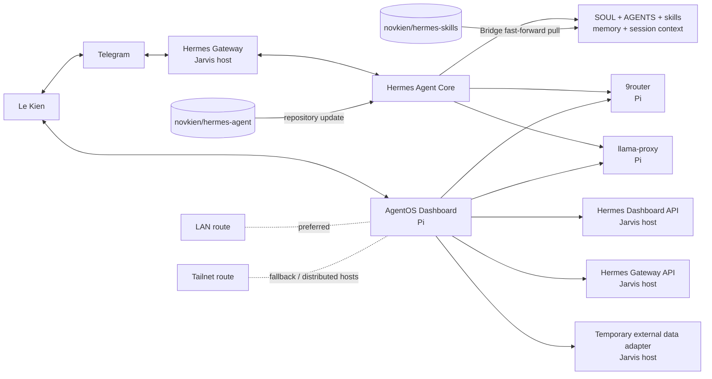

# Jarvis/Hermes — Repository Agent Guide

This file is the compact repository entrypoint for AI coding assistants, Hermes agents,
and human maintainers working in `novkien/hermes-agent`.

It explains where this application repository fits in Le Kien's wider Jarvis/Hermes
system. It is intentionally shorter than a full architecture manual. Deep deployment,
network, control-plane, and instruction-layer context lives in the installed
`hermes-agent` skill and its focused references.

## Authority and precedence

Le Kien is the owner and final decision authority.

Apply instructions in this order:

1. the newest explicit owner directive;
2. the current task's exact scope and target;
3. this repository guide;
4. the installed `hermes-agent` skill and the directly relevant reference;
5. current source, configuration structure, service state, logs, and runtime evidence;
6. older documentation and historical reports.

Never let an older reference override a newer owner decision or current evidence.

## Default work classification

Reading and searching this repository is allowed whenever it is needed to understand
Hermes behavior, trace an execution path, or identify the correct instruction surface.

A request is **not** permission to modify application source merely because source
inspection is useful.

Use these rules:

- Requests about skills, prompts, references, SOUL, context, role behavior,
  evaluation, reporting, or agent instructions are instruction-layer work by default.
- A general, ambiguous, or outcome-only request is not source-code authorization.
- Modify executable application source only when the owner explicitly requests a code,
  runtime, plugin, service, router, tool, dashboard, or other executable change.
- When code modification is explicitly authorized, execute the requested scope instead
  of redirecting it back to instruction-layer advice.
- Documentation changes to `AGENTS.md` and `README.md` remain repository documentation
  work; they do not authorize unrelated code changes.

## What this repository is

`novkien/hermes-agent` is the application source for the Hermes agent runtime and its
core surfaces:

- conversation and tool-calling loop;
- prompt and context assembly;
- CLI, TUI, web dashboard, desktop, and messaging gateway surfaces;
- Telegram and other platform adapters;
- tools, toolsets, plugins, skills integration, cron, memory, sessions, and profiles;
- tests, installer, documentation, and update mechanics.

This repository is **one component** of the Jarvis/Hermes deployment. It is not the
entire deployed system and is not the source of truth for live process state.

## Jarvis/Hermes system at a glance



### Current component roles

| Component | Current role | Current location or repository |
|---|---|---|
| Hermes application | Agent runtime, gateway, tools, profiles, sessions | This repository; deployed checkout normally `/home/jarvis/.hermes/hermes-agent` |
| Telegram | Primary owner conversation surface | Hermes gateway platform adapter |
| AgentOS | Browser control plane for the whole Jarvis/Hermes system | `novkien/agent-mission-control`; Pi LAN route currently `192.168.1.140` |
| AgentOS data adapter | Temporary read-only bridge for dashboard data | Jarvis host; intended to be merged into `hermes-agent` only under a later explicit implementation plan |
| 9router | General LLM/provider routing path | Pi; external project at `/home/pi/9router` |
| llama-proxy | Local model routing, wake/switch/unload lifecycle, dashboard and ComfyUI passthrough | `novkien/llama-proxy`; Pi |
| Skill registry | Canonical source for shared skills and profile packs | Private `novkien/hermes-skills` |

Addresses, ports, process identities, active models, bindings, branches, and commit SHAs
are volatile facts. Before an operational action, reverify them from current evidence.
The private `hermes-agent` skill contains the latest observed topology and the exact
reverification contract.

## Load deeper system context only when needed

When running inside Hermes and the task concerns Jarvis/Hermes architecture,
repositories, runtime topology, AgentOS, Telegram routing, LLM proxies, skills,
context loading, profiles, or deployment, load:

```text
skill_view("hermes-agent")
```

Then load only the directly relevant reference named by that skill. Do not preload the
entire reference library.

The installed skill is expected at:

```text
/home/jarvis/.hermes/skills/autonomous-ai-agents/hermes-agent/
```

Its canonical Git source is:

```text
novkien/hermes-skills:
skills/autonomous-ai-agents/hermes-agent/
```

## Context architecture

The intended context hierarchy is:

```text
Repository AGENTS.md
  └─ compact, common repository and owner boundaries

Installed hermes-agent SKILL.md
  └─ broad Jarvis/Hermes system context and routing table

Focused skill references
  ├─ system topology and hosts
  ├─ AgentOS and adapter
  ├─ 9router and llama-proxy
  ├─ Telegram and multi-agent routing
  ├─ repositories and change control
  ├─ context loading and skill routing
  ├─ skills registry and profile packs
  └─ freshness and source-of-truth rules

Current source/runtime evidence
  └─ authoritative for current implementation and deployment state
```

`AGENTS.md` must not become a dump of every subsystem detail. Put reusable deep detail
in a focused skill reference. Put deterministic behavior in code or a script. Put
current live facts in evidence rather than treating a dated document as timeless.

## Repository and deployment map

| Repository | Purpose | Normal write boundary |
|---|---|---|
| `novkien/hermes-agent` | Hermes application fork | Application source and root repository documentation |
| `NousResearch/hermes-agent` | Upstream Hermes project | Read/fetch/update source; do not push owner changes here |
| `novkien/hermes-skills` | Shared skills and profile-selectable skill packs | Instruction-layer skills, references, scripts, templates, tests and harnesses |
| `novkien/agent-mission-control` | AgentOS dashboard | Separate dashboard code until an owner-authorized merge plan is executed |
| `novkien/llama-proxy` | Sanitized llama-proxy source | Proxy application source |

Do not infer a remote's purpose from its name. Read current Git configuration and
branch state before pull, push, merge, or update work.

### Skills deployment

The live skill roots remain:

```text
/home/jarvis/.hermes/skills/
/home/jarvis/.hermes/workspace/skills-pack/
```

They are tracked by the private skills repository through a separate Git directory:

```text
/home/jarvis/.hermes/repos/hermes-skills.git
```

Bridge deploys an owner-authorized skills commit with a fast-forward-only pull:

```bash
git \
  --git-dir=/home/jarvis/.hermes/repos/hermes-skills.git \
  --work-tree=/home/jarvis/.hermes \
  pull --ff-only origin main
```

For repository-tracked skill paths, this Git transport replaces apply-ZIP unless the
owner explicitly selects apply-ZIP for that operation. Cache refresh, session reset,
service reload, and behavioral verification are separate actions and must be reported
separately.

## Network model

The current deployment prefers LAN routes. Tailnet routes are required fallbacks for:

- LAN failure;
- hosts deployed in different physical networks;
- future distribution of AgentOS, proxies, workers, or model servers.

Do not hardcode a Tailnet IP in public repository documentation. Resolve the current
Tailnet DNS name/IP from `tailscale status --json` or the private system-context
reference before use. Do not silently fall back to historical `192.168.0.x` addresses.

## Deep codebase development guide

When executable application-source work is explicitly authorized, read
[`docs/HERMES_CODEBASE_DEVELOPMENT_GUIDE.md`](docs/HERMES_CODEBASE_DEVELOPMENT_GUIDE.md)
before editing. It preserves the detailed architecture, contribution, testing, platform,
and implementation conventions that previously lived in root `AGENTS.md`, while keeping
the default context compact. Current owner directives, current source, and any more
specific nested `AGENTS.md` take precedence.

## Application source map

The filesystem is the source of truth; this map names the load-bearing areas rather
than every file.

```text
hermes-agent/
├── run_agent.py          # AIAgent orchestration and conversation loop
├── agent/                # prompt assembly, providers, memory, compression, skills
├── model_tools.py        # tool orchestration and function-call dispatch
├── toolsets.py           # toolset definitions and core tool surface
├── tools/                # tool implementations and registry
├── gateway/              # messaging gateway and platform runtime
├── plugins/              # plugin system and built-in plugins
├── hermes_cli/           # CLI commands, setup, profiles, web server and operations
├── cli.py                # classic interactive CLI orchestration
├── ui-tui/               # Ink/React terminal UI
├── tui_gateway/          # Python JSON-RPC backend for TUI/GUI surfaces
├── web/                  # Hermes web dashboard frontend when present in current tree
├── apps/                 # desktop/shared application packages when present
├── cron/                 # scheduler and job execution
├── skills/               # bundled seed skills, not the owner's complete live registry
├── optional-skills/      # optional seed skills
├── tests/                # automated behavior and integration tests
└── website/              # product documentation
```

## Load-bearing design invariants

Preserve these unless the owner explicitly requests a redesign:

1. **Prompt-cache stability.** A conversation's stable prefix and tool surface should
   remain byte-stable where the architecture requires it. Do not rebuild or mutate old
   prompt content casually.
2. **Strict message alternation and session integrity.** Do not inject synthetic turns
   in ways that violate provider message ordering or corrupt persisted history.
3. **Narrow core tool surface.** Prefer an existing tool, CLI command plus skill,
   service-gated tool, plugin, or MCP integration before adding a permanent core model
   tool.
4. **Session-scoped capabilities.** UI/client capabilities are determined by the
   session and platform, not only by process environment.
5. **Configuration separation.** Behavioral configuration belongs in `config.yaml`;
   `.env` is for credentials and secrets.
6. **Profiles are explicit scopes.** Do not flatten profile packs or merge profile
   state merely for convenience.
7. **Evidence-backed behavior claims.** Code proves implementation; runtime evidence
   proves deployment and current behavior. One does not substitute for the other.

## Change workflow

For every authorized change:

1. Restate the exact outcome and scope internally.
2. Inspect the smallest set of current source/evidence required.
3. Verify the premise against the current implementation before calling something a
   defect.
4. Select the smallest correct target: documentation, skill, prompt, config, plugin,
   service, or code.
5. Author complete final files. Do not use fragment patches as the normal Hermes
   handoff format.
6. Preserve unrelated behavior and profile boundaries.
7. Run the tests or checks requested by the owner or materially required by the
   changed surface.
8. Report writes, commits, pulls, reloads, resets, and behavioral outcomes as separate
   facts.

Do not transform an execution request into review-only advice. Do not add an approval
layer that the owner did not request.

## Security

- Never place credentials, passwords, private keys, bot tokens, API keys, cookies, or
  authorization headers in repository documentation or skills.
- Store only the name/location class of a secret, never its value.
- Do not publish live databases, WAL/SHM files, logs, session stores, model weights,
  runtime state, or unreviewed backups.
- Treat repository visibility as a current GitHub fact, not an assumption.
- A historical secret found in Git history requires owner-facing reporting and secret
  rotation; do not reproduce the value in a report.

## Verification and completion evidence

A complete report distinguishes:

```text
SOURCE_INSPECTED:
FILES_CREATED:
FILES_REPLACED:
FILES_DELETED:
COMMIT_CREATED:
REMOTE_UPDATED:
LOCAL_PULL_RESULT:
CACHE_REFRESH_RESULT:
SESSION_RESET_RESULTC:
SERVICE_RELOAD_RESULTC:
BEHAVIORAL_TEST_RESULT:
UNRESOLVED_FACTS:
```

Never claim a commit, pull, reload, activation, or behavior change without the
corresponding result.
