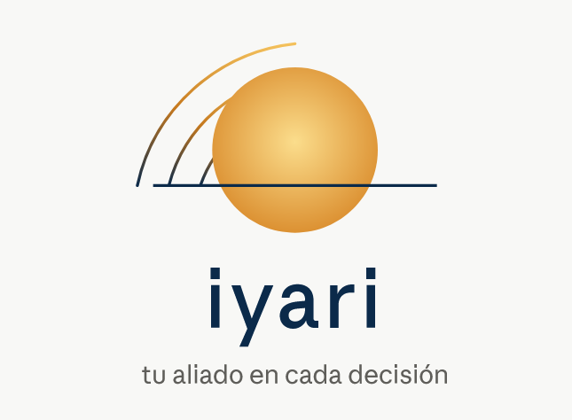

<p align="center">
  
</p>

<p align="center">
  <a href="https://iyari.io"></a>
  <a href="LICENSE"></a>
  
</p>

# IYARI

**Tu aliado en cada decisión.**

IYARI is a self-improving AI agent built by **Digital Services LLC**. It creates skills from experience, improves them during use, persists knowledge across sessions, searches its own past conversations, and builds a deepening model of who you are over time.

Run it on a $5 VPS, a GPU cluster, or serverless infrastructure that costs nearly nothing when idle. It's not tied to your laptop — talk to it from Telegram while it works on a cloud VM.

IYARI is a fork of [Hermes Agent](https://github.com/NousResearch/hermes-agent), originally built by Nous Research, developed and maintained independently by Digital Services LLC under the MIT license.

## Use any model you want

Nous Portal, OpenRouter, OpenAI, DeepSeek, Kimi, your own endpoint, and many others. Switch with `hermes model` — no code changes, no lock-in.

## Quickstart

```bash
git clone https://github.com/digital-services-llc/iyari.git
cd iyari
curl -LsSf https://astral.sh/uv/install.sh | sh
uv venv && uv pip install -e ".[all]"
hermes setup
```

> **Note:** during the brand transition, the CLI command remains `hermes`. Everything else — docs, web, branding — is IYARI.

## Documentation

📖 Full docs: **[iyari.io](https://iyari.io)**

## Community

- 🐛 [Issues](https://github.com/digital-services-llc/iyari/issues) — bug reports and feature requests go here, in our own repo
- 🌐 [iyari.io](https://iyari.io)
- ✉️ team@iyari.io

## License

MIT — see [LICENSE](LICENSE).

Originally built by [Nous Research](https://nousresearch.com/). Fork maintained by **Digital Services LLC** — © 2026.

*Iyari — contigo cada día.*
