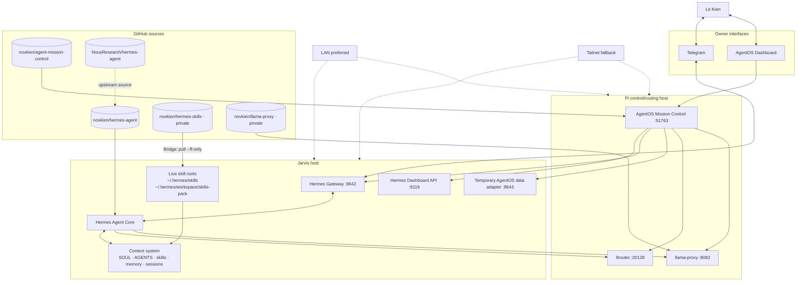
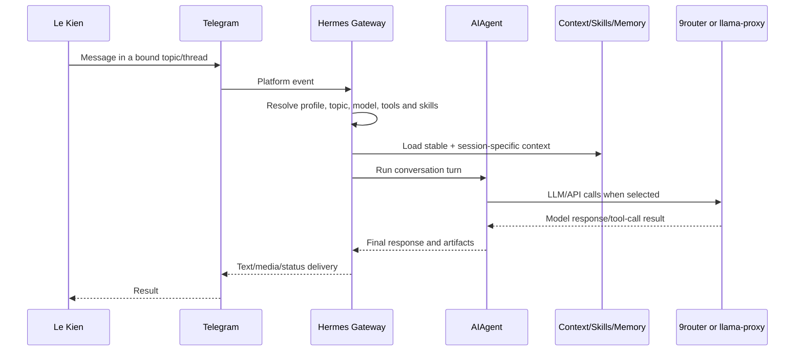
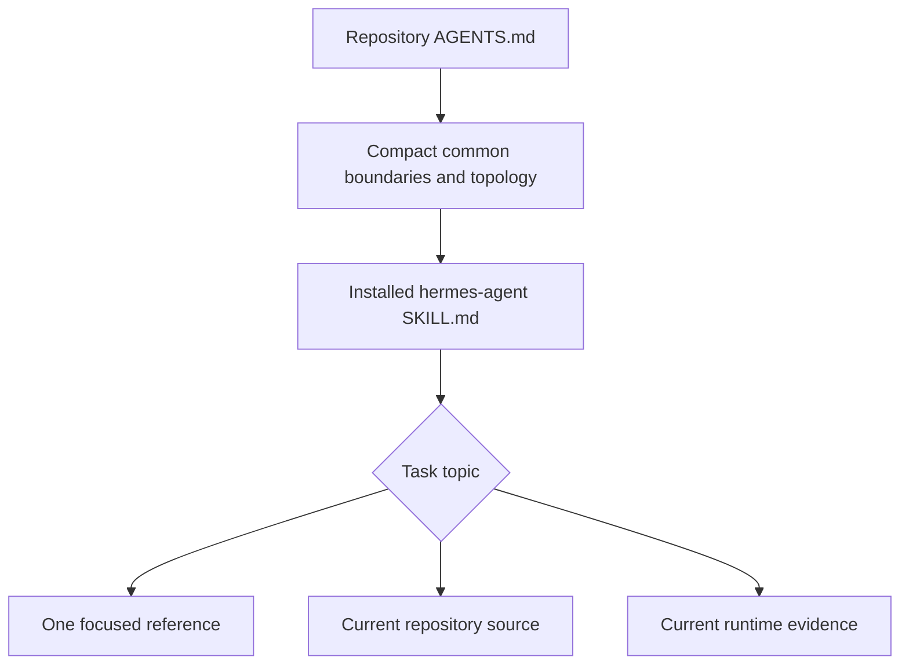

# Jarvis/Hermes Agent System

`novkien/hermes-agent` is the application fork at the center of Le Kien's distributed
Jarvis/Hermes agent system.

This repository contains the Hermes runtime. The complete system also includes a
Telegram interaction layer, AgentOS browser control plane, an external read-only data
adapter, two LLM routing services, a private skills registry, profile-selectable skill
packs, and multiple manager/worker agents.

> **Base project:** Hermes Agent by Nous Research. This fork retains the upstream
> application architecture while adding Jarvis-owned instruction layers, runtime
> integrations, profiles, routing, and operational workflows.

## System objective

Jarvis/Hermes is designed as an owner-directed multi-agent operating environment:

- Le Kien interacts primarily through Telegram.
- Hermes coordinates CEO, Manager, Worker, Skill Lab, System Prompt Lab, Bridge, and
  specialist roles.
- AgentOS provides a browser dashboard for observing and controlling the wider system.
- 9router and llama-proxy provide separate LLM/API routing paths.
- Skills and profile packs are maintained in a private Git repository and deployed by
  fast-forward pull.
- LAN is the preferred network path; Tailnet is the resilient fallback for distributed
  hosts and LAN failure.

## Topology



## Component inventory

| Component | Responsibility | Current source/deployment evidence |
|---|---|---|
| Hermes Agent | Agent loop, tools, gateway, profiles, sessions, memory, skills integration and user interfaces | Repository `novkien/hermes-agent`; deployed checkout normally `/home/jarvis/.hermes/hermes-agent` |
| Telegram gateway | Primary owner conversation channel and thread/topic routing | `gateway/` plus Telegram platform implementation in this repository |
| AgentOS Mission Control | Browser control plane for system state, health, governance, logs, chat and proxy dashboards | `novkien/agent-mission-control`; deployed on the Pi |
| AgentOS data adapter | Temporary read-only API over Hermes-owned stores used by AgentOS | External Jarvis-host service; planned for a future owner-authorized merge into `hermes-agent` |
| 9router | General model/provider router used by Hermes auxiliary and model paths | External source on the Pi |
| llama-proxy | OpenAI-compatible local-model router, model lifecycle controller, dashboard and ComfyUI passthrough | `novkien/llama-proxy`; deployed on the Pi |
| Hermes skills registry | Canonical Git source for shared skills and profile packs | Private `novkien/hermes-skills` |

### Current network convention

The owner-declared current Pi LAN route is:

```text
pi@192.168.1.140
```

LAN is preferred while hosts are on the same network. Tailnet addressing must remain
available as an independent fallback. Exact Tailnet IPs are deliberately kept out of
this public repository because they are volatile deployment facts; resolve them from
current Tailscale state or the private system-context skill.

Historical `192.168.0.x` values are not automatic fallbacks. Reverify before use.

## Primary interaction flow



Telegram is the owner conversation surface. AgentOS is an additional control plane;
it does not replace Telegram as the primary human-agent conversation contract.

## AgentOS control plane

AgentOS Mission Control runs on the Pi and presents the browser dashboard. It acts as a
BFF/control surface over several sources:

```text
AgentOS browser
  → AgentOS Mission Control on Pi
      → Hermes Dashboard API on Jarvis
      → Hermes Gateway API on Jarvis
      → external AgentOS data adapter on Jarvis
      → direct/proxied 9router dashboard
      → direct/proxied llama-proxy dashboard
```

The external adapter currently exists as a separate service. It supplies read-only
views for data such as Kanban, permits, issues, bindings, and related provenance. The
owner intends to replace this temporary split with a later explicit plan that merges
the adapter capability into `hermes-agent`. That future merge is **planned**, not a
claim about the current source tree.

## LLM routing

Jarvis/Hermes has two distinct routing surfaces:

### 9router

- General custom-provider/model routing path.
- Used by Hermes model and auxiliary model configuration where selected.
- Runs on the Pi and exposes its own dashboard/API surface.
- Remains an external project; current implementation facts must be verified from its
  source/service before modification.

### llama-proxy

- OpenAI-compatible local-model endpoint.
- Routes public model aliases to remote/local llama-server services.
- Controls wake, availability, model switching, idle unload and shutdown behavior.
- Provides `/v1/models`, `/v1/chat/completions`, `/dashboard`, and ComfyUI passthrough
  routes in the published source snapshot.
- Canonical sanitized source is stored in private `novkien/llama-proxy`.

A configured URL is not proof that a service is active. Runtime state must be checked
from listeners, service state, and a safe health/model-list request.

## Context system

The context architecture uses progressive disclosure:



### Roles of each layer

| Layer | Purpose |
|---|---|
| `AGENTS.md` | Compact repository-wide owner authority, scope boundary, topology and routing instructions |
| `README.md` | Human-readable system overview and topology |
| `hermes-agent/SKILL.md` | Broad private Jarvis/Hermes context authority and reference router |
| Skill references | Focused details loaded only when relevant |
| Current source | Authoritative for present implementation |
| Current runtime evidence | Authoritative for deployed paths, services, bindings and behavior |

The system distinguishes stable design from volatile facts. IPs, ports, models,
branches, SHAs, service state, topic bindings, and active skill versions must be
reverified instead of silently trusted from an old document.

## Skills and profile packs

The live skill estate is intentionally split:

```text
~/.hermes/skills/                    # shared installation skills
~/.hermes/workspace/skills-pack/     # profile-selectable packs
```

Current pack names observed during the registry bootstrap are:

```text
coder
creative
general
office-work
research
```

Hermes discovers the shared skill root and configured external pack directories. Topic
and profile configuration may further preload or allowlist specific skills.

### Canonical Git workflow

The private repository maps directly to the existing runtime paths:

| Git path | Runtime path |
|---|---|
| `skills/` | `/home/jarvis/.hermes/skills/` |
| `workspace/skills-pack/` | `/home/jarvis/.hermes/workspace/skills-pack/` |

Bridge deploys a committed change using:

```bash
git \
  --git-dir=/home/jarvis/.hermes/repos/hermes-skills.git \
  --work-tree=/home/jarvis/.hermes \
  pull --ff-only origin main
```

The linked worktree must be clean and the update must be a fast-forward. Bridge must
not repair divergence with reset, clean, stash, merge, or rebase.

For Git-tracked skill paths, this workflow supersedes apply-ZIP unless the owner
explicitly chooses apply-ZIP for a particular operation. A pull deploys files only;
`/reload-skills`, session reset, service reload, and behavioral validation are separate
facts/actions.

## Source-change boundary

Primary ChatGPT and agents may inspect this repository to understand current behavior.
They may not modify executable source from a general or ambiguous request.

```text
General request about behavior/context/prompt/skill
  → instruction-layer target by default

Explicit request to change a named code/runtime surface
  → code/runtime work authorized for that scope
```

This boundary prevents a documentation or agent-behavior request from drifting into an
unrequested code redesign. It does not block owner-authorized runtime work.

## Repository structure

```text
hermes-agent/
├── run_agent.py          # core AIAgent orchestration
├── agent/                # prompt, providers, memory, compression, skills
├── model_tools.py        # tool-call orchestration
├── toolsets.py           # toolset definitions
├── tools/                # tool implementations and registry
├── gateway/              # messaging gateway runtime
├── plugins/              # plugin ecosystem
├── hermes_cli/           # commands, setup, profiles, web server
├── cli.py                # classic CLI
├── ui-tui/               # Ink/React terminal UI
├── tui_gateway/          # JSON-RPC backend
├── cron/                 # scheduled work
├── skills/               # bundled seed skills
├── optional-skills/      # optional seed skills
├── tests/                # automated tests
└── website/              # product documentation
```

See [`AGENTS.md`](AGENTS.md) for working rules and the private `hermes-agent` skill for
deep deployment context.

## Evidence snapshot

The initial context survey on **2026-08-11** observed:

- Jarvis host on LAN `192.168.1.128`;
- Pi on LAN `192.168.1.140`;
- AgentOS Mission Control active on the Pi;
- the external AgentOS data adapter active on the Jarvis host;
- 9router and llama-proxy active on the Pi;
- Telegram gateway bindings present in Hermes configuration;
- `novkien/hermes-skills` bootstrapped as a private repository;
- `novkien/llama-proxy` published as a private sanitized source repository.

This section is a dated snapshot, not a permanent guarantee. Reverify live facts before
an operational action.

## Security and publication rules

- Never commit passwords, tokens, private keys, cookies, auth headers, live databases,
  sessions, logs, runtime state, model weights, or unreviewed backups.
- Keep exact Tailnet addressing and private thread bindings in private context sources.
- Do not assume a repository is private; verify GitHub metadata.
- Report suspected secret locations without reproducing the secret value.
- Historical credentials in Git history require rotation and a separate owner-directed
  history-remediation decision.

## Upstream and licensing

This fork is based on the Nous Research Hermes Agent project. Consult the repository's
license and upstream documentation for licensing, installation, and generic product
usage. Jarvis-specific deployment and instruction-layer behavior are governed by the
owner context documented here and in the private skills repository.
