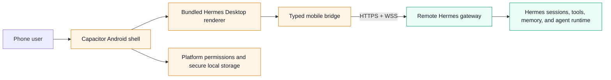

# Hermes Mobile

> **Status: active upstream contribution — not an official release and not yet a supported install path.**

Hermes Mobile brings the **real Hermes Desktop experience** to Android. It packages the Desktop renderer in a Capacitor shell and connects it to the same remote Hermes gateway that powers Desktop's Remote Gateway mode.

## 📱 What this is

- A native Android shell for the existing Hermes Desktop renderer.
- A remote client for the same Hermes sessions, profiles, skills, and tool activity you use elsewhere.
- An upstream-focused effort: changes should be narrow, testable, secure, and suitable for review in `NousResearch/hermes-agent`.

## 🚫 What this is not

- Not a Termux/local-agent replacement.
- Not a separate mobile chat UI or a copy of the Desktop source tree.
- Not an official Hermes app, signed release, or APK download source yet.
- Not a way to expose a Hermes gateway publicly or to copy desktop credentials to a phone.

## 🧭 Architecture



The bridge is deliberately explicit. Desktop-only capabilities must either map to a meaningful phone capability (for example, clipboard, file picker, haptics, or microphone permission) or be disabled cleanly. A missing bridge capability must never silently pretend to work.

## 🧭 Touch navigation

Hermes Mobile preserves the Desktop renderer instead of rebuilding it as a separate chat app, but gives its navigation a phone-native home:

- One compact top toolbar keeps **Sessions** one tap or left-edge swipe away.
- A right-edge swipe opens the Files/preview drawer.
- The toolbar’s overflow sheet opens directly below its top-right control and contains every visible workspace pane plus New session, Browser/preview, Command Center, Command palette, Settings, Layout editor, HUD, haptics, pane flip, Keyboard Shortcuts, and page-specific Desktop toolbar actions.
- Sheets and drawers have explicit close controls, scrims, Android Back priority, and keyboard Escape behavior. Focus returns to the invoking toolbar control after a sheet closes.
- Native mobile never keeps a desktop rail docked beside chat, even on an unfolded Fold. Drawers overlay the full-width chat canvas instead.
- Browser, PDF, Markdown, image, source, and artifact preview tabs open in a full-screen mobile surface. Closing that surface preserves the tabs; users can reopen it, switch tabs, close individual tabs, or create another Browser tab.
- URL tabs embed only private **HTTPS** pages in a sandboxed in-app frame. The visible **Open** action hands a page to Android’s system browser when a site needs its normal browser session or blocks framing. Insecure and special schemes are never loaded inline.
- Motion is deliberately limited to navigation changes and touch feedback: drawers, menus, preview tabs, list/detail transitions, onboarding cards, and controls animate quietly; transcript/body content stays still, and every motion treatment respects `prefers-reduced-motion`.

This is intentional adaptation, not a separate dashboard: existing Desktop pages, sessions, composer behavior, overlays, and visual language remain shared.

## 🔐 Security model

- Connect only to a user-controlled remote Hermes gateway over **HTTPS/WSS**.
- Keep gateway tokens and session material out of source control, logs, screenshots, and CI output.
- Store mobile connection secrets through the platform-backed secure-storage path; do not use browser `localStorage` for secrets.
- Open external links only through an allowlisted system-browser path; gateway content cannot invoke arbitrary device schemes.
- A release will require its own reviewed package identifier, signing identity, update channel, and real-device verification.

## 🤳 Android capability boundaries

Every mobile capability begins with a deliberate user action or the one-time first successful connection onboarding. Hermes never requests contacts, location, SMS, Accessibility, overlay, notification-reader, boot, or exact-alarm access.

- **Files and images:** first successful connection requests the Android visual-media grant for gallery photos and videos. Regular document/photo pickers still use system URI grants; their bytes are held only for the current app process and are uploaded to the configured remote gateway only when the user sends the composer message.
- **Camera:** first successful connection requests Android camera permission. **Capture photo** still requires a separate composer action, does not write the image to the gallery, and keeps the capture as a normal draft attachment until the user sends it.
- **Incoming shares:** Android’s Share sheet can open Hermes with text and attachments. Shared text and files are staged in the composer; Hermes does not auto-send shared content to an agent session. Each shared URI is read once through its grant and capped at 25 MiB.
- **Microphone:** requested during first-connection onboarding and used only when the user starts voice input; the access probe immediately releases its test track.
- **Notifications:** first successful connection asks for Android notification permission; Settings also offers a benign local test. Hermes separates attention-needed, activity, and non-urgent background-update channels. This is local-notification support only—server-to-device push while the app is suspended is not implemented or claimed.
- **Background reliability:** first successful connection opens Android’s own battery-optimization decision and arms a visible active-session service for the next background transition. Its top-bar notification shows that the remote session is being kept ready; it stops when the user dismisses the app task. This improves reliability but does not create a hidden agent, make a WebView immortal, or prove closed-app completion notifications.

**Device-proof gate:** these source-level paths are covered by tests and native compilation, but camera, share-sheet, Android permission prompts, notification channels, and gallery behavior remain real-device acceptance items.

## 🔄 After the first published release

- A future GitHub Release check may compare a signed, published release against the installed version and show a user-controlled update link. It must never silently download or install an APK.
- A home-screen widget is deferred until the core mobile client is accepted and published. Any widget proposal must preserve the same remote-session, permission, and notification boundaries.

## 🧪 Contributor path

This workspace is intentionally set up as a normal Hermes monorepo workspace. Start from the repository root:

```bash
npm ci
npm run typecheck --workspace apps/mobile
npx vitest run --config apps/mobile/vitest.config.ts
npm run build --workspace apps/mobile
npm run cap:sync --workspace apps/mobile
cd apps/mobile/android && ./gradlew assembleDebug
```

> These are the intended quality gates. They must all be run successfully on the exact branch and Android toolchain before this README can describe an APK as buildable or installable.

### Prerequisites

- Node.js version required by the root `package.json`.
- JDK 17.
- Android SDK platform/build tools accepted by the Capacitor/Gradle project.
- A private, reachable Hermes gateway for an integration test. Do **not** use a public or credential-bearing example URL.

### Controlled release candidates

`Mobile Release Candidate` is a manual GitHub Actions workflow that builds a signed AAB only when all four release-signing secrets are configured in the canonical repository. It never falls back to the Android debug certificate. The workflow uploads the resulting AAB as a short-lived private Actions artifact; publishing to Play or another channel remains a separate, reviewed decision.

## ✅ First release bar

Before any signed Android build is shared, it must prove:

1. Remote connection configuration and authentication work for both REST and WebSocket paths.
2. Reverse-proxy path prefixes remain intact for WebSocket URLs.
3. A session loads, one message streams, and reconnect works after foreground/background.
4. Mobile bridge tests cover token, password-capable gateway, profile, reconnection, and error paths. OAuth-only gateway authorization is explicitly out of scope for this MVP.
5. Phone controls are touch-accessible; keyboard, back navigation, safe areas, and file selection behave correctly.
6. The app has passed real-device testing and a review of secrets, permissions, WebView navigation, and update behavior.

## 🤝 Upstream relationship

This work builds on—and preserves credit for—existing Hermes mobile contributions. Current open mobile PRs are research and implementation references, not install sources:

- [#49834 — Capacitor Android thin client](https://github.com/NousResearch/hermes-agent/pull/49834)
- [#52673 — native mobile shell for Hermes Desktop](https://github.com/NousResearch/hermes-agent/pull/52673)
- [#53772 — Expo mobile shell integration branch](https://github.com/NousResearch/hermes-agent/pull/53772)
- [#64962 — Capacitor iOS renderer client](https://github.com/NousResearch/hermes-agent/pull/64962)

When upstream Desktop changes, this project should rebase onto a pinned current `main`, run the full mobile test/build gates, and produce a reviewable candidate. It must never silently ship a new upstream renderer into an installed mobile app.

## 📚 Related documentation

- [Hermes contribution guide](../../CONTRIBUTING.md)
- [Desktop architecture rules](../desktop/AGENTS.md)
- [Android / Termux guide](../../website/docs/getting-started/termux.md) — a separate local-CLI path, not this project
