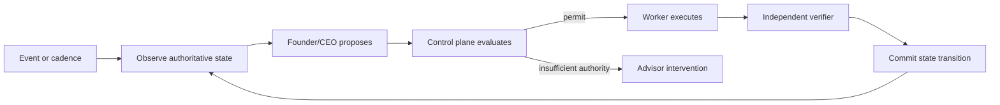

# Charterforge Architecture

## Control loop

The model proposes plans and actions. It is not the state machine, policy
engine, executor, verifier, or ledger.

Permits are bound to the current immutable plan version. Replanning makes
older proposed actions ineligible for new permits, so stale authority cannot
be revived after the CEO has changed course.
Permit consumption also checks the active runtime policy version; changing
policy invalidates unconsumed permits issued under the prior version.

## Runtime components

| Component | Responsibility |
|---|---|
| Objective service | Durable goals, immutable plan versions, actions, permits, results, evidence |
| Objective runtime | Event claims, cadence, lost-wakeup repair, leases, retries, recovery, stop and escalation |
| Organization database | Founder/CEO, reporting hierarchy, mandates, hiring and offboarding |
| Delegation control | Exact employee task grants and launch/result validation |
| Finance and accounting | Capital, reservations, budgets, journals, periods, tax and payment records |
| Compliance database | Regimes, applicability, obligations, controls, evidence and deadlines |
| Action adapters | Narrow external execution contracts |
| Independent verifiers | Read-back of authoritative external or deterministic state |
| Audit export | Tenant-scoped state and evidence lineage |

SQLite is the implemented authority store in this checkout. Postgres and an
external event broker remain future deployment work; documentation must not
describe them as present.

## State boundaries

Conversation history and vector memory are context, not authority. Financial,
organizational, objective, approval, compliance, and execution state is stored
in structured databases. External state changes are accepted only after
read-back or deterministic verification.

External subscriptions and schedules join the objective lifecycle before
emitting wake events. Terminal objectives are never reactivated by late
external deliveries or missed schedule intervals.
The durable inbox claim query applies the same terminal-state fence to all
internal events, including worker, compliance, and maintenance emissions.

Housekeeping repairs a narrowly defined failure window: if an accepted or
planned objective has no pending or processing inbox event, it emits one
versioned reconciliation wake. The versioned dedupe key makes this safe across
worker restarts without reviving blocked or terminal objectives.

The inherited `hermes_cli` package is a compatibility implementation detail.
The public distribution, command, and new namespace are `charterforge`.
# Metered revenue boundary

Charterforge records billable usage as immutable, idempotent events. Each event
stores the customer, metric, quantity, unit price, currency, and occurrence
time; pricing is therefore fixed at capture rather than supplied later by a
planner. A governed metered-invoice action may reference only an explicit set
of unallocated event IDs. The runtime aggregates those events, creates a
normal inbound payment intent, and atomically records immutable allocations so
retries cannot bill an event twice. Provider read-back remains the independent
completion check. Tax-bearing metered invoices are blocked unless a verified
tax rule is supplied through the existing accounting controls.

Recovery retries are bound to the original payment-intent idempotency key. An
already allocated event may be replayed only for that same intent; any attempt
to attach it to a different invoice is rejected.

The payment verifier independently reads the allocation ledger and requires
the exact event-ID set and aggregate amount to match the payment intent before
it can pass the metered-invoice action.

Metered usage is treated as the taxable base. If a verified `tax_rule_id` is
provided, the accounting layer calculates tax from the active organization
registration and matching customer jurisdiction; the gross payment intent and
tax-liability journal then include that result. Missing or mismatched rules
fail closed.
