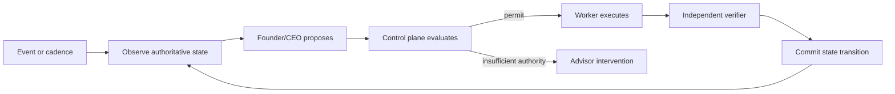

# Charterforge Architecture

## Control loop

The model proposes plans and actions. It is not the state machine, policy
engine, executor, verifier, or ledger.

## Runtime components

| Component | Responsibility |
|---|---|
| Objective service | Durable goals, immutable plan versions, actions, permits, results, evidence |
| Objective runtime | Event claims, cadence, lost-wakeup repair, leases, retries, recovery, stop and escalation |
| Organization database | Founder/CEO, reporting hierarchy, mandates, hiring and offboarding |
| Delegation control | Exact employee task grants and launch/result validation |
| Finance and accounting | Capital, reservations, budgets, journals, periods, tax and payment records |
| Compliance database | Regimes, applicability, obligations, controls, evidence and deadlines |
| Action adapters | Narrow external execution contracts |
| Independent verifiers | Read-back of authoritative external or deterministic state |
| Audit export | Tenant-scoped state and evidence lineage |

SQLite is the implemented authority store in this checkout. Postgres and an
external event broker remain future deployment work; documentation must not
describe them as present.

## State boundaries

Conversation history and vector memory are context, not authority. Financial,
organizational, objective, approval, compliance, and execution state is stored
in structured databases. External state changes are accepted only after
read-back or deterministic verification.

Housekeeping repairs a narrowly defined failure window: if an accepted or
planned objective has no pending or processing inbox event, it emits one
versioned reconciliation wake. The versioned dedupe key makes this safe across
worker restarts without reviving blocked or terminal objectives.

The inherited `hermes_cli` package is a compatibility implementation detail.
The public distribution, command, and new namespace are `charterforge`.
# Metered revenue boundary

Charterforge records billable usage as immutable, idempotent events. Each event
stores the customer, metric, quantity, unit price, currency, and occurrence
time; pricing is therefore fixed at capture rather than supplied later by a
planner. A governed metered-invoice action may reference only an explicit set
of unallocated event IDs. The runtime aggregates those events, creates a
normal inbound payment intent, and atomically records immutable allocations so
retries cannot bill an event twice. Provider read-back remains the independent
completion check. Tax-bearing metered invoices are blocked unless a verified
tax rule is supplied through the existing accounting controls.
