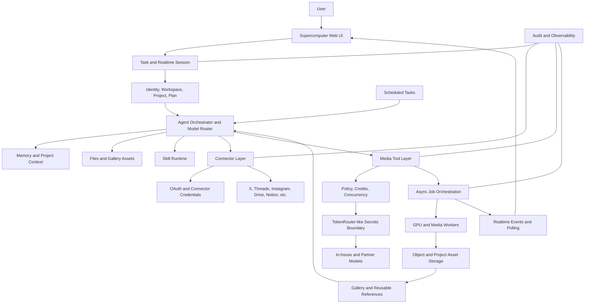

# Higgsfield Supercomputer Dialogue Architecture Research

Status: research dossier
Date: 2026-06-01
Fresh interactive task: <https://higgsfield.ai/supercomputer/e0e6431f-3978-4b89-a19b-ab0f4817cfc5>
Primary interactive task: <https://higgsfield.ai/supercomputer/096f0016-130d-4810-88ac-4a3df4cf5aa3>
Prior inspected task: <https://higgsfield.ai/supercomputer/748e2a15-f9e0-4ce9-9583-f0a40af40d01>

## Evidence Policy

This document separates product evidence from architecture inference.

| Label | Meaning | How to use |
|---|---|---|
| Visible UI | Directly observed in the authenticated Supercomputer page through Chrome Computer Use. | Safe as product-surface evidence. |
| Public Higgsfield | Public Higgsfield page or FAQ. | Safe as official product wording, but not as implementation proof. |
| Dialogue claim | Claimed by the Higgsfield Supercomputer chat during the architecture interview. | Useful as self-description; not authoritative for hidden internals. |
| Local Hermes plan | Existing repo planning docs under `docs/`. | Useful for our target architecture; not proof of Higgsfield production internals. |
| Inference | Reasonable synthesis across observed behavior and local plans. | Needs validation before implementation as fact. |
| Unknown | Not verified. | Must stay blank or be explicitly left for follow-up. |

The important correction is that tool lists and names such as `TokenRouter` or `CometAPI` may be model-inferred. They should not be treated as confirmed Higgsfield internal service names unless backed by a public source or direct API evidence.

## Source Map

| Source | What it contributed |
|---|---|
| Public: <https://higgsfield.ai/supercomputer-intro> | Supercomputer is a chat-driven agent that plans work, picks models/presets, uses Skills, Connectors, Files, Scheduled Tasks, project storage, credits, and model auto-routing. |
| Public: <https://higgsfield.ai/about> | Higgsfield positions itself as full-stack creative infrastructure with proprietary models, partner models, and a proprietary reasoning engine for narrative, camera logic, and visual consistency. |
| Public: <https://higgsfield.ai/soul-intro> | Soul 2.0 and Soul ID public behavior: identity consistency, reference-image/image modes, presets, and Soul ID training requirements. |
| Public: <https://higgsfield.ai/cli> | MCP integration, no direct API key management, 30+ model access, asynchronous generation and polling, history reuse. |
| Public: <https://higgsfield.ai/social-connectors> | Connector surface: OAuth, X/Threads/Instagram tooling, publishing, status tools, retry/error surfacing. |
| Dialogue: `e0e6431f-3978-4b89-a19b-ab0f4817cfc5` | Fresh restart chat. Returned a layer-by-layer decomposition, literal skill categories, toolsets, UI protocol claim, identity/session claims, media/job/credit layers, and unknowns list. |
| Dialogue: `096f0016-130d-4810-88ac-4a3df4cf5aa3` | Interview answer listing declared Higgsfield tools, concurrency caps, media refs, Soul ID, enhancer, TokenRouter/CometAPI claims. |
| Notion: `docs/notion-source/hermes/` | 2026-06-02 refresh with Hermes `references` model, Soul ID/Element asset notes, `default_api` tool declarations, TokenRouter, and CometAPI pages. |
| Local: `docs/lark-source/higgsfield-hermes-agent-architecture.body.html` | Existing Higgsfield/Hermes four-layer architecture analysis and open questions. |
| Local: `docs/hermes-open-source-architecture-plan.md` | Target open-source Hermes implementation plan across 16 modules. |
| Local: `docs/hermes-notion-update-index.md` | Split index for the Notion refresh; use this for implementation follow-up instead of merging all updated content into this dossier. |

## Fresh Restart Chat Capture

Evidence level: Visible UI, Dialogue claim.

The restarted task was created after the prior conversation stalled. The task title in the sidebar was `Higgsfield Decomposition`, and the visible assistant answer described its own evidence policy as: visible product behavior, declared tool schemas, and literal system instructions, with claims marked as `[LITERAL PROMPT]`, `[LITERAL TOOL]`, `[INFERENCE]`, or `[UNKNOWN]`.

Important caveat: a Higgsfield Supercomputer answer that says `[LITERAL PROMPT]` is still an answer rendered by the product. It is stronger than a pure guess, but it is not the same as inspecting Higgsfield source code or an official public architecture document. This dossier therefore stores those claims as "Dialogue claim" unless independently backed by public pages or visible UI.

### Literal Skill Categories From The Fresh Chat

The restarted chat listed these skill registry categories:

- `analyzer`
- `creative`
- `mcp`
- `media`
- `productivity`
- `research`
- `social-media`
- `troubleshooting`
- `uncategorized`
- `workflow-generation`

Earlier inspected output also surfaced `custom`, but the fresh restart answer did not include it in this category list.

### Literal Toolsets From The Fresh Chat

The restarted chat listed these loadable toolsets:

`ads`, `artifacts`, `ask_user_question`, `browser`, `browser-cdp`, `clarify`, `code_execution`, `connectors`, `data_ingestion`, `debugging`, `delegation`, `discord`, `feishu_doc`, `feishu_drive`, `file`, `higgsfield`, `higgsfield_audio`, `homeassistant`, `image_gen`, `instagram`, `memory`, `messaging`, `moa`, `rl`, `safe`, `scheduling`, `search`, `session_search`, `skills`, `spotify`, `terminal`, `tiktok`, `todo`, `trends`, `tts`, `video_adapt`, `vision`, `web`, `youtube`.

This supports the product-shape conclusion that Supercomputer is a general agent runtime with a specialized Higgsfield/media toolset, not only a media form UI.

### Fresh Chat Layer Claims

| Layer | Fresh chat claim | Evidence handling |
|---|---|---|
| UI/session | Streams chunks to the web client via Vercel AI SDK Data Stream Protocol / `UIMessageChunks`; renders Markdown plus structured interactive cards. | Dialogue claim. Verify through network capture before treating as implementation fact. |
| Identity/tenant | Uses short-lived `HF_JWT_TOKEN` claims for user/chat identity and tracks workspace preferences and subscription limits. | Dialogue claim. Pattern is plausible; token format is unknown. |
| Orchestrator | Uses a Gemini LLM engine, parses instructions into tool payloads, and can delegate to sandboxed subagents. | Visible model picker supports Gemini usage; delegation details remain dialogue claim. |
| Skills | Skills are markdown workflow blueprints with frontmatter, templates, scripts, and references, loaded dynamically into context. | Dialogue claim, consistent with visible Skills product surface. |
| Files/memory | Uses isolated sandbox filesystem, durable user/project memory, session search, and chat-scoped artifact key-value state. | Dialogue claim, consistent with visible Files/Memory surfaces. |
| Connectors | MCP client, web parsers such as Firecrawl/Exa, and native scrapers such as `yt-dlp`. | Dialogue claim; public connector docs support the connector concept, not the exact backend list. |
| Media generation | Accesses model families including Cinematic Studio, flux, veo, seedance, and minimax; enhancer compiles structured intent into prompts. | Dialogue claim; public pages support broad model/preset routing. |
| Asset references | Soul IDs, persistent Elements, element placeholders, and typed asset chaining such as `image_job`, `job_set_type_job`, and `media_input`. | Dialogue claim; public pages support Soul ID and reusable outputs, not exact tags. |
| Scheduling/credits | Scheduler service named `Higgsclaw-cron`, workspace concurrency checked through Redis, Boost concurrency, and credit tracking. | Dialogue claim; visible UI/public pages support scheduling, usage, and credits. |
| Security | TokenRouter-like boundary exchanges short-lived tokens for vault-held upstream provider credentials. | Dialogue claim. Treat as a useful pattern, not a verified service name. |
| Observability | Job status polling, terminal process monitoring, browser console tracking, and billing audits. | Dialogue claim plus public async/polling behavior. |

The fresh chat unknowns were also useful: exact diffusion architectures, VM/container runtime, credential vault encryption, and upstream model hosting remain unknown.

### Captured `default_api` Tool Boundary

Evidence level: Visible UI and Dialogue claim.

The inspected Supercomputer tasks showed a `default_api:*` namespace for native tools exposed to the agent. The visible explanation said native tools and interfaces are mounted under a default namespace prefix and routed by a backend executor. Treat this as observed product behavior, not as a public API contract.

Key captured groups:

| Group | Captured tools and schemas, summarized |
|---|---|
| Artifacts/state | `artifact_get(key)`, `artifact_put(key, value)`, `artifacts(action, content?, text?)`, `memory(action, target, content?, old_text?, project?, category?)`. |
| User interaction | `ask_user_question(questions)` with text/entity/files modes and entity types such as `soul_id`, `element`, `voice`, `language`. |
| Browser/runtime | `browser_navigate`, `browser_click`, `browser_type`, `browser_press`, `browser_scroll`, `browser_screenshot`, `browser_vision`, `browser_console`, `browser_get_images`, `browser_snapshot`, `browser_back`, plus `terminal`, `todo`, `patch`, `process`, `read_file`. |
| Delegation/search/skills | `delegate_task(goal?, context?, title?, role?, category?, toolsets?, acp_command?, acp_args?, tasks?)`, `search_files`, `session_search`, `skill_manage`, `skill_view`, `skills_list`, `tool_search`. |
| Scheduling | `schedule(action, id?, title?, prompt?, cron?, timezone?, start_at?, end_at?, max_runs?)` with actions including create, delete, get, list, patch, pause, resume, stop, trigger. |
| File/web/analysis | `parse_file`, `web_search`, `web_extract`, `vision_analyze`, `audio_analyze`, `video_analyze`. |
| Higgsfield media | `higgsfield_generate(requests, async?, concurrency?, limits?, poll_interval?, timeout_seconds?)`, `higgsfield_job_status(job_id?, job_ids?, poll?, interval?, timeout_seconds?, concurrency?)`, `higgsfield_upload(files, concurrency?)`, `higgsfield_attachments_list(type?, cursor?, size?)`, `higgsfield_balance()`. |
| References | `higgsfield_element(action, element_id?, category?, categories?, name?, description?, medias?, video_medias?, audio_input_id?, pinned?, filter?, cursor?, size?)`, `higgsfield_soul_id(action, reference_id?, files?, dir?, name?, poll?, timeout_seconds?, status?, type?, search?, cursor?, size?)`, `higgsfield_enhancer(flow, inputs, image_refs?, reasoning_effort?)`. |

This boundary is the strongest dialogue-derived evidence for how Supercomputer exposes media operations to the agent. It still does not prove the names of internal services behind those tools.

## Executive Summary

Higgsfield Supercomputer should be understood as an agentic creative-production workspace, not as a single media API. The visible product surface is a chat app with tasks, model selection, Auto Run, Usage, Scheduled, Gallery, Skills, Connectors, Files, Memory, and persistent project outputs.

The official public product pages support the following high-confidence architecture shape:

- Supercomputer is an agent chat that converts natural-language briefs into creative workflows.
- It routes between models and presets automatically unless the user selects a model.
- Skills are installable/versioned workflow units.
- Files and generation history are project-scoped and reusable.
- Scheduled tasks and connectors let the agent run and publish work outside a single chat turn.
- MCP/CLI integration lets external agents generate media, train characters, and browse creation history without users managing provider API keys directly.
- Media generation is asynchronous; agents poll for results.

The deeper infrastructure story is partly inferred. The dialogue and local Hermes plan converge on a plausible stack: realtime ingress, identity and tenant policy, sandbox runtime, workspace volume mounting, tool runtime, credential boundary, async job orchestration, event fanout, GPU/media workers, asset storage, observability, and egress governance. For Hermes, this shape is useful; for claims about Higgsfield production internals, it remains unverified.

## Observed Product Surface

| Surface | Evidence | Architecture implication |
|---|---|---|
| Chat/task workspace | Visible UI | There is a persisted task/thread model rather than a stateless prompt box. |
| New task/New chat | Visible UI | Task metadata and chat history are first-class entities. |
| Model picker | Visible UI showed `Google Gemini 3.5 Flash`; public pages mention auto-routing. | Runtime can bind a turn to a selected model or an orchestrated model choice. |
| Auto Run | Visible UI | The UI supports queued execution without manual send per step. |
| Usage | Visible UI and public credit FAQ | Billing/usage is exposed as a workspace control surface. |
| Scheduled | Visible UI and public page | Workflows can run on timers outside active chat. |
| Gallery | Visible UI | Generated media outputs are persisted and browsable. |
| Skills | Visible UI and public page | Workflows are packaged and reusable. |
| Connectors | Visible UI and public pages | External OAuth/data/publishing tools are part of the agent runtime. |
| Files | Visible UI and public page | Project assets, revisions, briefs, and outputs persist across chats. |
| Memory | Visible UI and public page | Cross-session context is a product feature, not just chat transcript. |

## End-to-End Flow

1. User opens a Supercomputer task in the browser.
2. The chat UI sends a prompt over a realtime transport.
3. The session layer authenticates the user and binds the task to a project/workspace.
4. The orchestrator chooses either the selected model or an automatic model/tool route.
5. The agent runtime loads relevant context: memory, files, skills, connectors, prior assets, and current task history.
6. If the task needs external data, connector tools run under workspace authorization.
7. If the task needs media generation, the agent submits an asynchronous generation job.
8. The job layer checks credits, plan, concurrency, and media input references.
9. Media workers or partner/in-house model APIs produce images, videos, or audio.
10. The agent polls job status and streams progress back to the UI.
11. Completed outputs land in the project/gallery and can be reused as inputs.
12. Scheduled workflows repeat the same pattern without a live user turn.

## Component Decomposition

### 1. Web UI and Session Layer

Evidence level: Visible UI, Public Higgsfield, Local Hermes plan.

Responsibilities:

- Render task list, chat transcript, model picker, usage, scheduled tasks, gallery, skills, connectors, files, and memory.
- Maintain a long-lived task/thread identity.
- Stream agent output, tool progress, queued prompts, and generated media status.
- Keep project assets visible and reusable.

Public product behavior strongly supports a task/session model: Supercomputer plans creative work, picks models/presets, shows cost before rendering, and stores finished generations in a project.

Open questions:

- Whether the current web transport is pure SSE, WebSocket, Vercel AI SDK Data Stream Protocol, or a mixture.
- Exact event schema for tool progress, queued prompts, media status, and errors.
- Whether Gallery is a projection of project assets, a separate feed, or both.

### 2. Identity, Tenant, and Project Boundary

Evidence level: Public Higgsfield, Visible UI, Inference, Local Hermes plan.

Responsibilities:

- Bind user, task, project, workspace, plan, and credits.
- Ensure generated assets and connected accounts cannot cross tenant/project boundaries.
- Provide OAuth-backed connector access.
- Surface usage/credit state before expensive generation.

The social connectors page says external accounts are connected through Connectors/OAuth and credentials are not stored as plain text. The Supercomputer public page says every generation lands in a project and credit cost is shown upfront.

Implementation implication for Hermes:

- Use a first-class membership/project model.
- Enforce tenant filters in application code and DB row-level security.
- Treat plan/credit state as a policy input before tool execution, not only after job submission.

### 3. Agent Orchestrator and Model Router

Evidence level: Public Higgsfield, Dialogue claim, Inference.

Responsibilities:

- Turn plain-language briefs into plans.
- Choose models and presets automatically when the user does not specify them.
- Decide when to call tools, skills, connectors, and media generation jobs.
- Preserve enough context to reference prior outputs by phrases like "the third one".

Public pages describe an Orchestrator that picks the best-fit model for each step, and an in-house reasoning layer that plans narrative structure, camera motion, pacing, and visual consistency. The interactive task used `Google Gemini 3.5 Flash`, showing that task turns can be bound to a specific model.

For Hermes, keep this provider-neutral:

- Do not hardcode Higgsfield-only model names into core orchestration.
- Use a model capability registry: image, video, audio, planning, coding, vision, cost, latency, quality, context.
- Record model choice and rationale in audit/job metadata.

### 4. Skills Runtime

Evidence level: Public Higgsfield, Visible UI, Local Hermes plan.

Responsibilities:

- Package workflows as installable units.
- Trigger workflows via slash-style commands.
- Reuse and share workflows across projects/teams.
- Version workflows like code.

Public Supercomputer pages describe Skills as workflows like `/montage`, `/cinematic`, and brand pipelines. The local Hermes plan maps this to a `LangGraph OSS library + custom Skill Registry` design, where Skill is a workflow rather than only a prompt.

Design implication:

- A Skill should expose public metadata, inputs, and outputs.
- Internal prompts, references, and implementation recipes should have a protected boundary.
- Skill execution should create traceable steps, not an opaque prompt expansion.

### 5. Files, Memory, and Context Retrieval

Evidence level: Public Higgsfield, Visible UI, Local Hermes plan.

Responsibilities:

- Persist briefs, assets, revisions, generated media, and reusable references.
- Let the agent retrieve project context across sessions.
- Import memory/skills from Claude, Claude Code, Codex, and ChatGPT.
- Support prompts that refer to prior project assets without re-uploading them.

Public docs say every asset/revision/brief is saved into the project and that memory/skills can be imported from other agents. The visible UI exposes separate Files and Memory sections.

Design implication:

- Keep file storage and semantic memory separate but linkable by asset/session/task IDs.
- Do not assume memory retrieval has permission to read every project file.
- Store lineage: source upload, generated output, derived output, connector publication.

### 6. Connector Layer

Evidence level: Public Higgsfield, Visible UI.

Responsibilities:

- Connect external accounts and APIs through OAuth or scoped credentials.
- Fetch data, prepare media, publish content, and return status/errors.
- Support scheduled flows and platform-specific media requirements.

The public connectors page names X, Threads, and Instagram as available in Supercomputer and describes status tools such as container/status checks. It also states that each platform's rate limits still apply.

Design implication:

- Connectors need durable credential records, scoped permissions, per-platform rate limits, and explicit status/error APIs.
- Publishing tools must not silently swallow failures; failed media processing should return exact status/error data.

### 7. Media Generation Tool Layer

Evidence level: Dialogue claim, Public Higgsfield CLI, Local Hermes plan.

Declared or discussed tools from the Supercomputer dialogue:

| Tool | Dialogue-described role | Evidence caveat |
|---|---|---|
| `higgsfield_generate` | Submit image/video generation jobs in batch format. | Dialogue claim; public CLI supports generation through MCP but not this exact schema. |
| `higgsfield_job_status` | Poll generation jobs. | Consistent with public CLI async polling FAQ. |
| `higgsfield_upload` | Upload local files; visible schema included `files` and `concurrency`. | Dialogue claim. |
| `higgsfield_attachments_list` | List created images, videos, and uploaded files. | Dialogue claim; consistent with history browsing. |
| `higgsfield_element` | Manage persistent character/environment/prop references. | Dialogue claim; public product supports reusable assets, but not this tool contract. |
| `higgsfield_soul_id` | Manage trained face identity models. | Dialogue claim; public Soul ID exists, exact MCP tool schema unknown. |
| `higgsfield_enhancer` | Compile structured inputs into production prompts. | Dialogue claim; consistent with public prompt/preset/orchestrator behavior. |
| `higgsfield_balance` | Retrieve workspace balance/concurrency details. | Dialogue claim; consistent with credit/usage surfaces. |

Local docs also mention `higgsfield_project_set`, `higgsfield_project_create`, and `higgsfield_audio_generate`; these were not confirmed in the current dialogue capture.

Design implication:

- Treat media tools as asynchronous job creators, not direct blocking model calls.
- Return stable `job_id`, `asset_id`, `project_id`, `status`, `cost`, and error metadata.
- Separate asset upload from generation submission so previous assets can be reused without re-upload.

### 8. Asset References, Elements, and Soul ID

Evidence level: Public Higgsfield, Dialogue claim, Inference.

Public evidence:

- Soul 2.0 supports text-to-image and image reference.
- Soul ID creates a consistent digital character from user photos.
- Public FAQ says Soul ID needs at least 20 photos and training takes about 3 minutes.
- Public CLI says agents can train characters and browse creation history.
- Public pages mention Soul HEX and moodboards as style/color/reference controls.

Dialogue claims:

- Reference Elements are persistent assets classified as character, environment, or prop.
- Element references may be inserted as an element tag with a UUID.
- Soul ID can be passed as an identifier into a generation model.
- One dialogue answer claimed Soul ID accepts 1 to 100 portrait files, while the public Soul page says Soul ID needs at least 20 photos. Treat the public requirement as stronger product evidence until live UI/API tests prove otherwise.
- Generated images use `image_job`; generated videos use a video job type such as `seedance_2_0_job`; uploaded images use `media_input`.

Reconciliation:

- The existence of character consistency and previous-output reuse is high confidence.
- The exact internal placeholder syntax and type names are not verified.
- Avoid writing "LoRA" into product architecture as fact. Public pages say Soul ID trains a character/identity; the dialogue explicitly warned that terms like LoRA, adapters, ControlNet, and latent cross-attention were not literal product terms in its visible system context.

Design implication:

- Use neutral names: `identity_reference`, `asset_reference`, `style_reference`, `media_input`, `generation_output`.
- Keep provider-specific names at plugin boundaries.
- Track whether references are user-uploaded, generated, trained identity, style/moodboard, or connector-derived.
- See `docs/hermes-soulid-element-asset-model.md` for the local asset model and `docs/hermes-soulid-reproduction-and-test-plan.md` for experiments around Soul ID behavior.

### 9. Job Orchestration, Scheduling, and Concurrency

Evidence level: Public Higgsfield, Dialogue claim, Local Hermes plan.

Public evidence:

- Generation runs asynchronously and the agent polls for results.
- Scheduled tasks can run daily, weekly, or at a specified future time.
- Credit cost is shown before rendering.

Dialogue claims:

- Text-to-image concurrent job cap: 8.
- Image-to-video concurrent job cap: 6.
- Boost may raise workspace concurrency, possibly up to about 24 jobs.
- The agent chunks batches and polls job status before submitting more.

Local Hermes plan:

- Use Temporal for durable session/job orchestration.
- Use NATS JetStream for realtime fanout.
- Use Kueue + NVIDIA GPU Operator for GPU job admission, queueing, quota, priority, and preemption.

Design implication:

- Model expensive media generation as durable workflows with idempotency keys.
- Make concurrency category-specific: text/image/video/audio/connectors may have different caps.
- Keep Boost/concurrency as policy data, not hardcoded constants.
- Polling is acceptable for MCP/agent clients; UI can use realtime fanout for progress.

### 10. Credential Boundary and Token Routing

Evidence level: Public Higgsfield CLI, Dialogue claim, Local Hermes plan.

Public evidence:

- The CLI/MCP page says users do not manage API keys; they authenticate with their Higgsfield account.
- Connector pages describe OAuth-based account connection.

Dialogue/local architecture claims:

- A sandbox or agent runtime gets a short-lived `HF_JWT_TOKEN`, not raw provider keys.
- A TokenRouter-like boundary validates token claims, checks scope/plan/quota, audits requests, and exchanges for upstream provider credentials.
- Provider keys stay inside a vault/secrets boundary.

Design implication for Hermes:

- This is a strong pattern even if Higgsfield's exact service name is unverified.
- Implement as `TokenRouter / Secrets Boundary` backed by OpenBao per existing plan.
- Do not let sandbox environment variables or files contain real provider keys.
- TokenRouter must enforce scope, asset ACL, model allowlist, concurrency, redaction, and audit.
- See `docs/hermes-tokenrouter-credential-flow.md` for the local four-stage credential-flow design.

Unknowns:

- Actual Higgsfield token TTL, scope format, refresh behavior, and key exchange mechanism.
- Whether `TokenRouter` is an internal Higgsfield name, a local planning name, or a model-derived label.

### 11. Media Gateway and Large Binary Processing

Evidence level: Dialogue claim, Local Hermes plan, Inference.

The dialogue described `CometAPI` as a separate media gateway for video/audio blobs: proxying remote media, decoding containers, extracting frames/audio, downsampling, and delivering multimodal inputs without token explosion. Existing local docs also mark `CometAPI` as not planned for the current Hermes phase.

This is plausible, but not publicly verified.

Design implication:

- For Hermes MVP, do not build a dedicated `CometAPI` service until direct need is proven.
- Use object storage plus worker-side media preprocessing first.
- If the media plane grows, split it into a media ingress/preprocess service with scoped URLs, file scanning, frame extraction, and transcode queues.
- See `docs/hermes-cometapi-media-gateway.md` for the future media data-plane design and MVP deferral rule.

### 12. Observability, Audit, and Failure Model

Evidence level: Public Higgsfield social connectors, Local Hermes plan, Inference.

Responsibilities:

- Trace prompt, tool call, job submission, model/provider request, asset registration, and connector publication.
- Surface exact errors for generation and publication failures.
- Record cost/credit estimates and actual spend.
- Support scheduled-run audit and retries.

Public connector docs explicitly mention status/error APIs for media publishing. Local Hermes plan chooses OpenTelemetry + Grafana LGTM and requires failed media jobs to be traceable from `job_id` to TokenRouter decision and worker log.

Design implication:

- Every media job should have a trace ID and idempotency key.
- Connector failures should be structured errors, not warnings with partial fallback.
- Audit events should distinguish user action, scheduled action, agent tool call, and backend retry.

## Confidence Matrix

| Claim | Confidence | Evidence |
|---|---:|---|
| Supercomputer is a chat agent that plans creative workflows and chooses models/presets. | High | Public Higgsfield. |
| Skills, Connectors, Files, Memory, Scheduled Tasks, Usage, and Gallery are product surfaces. | High | Visible UI + Public Higgsfield. |
| Media generation is async and polled by the agent. | High | Public CLI + dialogue. |
| Prior generations can be reused as inputs. | High | Public CLI + public Supercomputer project storage. |
| Soul ID exists for character/identity consistency. | High | Public Soul pages. |
| Soul ID exact backend implementation is LoRA/adapters/ControlNet. | Low | Not verified; avoid claim. |
| `default_api` exposes native agent tools in the inspected task output. | Medium-High | Visible UI output in authenticated Supercomputer tasks. |
| `higgsfield_generate` and `higgsfield_job_status` exist as exposed/default_api tools in inspected tasks. | Medium | Visible UI/dialogue output; consistent with public MCP behavior. |
| Exact `higgsfield_*` parameter schemas are fully known. | Low | Several schemas were captured, but public API stability and hidden backend fields are not verified. |
| Text-to-image cap 8 and image-to-video cap 6 are current. | Medium-Low | Dialogue claim only; may vary by plan/account/date. |
| Boost raises concurrency to around 24. | Low | Dialogue/local-doc claim; no public confirmation. |
| TokenRouter is Higgsfield's actual internal service name. | Low | Dialogue/local-doc claim; treat as pattern, not fact. |
| A TokenRouter-like secret boundary is the right Hermes design. | High | Public no-API-key behavior + local plan. |
| CometAPI exists as a production Higgsfield media gateway. | Low | Dialogue/local-doc claim only. |
| A separate media preprocessing plane may be needed eventually. | Medium | Inference from large media workflows. |

## Mermaid Architecture Sketch

## Unknowns To Verify

| Area | Question | Suggested verification |
|---|---|---|
| Web transport | SSE, WebSocket, Vercel AI SDK data stream, or mixed? | Capture network requests for one task turn. |
| Tool schemas | Exact `higgsfield_*` tool names and JSON schemas. | Inspect MCP manifest/tool list from authenticated client if available. |
| Concurrency | Current caps by plan and media type. | Query Usage/Balance UI and run controlled generation tests. |
| Credits | Exact pre-render estimate and post-render charge fields. | Capture a small generation approval flow. |
| Asset refs | Stable types for upload, image job, video job, element, Soul ID. | Use history reuse in a test generation and inspect request payloads. |
| Soul ID | Training minimum, file limits, status states, output reference type. | Cross-check public FAQ against live UI/API. |
| Connectors | Credential storage, refresh, scopes, rate-limit error model. | Add a test connector and inspect OAuth scopes/status surfaces. |
| Token boundary | Whether `TokenRouter` is an actual service name. | Avoid assuming; verify only through code/API/network evidence. |
| Media gateway | Whether `CometAPI` exists. | Avoid implementing as named service until product/API evidence exists. |
| Scheduling | Retry policy, timezone handling, skipped-run behavior. | Create a harmless scheduled task and inspect run history. |

## Hermes Implementation Implications

Use the Higgsfield research as product-shape inspiration, but keep Hermes implementation provider-neutral.

Recommended Hermes slice:

1. Realtime session ingress with task/project identity.
2. TokenRouter-like boundary backed by OpenBao.
3. Project asset store with reusable media references.
4. Async media job workflow with status polling and event fanout.
5. Skill registry and minimal workflow runtime.
6. Connector authorization model and structured status/errors.
7. Observability/audit across prompt, tool, job, asset, connector, and spend.

Notion refresh follow-up docs:

- `docs/hermes-references-knowledge-model.md`
- `docs/hermes-tokenrouter-credential-flow.md`
- `docs/hermes-cometapi-media-gateway.md`
- `docs/hermes-soulid-element-asset-model.md`
- `docs/hermes-soulid-reproduction-and-test-plan.md`
- `docs/hermes-tool-contracts-from-notion.md`

Explicitly defer:

- A dedicated `CometAPI` media gateway.
- Boost/concurrency upsell mechanics.
- Soul ID training implementation.
- Zero-upload feature-vector caching.
- Higgsfield-specific tool names in core modules.

Provider-neutral names to prefer:

| Avoid as core name | Prefer |
|---|---|
| `higgsfield_generate` | `media_job_create` |
| `higgsfield_job_status` | `media_job_status` |
| `higgsfield_element` | `asset_reference_create` |
| `higgsfield_soul_id` | `identity_reference_train` |
| `higgsfield_balance` | `workspace_usage_get` |
| `CometAPI` | `media_ingress` or `media_preprocess` |
| `TokenRouter` if uncertain | `credential_router` or `tool_gateway` internally, while preserving the existing Hermes TokenRouter plan if already adopted. |

## Notes From The Dialogue Session

- Chinese input through Computer Use dropped many characters, so the successful interview prompts were sent in English.
- The fresh restart task `e0e6431f-3978-4b89-a19b-ab0f4817cfc5` returned a complete decomposition with skill categories, toolsets, layer claims, a Mermaid diagram, and unknowns.
- The earlier task `096f0016-130d-4810-88ac-4a3df4cf5aa3` returned useful concurrency/tool/ref claims, then later queued follow-ups displayed `Viewing skill backend-architecture-explainer` without additional usable text before this dossier was updated.
- The dialogue repeatedly invoked `backend-architecture-explainer`, so its answers should be treated as architecture explanation output, not privileged internal proof.
