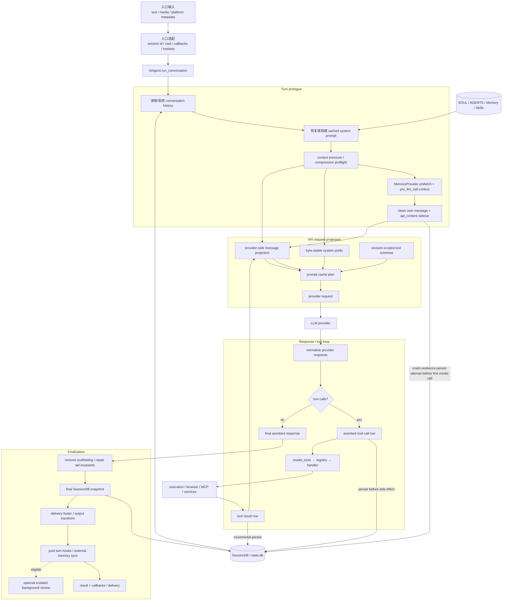
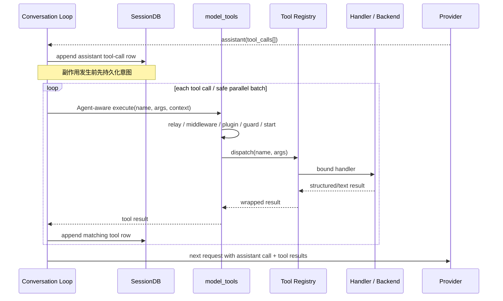

# 顶层数据流

## 研究结论

一次 Hermes 回合同时维护三种不同视图，理解它们的分离是理解整个系统的钥匙：

1. **展示视图**：用户在 CLI、TUI、Desktop 或消息平台看到的文本、进度和事件。
2. **API 视图**：实际发送给模型的 system prompt、messages、reasoning replay 和 tool schemas。
3. **持久化视图**：SessionDB 中可恢复、可搜索且保持角色/tool 配对的 canonical transcript。

三者大部分内容相同，但不能假设完全相同。当前轮动态上下文使用 `api_content` sidecar；display metadata 不改变模型语义；synthetic retry scaffolding 不应进入 durable transcript；streamed interim 内容可能早于最终持久化展示。

## 一次 canonical turn 的顶层流向



## 数据在各阶段的形态

### 1. 入口输入与 session envelope

入口先确定不是 prompt 内容、但决定运行语义的 envelope：

- `session_id` / gateway session key / ACP session handle；
- profile 与 `HERMES_HOME`；
- cwd、platform/user/chat/thread metadata；
- enabled/disabled toolsets；
- callbacks、stream/event transport、approval bridge；
- provider/model/reasoning override。

这些数据大多进入 `AIAgent` 构造参数或 ContextVar，不应无差别拼接进用户文本。

### 2. System prompt snapshot

`agent/system_prompt.py` 把 prompt 分为 stable、context、volatile 来源，最终连接为一个字符串并缓存在 `agent._cached_system_prompt`：

```text
identity + tool guidance + skill index
    + SOUL / project context / coding context
    + frozen Memory / USER / provider context / timestamp
    = session system prompt snapshot
```

“volatile”描述构建时的数据来源，并不表示它可以每轮原地变化。当前 session 一旦缓存，整个字符串仍作为 prompt prefix 稳定复用；显式压缩/重建边界才会使其失效。

### 3. Clean `content` 与 API-bound `api_content`

当前用户消息可能有两个相关字段：

| 字段 | 用途 | 典型内容 |
|---|---|---|
| `content` | canonical/display user text | 用户真正输入，适合搜索、恢复和展示 |
| `api_content` | 该轮实际发送给模型的字节级 sidecar | clean text + external memory prefetch + plugin pre-LLM context |

`build_turn_context()` 在 memory/plugin prefetch 完成后一次写入 user row，使 DB 保存“展示了什么”和“模型实际看到了什么”。构造 API messages 时，projection 会用 `api_content` 替换该条消息的 `content`；live canonical message 仍保留 clean content。

这样既避免每轮改写 system prompt，也避免恢复/审计时丢失真实 API 输入。

### 4. Tool schema snapshot

Agent 初始化时根据 platform/toolsets/config 取得工具快照；每次 API 请求使用该 session 获准的 schema：

```text
toolset selection
→ registry definitions
→ check_fn availability gate
→ schema filtering / optional tool-search collapse
→ provider request tools
```

MCP refresh或插件加载会增加 registry generation，但一个已经构造的 Agent 不应被假设会在任意时刻无条件获得新工具；入口通常在 Agent 构造前完成 discovery，必要时显式刷新/重建。

### 5. Provider request 与 normalization

API projection 将内部消息转换成特定 wire shape：

- system prompt 与 messages；
- reasoning/codex message replay sidecars；
- tool schemas 与 cache-control；
- model、reasoning、service tier 和 request overrides。

Provider transport 返回后，adapter/loop 把响应归一为内部 assistant content、reasoning、tool calls、usage 和 finish reason。后续工具与 persistence 逻辑依赖内部形态，而不是直接处理每家 SDK object。

## Tool-call 回路



这里有两个恢复不变量：

1. assistant tool-call row 在执行有副作用的 handler 前进入 canonical store；崩溃后能够知道“模型要求做什么”。
2. 每个 tool call 必须有匹配 result；中断或异常路径会补齐/闭合序列，避免下一次 provider replay 看到非法 transcript。

完整的双 hard-gate、分段并行、approval 分层和 result canonicalization 见 [Canonical 工具回合](../flows/canonical-tool-turn.md)。需注意 aggregate budget 与 `/steer` 会在 per-result flush 后原地改写 live tool row；其冷恢复一致性暂记为 `OPEN-M2-001`，等待 real SessionDB 定向复现。

## 最终响应与投递顺序

正常非流式路径的语义顺序是：

```text
provider final response
→ append/repair final assistant row
→ strip private retry scaffolding
→ final persistence
→ optional delivery footer / transform_llm_output
→ post-turn hooks / external memory sync
→ return result to caller
→ surface-specific final delivery
```

但 streaming、thinking、tool progress 和 interim assistant callbacks 可以在回合尚未完成时已经投影到 UI。最终收尾因此不能假设“用户尚未看到任何内容”；它必须保证 canonical core answer 有可恢复的 assistant row，同时把预览标记与最终交付区分开。

另一个容易混淆的边界是：`finalize_turn()` 在 canonical messages 持久化之后，才可能追加 file-mutation/异常完成说明，或运行 `transform_llm_output`。因此用户最终收到的 delivery projection 不保证与 durable assistant row 逐字相同。正常无变换路径二者相同；发生变换时，`result.final_response`/`response_transformed` 表达展示结果，`result.messages` 与 SessionDB 仍表达 canonical transcript。

`finalize_turn()` 将 trajectory、资源清理和 persistence 分别保护：某个 cleanup 失败会进入 `cleanup_errors`，不应吞掉已经得到的 final response。

## Durable state、live state 与派生数据

| 数据 | 类型 | Owner / store | 是否直接发送给模型 |
|---|---|---|---|
| live `messages` list | live mutable state | 当前 `AIAgent` | 是，经 provider projection |
| system prompt cache | session snapshot | 当前 `AIAgent` + SessionDB session metadata | 是 |
| canonical transcript | durable source of truth | SessionDB messages | 恢复后参与 |
| `api_content` | durable API-fidelity sidecar | SessionDB message row | 仅 projection 时替换 |
| reasoning / provider replay items | durable/adapter metadata | message columns/sidecars | 按 provider mode 选择性发送 |
| display kind/metadata | presentation metadata | SessionDB message row | 否 |
| gateway session key/cache | routing/live state | GatewayRunner/session store | 否 |
| built-in Memory/User profile | durable knowledge | profile files + frozen Agent snapshot | system prompt 构建时 |
| external memory prefetch | per-turn dynamic context | MemoryManager cache + `api_content` | 是，当前 user message |
| Skill body | durable instruction asset | `skills/<name>/SKILL.md` | 被显式加载后作为上下文 |
| Skill index | cached derived prompt data | prompt snapshot/cache file | 是，system prompt 的紧凑索引 |
| tool registry | process-global capability catalog | registry singleton | 只发送过滤后的 schemas |

## Memory 与 Skill 的反馈回路

### Memory

- built-in Memory 工具写入 profile durable store。
- 当前 Agent 的 prompt snapshot 不因这次写入而隐式变化；下一 session 或显式 prompt rebuild 才采用新快照。
- external MemoryProvider 在 turn start prefetch，并在 turn finalization 后同步完成回合。

### Skills

- system prompt 通常只携带 compact index/metadata，而不是全部 Skill body。
- `skill_view` 按需把完整 `SKILL.md` 作为 tool result 带入当前 transcript。
- `skill_manage` 修改 durable Skill 文件；未来 prompt snapshot/index 会反映变化。
- Background Review 可以在主响应之后启动隔离 Agent，提出 Memory/Skill 更新；它不能污染主会话 lifecycle 或继承额外权限。

## Plugin 数据注入点

| 注入点 | 数据方向 | 约束 |
|---|---|---|
| `pre_llm_call` context | plugin → current user `api_content` | 不改写已缓存 system prefix |
| tool request/execution middleware | plugin → args/result control | 必须保持 session tool scope 与 approval 边界 |
| pre/post tool hooks | 双向 observation/directive | 单次调用只触发一次语义 hook |
| turn/session hooks | Agent → plugin | 插件失败不应破坏主响应持久化 |
| plugin tool registration | plugin → registry | Agent 构造/刷新时进入过滤后 schema |
| context engine | plugin → compression strategy | 单选，实现 canonical compression contract |
| memory provider | Agent ↔ provider | user/chat/profile scope 必须保持隔离 |

## 失败与恢复边界

| 失败点 | 已有数据 | 顶层恢复策略 |
|---|---|---|
| turn-start user row 持久化失败 | session row 或 in-memory user input | 记录失败并在后续 flush/finalizer 重试；尚未执行工具副作用 |
| provider 请求失败 | user row + prior transcript | 分类、退避、credential rotation、fallback 或明确失败 |
| tool 执行中崩溃 | assistant tool-call row 已持久化 | 恢复时可识别 incomplete sequence；错误/中断路径补 result |
| tool result 持久化失败 | backend 可能已产生副作用 | 停止继续推理并报告 persistence failure，避免重复盲跑 |
| final cleanup 失败 | final response 已产生 | 独立记录 cleanup error，继续其它收尾并保留 response |
| delivery transform 失败 | canonical assistant row 已持久化 | hook fail-open，返回未变换或已追加安全说明的文本 |
| context overflow | canonical transcript 尚在 | preflight/错误触发 compression，建立/更新 lineage 后重试 |
| 另一个进程写 session | live Agent 可能陈旧 | Gateway 用 message count/session id 检测并重建 cache |

## 关键设计含义

1. **Prompt cache 与审计能力可以兼得。** 动态上下文通过 `api_content` 附着当前 user row，而不是每轮重建 system prompt。
2. **SessionDB 不只是聊天记录。** 它是崩溃恢复、provider replay、compression lineage 和跨进程 cache invalidation 的共同协议。
3. **Tool 调用是一段小事务。** 先保存 assistant intent，再执行 side effect，再保存 result，最后才继续模型循环。
4. **UI events 是 projection。** UI 可以实时显示 reasoning/tool progress，但不能成为 canonical conversation state 的唯一 owner。
5. **Memory 与 Skills 是下一次能力提升的 durable input。** 它们的写入不应偷偷改变当前已缓存前缀。

## 证据索引

| 结论 | 代码证据 | 状态 |
|---|---|---|
| Prologue 集中在 `build_turn_context` | `agent/conversation_loop.py`, `agent/turn_context.py` | verified |
| system prompt 构建后缓存 | `agent/system_prompt.py::build_system_prompt` | verified |
| `api_content` 保存 API 实际输入 | `agent/turn_context.py`, `hermes_state.py::append_message/get_messages_as_conversation` | verified |
| tool schema 来自 session-scoped registry filtering | `model_tools.py::get_tool_definitions`, `tools/registry.py` | verified |
| tool-call intent 先于 handler side effect 持久化 | `agent/conversation_loop.py` incremental persistence path | verified |
| finalizer 修复尾部并最终持久化 | `agent/turn_finalizer.py::finalize_turn` | verified |
| external memory 在 turn start/complete 协作 | `agent/memory_manager.py`, `turn_context.py`, `turn_finalizer.py` | verified |
| UI streaming 与 final result 是不同 projection | Agent callbacks、TUI/Gateway event adapters | verified |

## 后续验证

- M2 将沿 Classic CLI 走一条真实 canonical turn，给每个状态突变补准确 symbol 与测试。
- M3 验证 interrupt、retry、fallback、empty/incomplete recovery 与 persistence failure 时序。
- M4 验证各 provider projection、cache-control 和 compression lineage。
- M6/M7 验证 SessionDB schema、Memory snapshot、Skill load/write 的完整契约。
