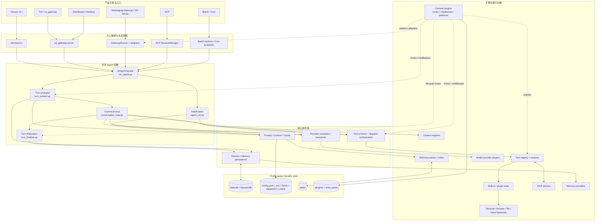

# 一级模块依赖图

## 研究结论

Hermes 的一级架构不是“一个大 Agent 加许多零散功能”，而是一个由入口适配层包围的窄腰：

```text
多种产品与协议
    ↓
入口编排 / 生命周期适配
    ↓
AIAgent + canonical turn runtime
    ↓
Prompt / Provider / Tool / Persistence 四个核心协作面
    ↓
插件、Skill、MCP、执行环境、外部 Provider 等边缘能力
```

`AIAgent` 是共享 façade 和 live state owner；真正的一次回合已经按职责拆到 `agent/` 子模块。能力扩展主要通过注册表、provider interface、hook/middleware、文件化 Skill 和 MCP 进入，而不是不断增加核心类的公开表面。

## 一级模块图



图中的插件虚线不是“Core 直接 import 每个插件实现”。一般路径是 discovery 后把实现注册到稳定的 registry、hook、middleware 或 adapter surface；专用插件类别则由自己的 loader 选择单一实现。

## 分层职责

### 1. 产品与协议入口

入口层负责把用户或系统事件转成 Agent 能消费的一次回合，并把 Agent 事件/结果投影回各自界面：

| 入口 | 入口层特有职责 | 不应复制的核心语义 |
|---|---|---|
| Classic CLI | REPL、Rich/prompt_toolkit、slash command、本地 approvals | provider loop、tool dispatch、SessionDB message contract |
| TUI/Dashboard/Desktop | JSON-RPC、PTY/WS、streaming events、GUI prompts | Agent loop、tool schema、session transcript 语义 |
| Gateway/API | platform event、authorization、session key、queue、delivery | prompt assembly、provider normalization、tool-call loop |
| ACP | ACP session/cwd、protocol updates、edit approval bridge | core Agent turn 与 persistence contract |
| Batch/Cron | 调度、并行 worker、job claim、delivery | fresh Agent 的推理与工具语义 |

入口可以选择 Agent 生命周期：CLI 长期持有一个、Gateway 按 session 缓存、ACP 每 session 持有、Cron/Batch 每次运行新建；它们不应各自实现一套 Agent loop。

### 2. `AIAgent` façade 与 canonical turn

`run_agent.py::AIAgent` 仍是对外主要编程接口和 live state 容器，但当前实现已经有清晰的内部阶段：

| 阶段 | 主要模块 | 责任 |
|---|---|---|
| 构造 | `agent/agent_init.py::init_agent` | provider/runtime、tool snapshot、memory/context engine、callbacks、预算与 session state |
| 回合入口 | `AIAgent.run_conversation` | turn/accounting/relay ContextVar 生命周期，并转发到 canonical loop |
| Prologue | `agent/turn_context.py::build_turn_context` | 清洗输入、恢复/构建 prompt、压缩预检、memory/plugin prefetch、写入最终 user row |
| 主循环 | `agent/conversation_loop.py::run_conversation` | provider 请求、重试/fallback、tool batch、interrupt/steer、compression、预算 |
| 收尾 | `agent/turn_finalizer.py::finalize_turn` | 修复 transcript 尾部、最终持久化、资源清理、hooks、memory sync、background review |

这五层仍通过 `agent` 属性共享大量 live state，因此是“模块化的状态机”，还不是彼此独立的服务。研究时应以阶段契约为边界，不要把文件拆分误读成分布式组件。

### 3. Prompt / Context / Cache

主要责任由以下模块协作：

- `agent/system_prompt.py`：stable/context/volatile tiers，构建后缓存到 Agent。
- `agent/prompt_builder.py`：SOUL、平台提示、context files、Skill index 等无状态组装函数。
- `agent/turn_context.py`：当前轮动态上下文与 `api_content` sidecar。
- `agent/context_engine.py`、`context_compressor.py`：上下文压缩抽象与默认实现。
- `agent/prompt_caching.py`：把稳定前缀映射到 provider cache-control 布局。

这一协作面的核心边界是：system prompt 是 session 级快照；当前轮才产生的 memory/plugin context 应进入 API-bound user content，而不是改写历史前缀。

### 4. Provider Runtime

Provider 面吸收入口之外的模型差异：

- `hermes_cli/runtime_provider.py` 与 provider profiles 解析 provider/model/credential/base URL/api mode。
- `agent/transports/`、Anthropic/Codex adapters 等处理 wire protocol 和 response normalization。
- conversation loop 在 `chat_completions`、`codex_responses`、`anthropic_messages`、`bedrock_converse` 等模式之间分支，但向上仍产出统一 assistant/tool-call 语义。
- credential pool、fallback chain 和错误分类属于回合可靠性，而不是 UI 责任。

### 5. Tool Runtime

工具侧的依赖链是项目最清晰的窄腰之一：

```text
toolsets.py
    ↓ 解析一次 session 获准的工具名
model_tools.py
    ↓ schema 过滤、middleware/hook、参数修复、统一错误包装
tools/registry.py
    ↓ schema + handler + metadata binding
tools/*.py / plugin / MCP registrations
    ↓
local / Docker / SSH / cloud / browser / network backends
```

`tools/registry.py` 不反向依赖具体工具；具体工具在 import 时自注册。`model_tools.py` 是 Agent loop 与 registry 之间的 orchestration layer，而不是所有工具实现的集合。

### 6. Persistence 与长期状态

Persistence 不是单个模块：

- `SessionDB` 保存 canonical transcript、reasoning/tool metadata、session lineage 和检索索引。
- built-in Memory 以 profile 文件为 durable store，并在 session prompt 中使用冻结快照。
- `MemoryManager` 协调外部 MemoryProvider 的 turn-start prefetch、system block 与 post-turn sync。
- Skills 是带 `SKILL.md` 的文件化指令资产，通过 index、`skill_view` 和 `skill_manage` 渐进加载。
- Gateway 另有 session routing/cache state，但它不替代 canonical SessionDB。

## 扩展面与专用 loader

| 扩展类别 | 发现/选择 owner | 接入核心的方式 | 生命周期特征 |
|---|---|---|---|
| General plugin | `hermes_cli.plugins::PluginManager` | tools、hooks、middleware、CLI/slash、aux tasks | 多个可同时启用 |
| Gateway platform plugin | PluginManager 的延迟 platform loader | `BasePlatformAdapter` / `MessageEvent` | 按配置平台加载 |
| Memory provider | `plugins/memory/__init__.py` | `MemoryProvider` → `MemoryManager` | 单选 active provider |
| Context engine | `plugins/context_engine/__init__.py` | `ContextEngine` | 单选 active engine |
| Model provider | `providers/__init__.py` | `ProviderProfile` / runtime resolution | lazy discovery，按 provider 使用 |
| Tool plugin | Plugin context → global tool registry | schema/handler/check_fn | 进入 session tool snapshot 前注册 |
| Skill | filesystem discovery/index | Prompt index + explicit `skill_view` | 文档式、渐进披露，不执行 import |
| MCP | MCP startup/discovery | 动态注册 tool schemas/handlers | 服务配置门控，可刷新 registry generation |

General PluginManager 会跳过 `memory/`、`context_engine/` 和 `model-providers/` 的直接加载，避免同一专用实现被导入两次或破坏“单选 provider”语义。

## 依赖方向与设计规则

1. **入口依赖 Agent，Agent 不依赖具体 UI。** Agent 通过 callbacks/events 暴露进度和交互需求。
2. **Agent loop 依赖工具 orchestration，不依赖具体 backend。** registry 和 environment abstraction 吸收实现差异。
3. **扩展通过注册面进入。** Plugin/MCP/Skill 应停留在边缘，除非能力满足 core tool 的严格门槛。
4. **Persistence 是共享基础设施，不是全局 live-state owner。** 每个进程创建连接或 wrapper，通过 durable contract 协调。
5. **Provider 特异性向下收敛。** UI 与普通 tool handler 不应关心 Anthropic/Codex/OpenAI wire shape。
6. **Prompt 与 Tool schema 都影响每次 API 调用成本。** 因而缓存稳定性和窄工具面是同一类“每轮永久税”约束。

## 复杂度热点

- `AIAgent` façade 与拆出的阶段模块仍共享大量 attributes，阶段之间的隐式状态契约较多。
- `conversation_loop.py` 同时承担多 API mode、重试、压缩、工具执行和交互控制，是后续状态机研究中心。
- `model_tools.py` 同时承载 registry bridge、middleware、hooks、approval 和特殊工具语义，是工具侧的主要 orchestration hotspot。
- Gateway 的 session routing、Agent cache 和 canonical SessionDB 是两套互补状态，容易被误认为重复 persistence。
- PluginManager 加专用 loader 的多轨发现是刻意设计，但必须维护清晰的“谁拥有哪个类别”规则。

## 证据索引

| 结论 | 代码证据 | 状态 |
|---|---|---|
| `AIAgent.__init__` 转发到独立初始化模块 | `run_agent.py::AIAgent.__init__`, `agent/agent_init.py::init_agent` | verified |
| canonical turn 分为 prologue/loop/finalizer | `agent/conversation_loop.py::run_conversation`, `turn_context.py`, `turn_finalizer.py` | verified |
| tool orchestration 经 registry 分发 | `model_tools.py`, `tools/registry.py` | verified |
| tool modules 以 import-time registration 接入 | `model_tools.py::discover_builtin_tools`, `tools/*.py` | verified |
| SessionDB 是 canonical transcript store | `hermes_state.py::SessionDB`, turn persistence sites | verified |
| prompt tier 与 session cache | `agent/system_prompt.py` | verified |
| General PluginManager 跳过专用类别 | `hermes_cli/plugins.py::PluginManager._discover_and_load_inner` | verified |
| Memory/Context/Model provider 各有 loader | `plugins/memory/`, `plugins/context_engine/`, `providers/__init__.py` | verified |

## 后续深入边界

- 本图只说明稳定依赖方向，不证明各阶段的完整状态机；M2/M3 逐语句验证 canonical turn。
- Prompt cache、compression 和 provider adapter 在 M4 展开。
- Tool registry、middleware、approval 和环境后端在 M5 展开。
- SessionDB、Memory 和 Skills 的 schema/读写契约分别在 M6/M7 展开。
- Gateway/Plugin 的运行时细节在 M9 展开。
