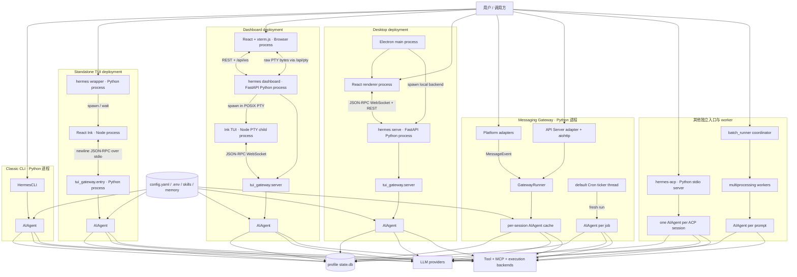
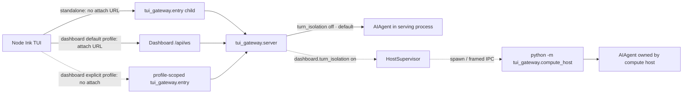

# 进程与部署模型

## 研究结论

Hermes 的“共享 Agent Core”是**代码与行为内核的复用**，不是一个所有入口都通过网络调用的中央 Agent 服务。不同产品入口会在自己的 Python 运行时中构造 `AIAgent`；TUI、Dashboard 和 Desktop 再通过 stdio、PTY 或 WebSocket 把呈现层与该运行时连接起来。

这带来四个顶层事实：

1. Classic CLI 是最直接的单进程路径：`HermesCLI` 与 `AIAgent` 在同一 Python 进程。
2. 独立 TUI 是 Node/Ink 父界面加 Python JSON-RPC 子进程；Dashboard 中的 TUI 通常改为连接 FastAPI 进程内的同一 JSON-RPC dispatcher。
3. Desktop 是独立 Electron/React 界面，启动或连接 `hermes serve`，不嵌入 TUI，也不依赖 Dashboard SPA。
4. API Server 和 Cron 默认不是独立 daemon：API Server 是 Gateway 的一个平台适配器；Cron 的内建 ticker 寄宿在 Gateway 或 Desktop 后端中。

## 图例

- 实线：默认请求或控制路径。
- 虚线：配置门控、兼容回退或特定部署才存在的路径。
- 标有“进程”的节点代表 OS 进程；`deployment` 分组只表达一次产品启动涉及的协作进程，不表示它们共享地址空间。
- `state.db` 表示 profile-aware `HERMES_HOME` 下的 canonical SessionDB；并不意味着所有进程共享同一个数据库连接。

## 默认本地部署图

这张图有意省略多 profile multiplex、远程 Desktop 连接、服务管理器、浏览器/终端后端内部进程，以及 Agent 自己创建的 delegation 子任务；它们将在对应模块展开。

## 可选与分支部署

`dashboard.turn_isolation` 在当前基线默认是 `false`。启用后，尚未在服务进程中构造 live agent 的 lazy/dashboard session 可以交给 compute-host 子进程；已经构造的 in-process session 保持原路径。它是故障与资源隔离机制，不应画成每个 TUI/Desktop 回合的固定中间层。

## 入口逐项说明

### Classic CLI 与直接 Agent 入口

- `pyproject.toml` 将 `hermes` 指向 `hermes_cli.main:main`，将 `hermes-agent` 指向 `run_agent:main`。
- `hermes chat`/默认 chat 由 `hermes_cli.main.cmd_chat()` 选择 TUI 或 classic CLI；classic 路径调用 `cli.main()`。
- `cli.main()` 构造一个 `HermesCLI`，其初始化路径构造并持有一个 `AIAgent`。后续轮次复用该对象与会话状态。
- 因此 Classic CLI 没有 IPC 边界；终端呈现、SessionDB 访问和 Agent loop 都在同一 Python 进程。

### Standalone TUI

1. `hermes_cli.main._launch_tui()` 解析/构建 TUI bundle，启动 Node `entry.js` 并等待退出。
2. `ui-tui/src/gatewayClient.ts::start()` 在没有 `HERMES_TUI_GATEWAY_URL` 时启动 `python -m tui_gateway.entry`。
3. Ink 与 Python 子进程使用逐行 JSON-RPC over stdio；stdout 必须保持协议专用，诊断写 stderr。
4. `tui_gateway.entry` 和 WebSocket transport 共用 `tui_gateway.server.dispatch`；session 首次真正需要 Agent 时由 `_make_agent()` 懒构造 `AIAgent`。

这里至少有三个 OS 进程：启动包装器、Node TUI、Python gateway。包装器等待 Node，因此不是常驻服务；关键长期边界是 Ink ↔ `tui_gateway.entry`。

### Dashboard

Dashboard 是一个 FastAPI 服务，但主聊天体验不是 React 重写的 chat：

- Browser 的 `/chat` 页面用 xterm.js 连接 `/api/pty`。
- `/api/pty` 通过 `PtyBridge` 启动“`hermes --tui` 实际会运行的 Node/Ink argv”，并双向搬运原始 PTY 字节。
- 对当前 profile，服务端向 PTY child 注入 `HERMES_TUI_GATEWAY_URL`；Ink 因而连接同一 FastAPI 进程的 `/api/ws`，不再启动自己的 `tui_gateway.entry`。
- 对显式 profile-scoped chat，不能复用 Dashboard 进程当前 profile 的 in-memory gateway，因此不注入 attach URL；Ink 会启动继承目标 `HERMES_HOME` 的 `tui_gateway.entry`。
- `/api/pub` 与 `/api/events` 是结构化事件 sidecar，用来让 React 边栏观察 PTY 内 Agent 事件，而不接管 transcript/composer。

所以“Dashboard → TUI”正确描述产品体验，但进程图必须同时表达 FastAPI 内嵌 JSON-RPC dispatcher 和 PTY child。

### Electron Desktop

- Electron renderer 是独立 chat surface，不嵌入 Ink TUI，也不以 Dashboard 前端作为运行时依赖。
- Electron main 默认生成 `serve --host 127.0.0.1 --port 0` 参数并启动本地 Hermes Python 后端；renderer 通过共享的 WebSocket/REST 客户端连接它。
- `hermes serve` 与 `hermes dashboard` 共用 `cmd_dashboard()`/`start_server()` 后端实现，但设置 headless 模式：不构建也不挂载 SPA。
- 对不认识 `serve` 的旧 Hermes runtime，Electron 才把 argv 改写为 `dashboard --no-open`，这是升级兼容路径，不是当前架构主路径。
- Desktop 也可以选择远程 backend；此时 Electron 不拥有远端进程，只持有连接描述。

### Messaging Gateway 与 API Server

- `gateway.run.start_gateway()` 创建长驻 `GatewayRunner`，加载并连接平台 adapters。
- adapter 将平台差异收敛成 `MessageEvent`，Gateway 完成鉴权、session routing、排队和 delivery。
- 普通会话的 `AIAgent` 按 session key 缓存在 `GatewayRunner._agent_cache`；配置签名、SessionDB message count 或 session id 不一致时会失效并重建。
- `APIServerAdapter` 是 `Platform.API_SERVER` 的 adapter，由 `GatewayRunner` 创建并回填 runner 引用；它在同一进程内启动 aiohttp listener。
- API Server 的 HTTP/SSE route 会触发 Agent 工作，但它不提供持久 outbound channel，`supports_async_delivery = false`。因此它不能被误画成 Dashboard `/api/ws`，也不是独立的 `hermes serve`。

### Cron

- `hermes cron ...` 管理 durable job；它本身不是负责持续触发的 daemon。
- 默认 `InProcessCronScheduler` 是阻塞 ticker，由 Gateway 放入 daemon thread；Desktop-spawned `hermes serve` 在没有 Gateway 时也启动相同 provider。
- tick 领取 due job 后，`cron.scheduler.run_job()` 为该次运行构造 fresh `AIAgent`，使用独立 cron session id，并默认 `skip_memory=True`，避免 cron prompt 污染用户画像。
- 外部 scheduler provider 可以替代触发轴；执行仍通过共享的 `run_one_job()`/`run_job()` 语义。
- tick lock 保护同一 `HERMES_HOME` 下的重复触发，因此 Gateway 与 Desktop 后端同时存在时不会简单地双发同一 job。

### ACP

- `hermes-acp`/`hermes acp` 启动 Python stdio ACP server；stdout 保留给 ACP JSON-RPC。
- `SessionManager` 为每个 ACP session 持有一个 `AIAgent`，并把会话持久化到共享 SessionDB，使 IDE 重连后可恢复。
- Agent 的同步运行通过 executor 从 async ACP server 调用；workspace cwd 会绑定到 session/task，使工具在编辑器工作区执行。

### Batch Runner

- `batch_runner.py` 是独立协调器，使用 `multiprocessing.Pool` 并行处理 batch。
- worker 为每个 prompt 构造 fresh `AIAgent`，用独立 task id 隔离执行环境。
- batch 默认跳过项目 context 和 persistent memory，主要产出 trajectory/训练数据，而不是交互式长期会话。

## 状态与 ownership

| 状态 | 典型 owner | 跨进程共享方式 |
|---|---|---|
| 当前 live `AIAgent` | CLI 对象、TUI gateway session、Gateway cache、ACP session 或 Cron/Batch worker | 不直接共享；通过持久化后重建 |
| Conversation transcript | `SessionDB` / `state.db` | profile-aware SQLite；各进程持有自己的连接 |
| Gateway routing/session key | `GatewayRunner` + gateway session store | Gateway 内存与专用 routing state；不替代 SessionDB |
| TUI structured events | `tui_gateway.server` dispatcher | stdio JSON-RPC、WebSocket 或 `/api/pub` sidecar |
| Cron jobs与领取状态 | cron store + scheduler provider | durable store 与 tick/claim lock |
| Config、Memory、Skills | 当前 profile 的 `HERMES_HOME` | 文件系统读取；显式 profile 必须传播到 child process |
| Tool/backend live handles | owning Agent/process registry | 通常只在 owner 进程有效；SessionDB 只保存可恢复语义状态 |

## 关键设计含义

### 1. 共享内核不等于单体服务

Provider resolution、prompt assembly、tool runtime 和 turn loop 被各入口复用，但每个入口可以选择自己的生命周期、并发模型和 UI transport。这样 CLI 不需要依赖 daemon，Gateway 可以长驻缓存 Agent，Batch 可以多进程隔离。

### 2. SessionDB 是恢复边界，live object 不是

跨进程连续性依赖 canonical transcript、session metadata 和 profile path，而不是序列化一个正在运行的 `AIAgent`。当另一个进程修改同一 session 时，Gateway 会通过 message count/session id 检查使缓存失效。

### 3. 展示 transport 不应改变 Agent 语义

stdio 与 WebSocket 都复用 `tui_gateway.server.dispatch`；Dashboard PTY 复用真实 Ink TUI。复用的是协议和运行时，而不是复制一套命令、approval 或 tool-progress 逻辑。

### 4. Profile 是部署边界的一部分

`HERMES_HOME` 决定配置、凭据、skills、memory 和 `state.db`。Dashboard 明确 profile chat 不能附着到错误 profile 的 in-process gateway，说明 profile propagation 不是普通 UI 参数，而是 Agent 构造前必须确定的运行时边界。

## 证据索引

| 结论 | 主要代码证据 | 状态 |
|---|---|---|
| CLI 与 Agent 同进程 | `hermes_cli/main.py::cmd_chat`, `cli.py::main`, `cli.py::HermesCLI` | verified |
| TUI 启动 Node，再启动/连接 Python gateway | `hermes_cli/main.py::_launch_tui`, `ui-tui/src/gatewayClient.ts::start` | verified |
| stdio 与 WS 共用 dispatcher | `tui_gateway/entry.py::main`, `tui_gateway/ws.py::handle_ws`, `tui_gateway/server.py::dispatch` | verified |
| Dashboard PTY 复用 Ink TUI | `hermes_cli/web_server.py::_resolve_chat_argv`, `pty_ws`, `hermes_cli/pty_bridge.py` | verified |
| Desktop 启动 headless `serve` | `apps/desktop/electron/main.ts::startHermes`, `apps/desktop/electron/backend-command.ts`, `hermes_cli/main.py::cmd_dashboard` | verified |
| Gateway 缓存 per-session Agent | `gateway/run.py::GatewayRunner`, `_agent_cache`, Agent turn executor | verified |
| API Server 是 Gateway adapter | `gateway/run.py::_create_adapter`, `gateway/platforms/api_server.py::APIServerAdapter` | verified |
| Cron ticker 寄宿 Gateway/Desktop，run 构造 fresh Agent | `cron/scheduler_provider.py`, `gateway/run.py::start_gateway`, `hermes_cli/web_server.py::_lifespan`, `cron/scheduler.py::run_job` | verified |
| ACP 每 session 持有 Agent | `acp_adapter/session.py::SessionManager`, `acp_adapter/entry.py::main` | verified |
| Batch 多进程、每 prompt Agent | `batch_runner.py::BatchRunner`, `_process_single_prompt`, `_process_batch_worker` | verified |
| compute-host 是默认关闭的可选隔离 | `tui_gateway/server.py::_DASHBOARD_TURN_ISOLATION_DEFAULT`, `_session_uses_compute_host`, `tui_gateway/host_supervisor.py` | verified |

## 尚待后续里程碑展开

- `AIAgent` 在各入口中拿到的 toolset、callbacks、reasoning 和 persistence 参数差异；进入 M2/M9。
- SessionDB connection、WAL、lineage 与 gateway routing 的准确 ownership；进入 M6。
- Gateway busy queue、agent cache eviction 和并发 turn slot；进入 M9。
- delegation、terminal backend、browser backend 和 MCP 自身创建的子进程/远端资源；进入 M5/M8。
- 多 profile Gateway multiplex 与 Desktop backend pool；进入 M9。
