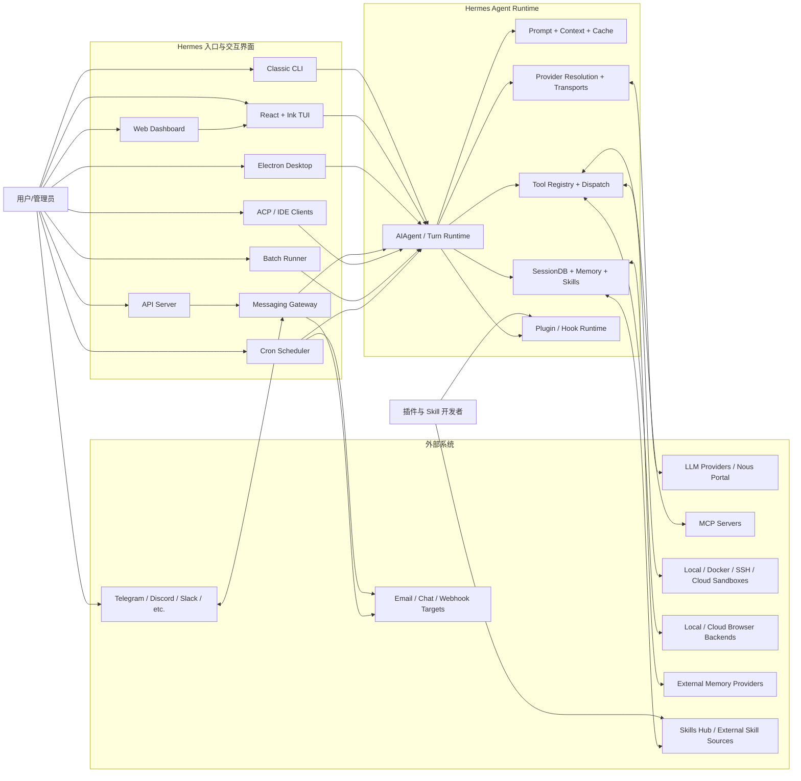

# 系统上下文图

## 研究目的

这张图回答“谁与 Hermes 交互、请求从哪里进入、Hermes 依赖哪些外部系统”。它暂不表达线程、子进程和模块内部结构；这些内容进入后续进程图和组件图。

## 第一版图

## 已验证的边

| 边 | 初始证据 | 状态 |
|---|---|---|
| CLI → AIAgent | `hermes_cli/main.py::cmd_chat`, `cli.py::main`, `HermesCLI` | verified：同一 Python 进程 |
| Gateway → AIAgent | `gateway/run.py::GatewayRunner` 与 `_agent_cache` | verified：按 session 缓存并在状态漂移时重建 |
| TUI → Python runtime | `ui-tui/src/gatewayClient.ts`, `tui_gateway/entry.py`, `tui_gateway/ws.py` | verified：stdio child 或 WebSocket attach，共用 dispatcher |
| Dashboard → TUI | `hermes_cli/web_server.py::_resolve_chat_argv`, `pty_ws` | verified：主聊天通过 POSIX PTY 嵌入真实 Ink TUI |
| Desktop → Python runtime | `apps/desktop/electron/main.ts`, `electron/backend-command.ts` | verified：通过 headless `hermes serve`/JSON-RPC |
| API Server → Gateway/AIAgent | `gateway/run.py::_create_adapter`, `gateway/platforms/api_server.py` | verified：Gateway 内 aiohttp platform adapter，不是 Dashboard API |
| ACP → AIAgent | `acp_adapter/entry.py`, `acp_adapter/session.py::SessionManager` | verified：每个 ACP session 持有 Agent |
| Batch → AIAgent | `batch_runner.py` | verified：multiprocessing worker 为每个 prompt 建 Agent |
| Cron → AIAgent | `cron/scheduler_provider.py`, `cron/scheduler.py::run_job` | verified：ticker 寄宿 Gateway/Desktop，每次 job 建 fresh Agent |
| Agent → Provider runtime | `hermes_cli/runtime_provider.py`, `agent/transports/` | 待 M4 深入 |
| Agent → Tool runtime | `model_tools.py`, `tools/registry.py` | 待 M5 深入 |
| Persistence → SessionDB | `hermes_state*.py` | 待 M6 深入 |
| Tool runtime → execution backends | `tools/environments/` | 待 M5 深入 |
| Persistence ↔ external memory | `agent/memory_manager.py`, `plugins/memory/` | 待 M6 深入 |

## 图中刻意简化的部分

- TUI 并不在同一进程中直接调用 `AIAgent`，图中的边表示产品级请求流；进程级细节见 [process-model.md](./process-model.md)。
- Dashboard 的配置页面是 React/FastAPI，而主聊天区嵌入 TUI；图中只突出主聊天链路。
- Desktop 是独立 React 聊天表面，不嵌入 Dashboard 或 TUI。
- API Server 是 Gateway platform adapter；图中单列是为了表达外部 HTTP 入口，而不是独立 daemon。
- Cron 的投递和 Gateway 会话不是同一 Session；scheduler 默认寄宿 Gateway 或 Desktop backend，但执行使用 fresh Agent。
- Memory、Skills 和 SessionDB 暂时合并为 Persistence；模块研究时会拆开。

## 配套视图与后续验证

- [进程与部署模型](./process-model.md) 展开真实 OS 进程和 stdio/PTY/WS 边界。
- [一级模块依赖](./module-map.md) 展开 Agent Core 的窄腰与扩展边缘。
- [顶层数据流](./data-flow.md) 区分 live、API-bound 和 canonical persistence 视图。
- M2 将比较各入口传给 `AIAgent` 的构造参数，并逐 symbol 验证 Classic CLI canonical turn。
