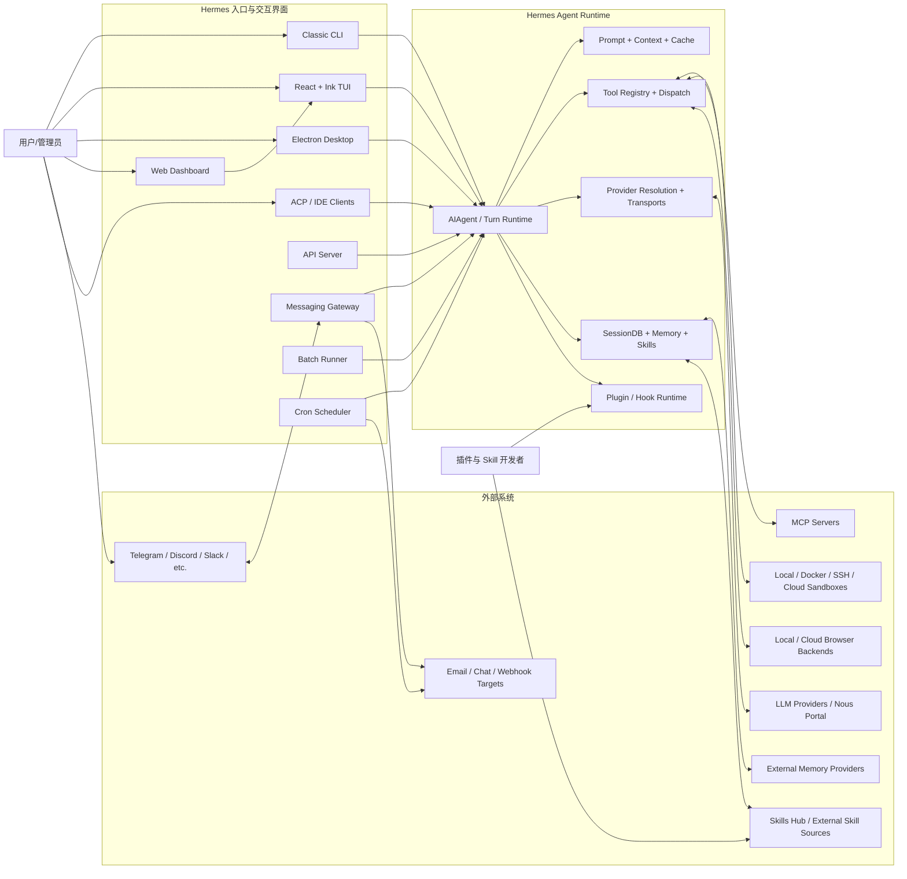

# 系统上下文图

## 研究目的

这张图回答“谁与 Hermes 交互、请求从哪里进入、Hermes 依赖哪些外部系统”。它暂不表达线程、子进程和模块内部结构；这些内容进入后续进程图和组件图。

## 第一版图

## 已验证的边

| 边 | 初始证据 | 状态 |
|---|---|---|
| CLI → AIAgent | `cli.py`, `run_agent.py` | 需在 M2 追踪准确构造点 |
| Gateway → AIAgent | `gateway/run.py`, 架构文档 | 需验证 agent cache 与每轮复用方式 |
| TUI → Python runtime | `ui-tui/README.md`, `tui_gateway/` | 已验证为 JSON-RPC 边界，待画进程图 |
| Dashboard → TUI | 根 `AGENTS.md` Dashboard 架构说明 | 已验证：主聊天通过 PTY 嵌入 TUI |
| Desktop → Python runtime | `apps/desktop/README.md`, 根 `AGENTS.md` | 已验证：通过 `hermes serve`/JSON-RPC，待画进程图 |
| Agent → Provider runtime | `hermes_cli/runtime_provider.py`, `agent/transports/` | 待 M4 深入 |
| Agent → Tool runtime | `model_tools.py`, `tools/registry.py` | 待 M5 深入 |
| Persistence → SessionDB | `hermes_state*.py` | 待 M6 深入 |
| Tool runtime → execution backends | `tools/environments/` | 待 M5 深入 |
| Persistence ↔ external memory | `agent/memory_manager.py`, `plugins/memory/` | 待 M6 深入 |

## 图中刻意简化的部分

- TUI 并不在同一进程中直接调用 `AIAgent`，图中的边表示产品级请求流；进程级细节将在 `process-model.md` 展开。
- Dashboard 的配置页面是 React/FastAPI，而主聊天区嵌入 TUI；图中只突出主聊天链路。
- Desktop 是独立 React 聊天表面，不嵌入 Dashboard 或 TUI。
- Cron 的投递和 Gateway 会话不是同一 Session，后续需要在端到端时序中表达。
- Memory、Skills 和 SessionDB 暂时合并为 Persistence；模块研究时会拆开。

## 下一轮验证任务

1. 为每个入口定位实际命令和 Agent 构造符号。
2. 区分常驻 Agent、每请求 Agent、cached Agent 和 child Agent。
3. 确认 API Server、ACP 和 Batch 是否共享完全相同的 Turn Runtime。
4. 创建进程/部署图，展开 TUI、Desktop、Dashboard 和 Gateway。

