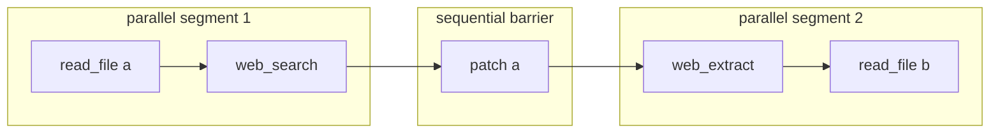

# Canonical 工具回合

本文从模型返回 `assistant.tool_calls` 开始，追踪一次成功的 registry 工具调用，直到匹配的 `tool` result 成为下一次 Provider 请求的一部分。随后叠加 invalid call、并行批次、中断、权限拒绝和持久化失败分支。

这里最重要的结论不是“模型调用一个 Python 函数”，而是 Hermes 把工具回合实现成一个带恢复约束的小型事务：

1. 先持久化模型的工具意图；
2. 再允许副作用和 UI start projection；
3. 执行、规范化并 append 匹配结果；
4. 再持久化结果；
5. 最后才允许 completion projection 和下一次模型调用。

SessionDB 因此接近 tool runtime 的 write-ahead record，而不仅是回合结束时保存聊天记录的归档层。

## 范围与前置条件

主路径假设：

- Classic CLI 已经通过 `build_turn_context()` 建立 canonical `messages`；
- Provider 返回一个合法、已启用的普通 registry tool call；
- 工具未被 plugin、guardrail、ACP 或 handler-native approval 拒绝；
- SessionDB 可写；
- 工具返回文本结果，随后模型再返回最终 assistant 文本。

不在本单元深入展开：

- 单个工具 handler 的业务实现；
- tool schema 的发现和 toolset 装配；
- terminal/file/browser 的具体审批规则；
- 下一回合的 context compression 决策。

这些分别属于 M5 Tool Runtime、M4 Prompt/Context 和 M10 Security。

## 主时序：一个成功的 registry 工具

```mermaid
sequenceDiagram
    autonumber
    participant P as Provider
    participant L as conversation_loop
    participant DB as SessionDB
    participant UI as Surface callbacks
    participant E as tool_executor
    participant MW as Relay + Hermes middleware
    participant POL as Plugin / Guardrail / Approval
    participant D as model_tools + registry

    P-->>L: assistant(content?, tool_calls=[call_1])
    L->>L: normalize ids/names; cap and deduplicate calls
    L->>L: append canonical assistant_msg
    L->>DB: flush assistant tool-call row
    alt intent persistence fails
        DB-->>L: false / exception
        L-->>L: failed=true; session_persistence_failed
        Note over L,D: no interim UI and no tool side effect
    else intent is durable
        DB-->>L: success
        L-->>UI: interim assistant projection
        L->>E: _execute_tool_calls(...)
        E->>E: one call => sequential path
        E->>MW: relay_tools.execute
        MW->>MW: tool-request middleware; execution middleware
        MW->>POL: plugin pre_tool_call / approval
        POL->>POL: loop guardrail before_call
        POL-->>UI: tool.started (allowed calls only)
        POL->>D: handle_function_call(... skip already-run stages)
        D->>POL: ACP edit approval if applicable
        D->>D: registry.dispatch(name, args, context)
        D-->>E: raw/transformed result
        E->>E: result budget, hints, model projection, risk wrapping
        E->>L: append canonical tool result(call_1)
        E->>DB: flush matching tool row
        alt result persistence fails
            DB-->>E: false / exception
            E-->>L: _incremental_persistence_failed=true
            Note over L,P: no tool.completed and no follow-up Provider call
        else result is durable
            DB-->>E: success
            E-->>UI: tool.completed / completion projection
            E->>E: whole-batch budget + pending steer
            E-->>L: return
            L->>P: next request includes assistant intent + tool result
        end
    end
```

图中的 `DB success` 需要精确理解：没有 SessionDB 或显式 persistence-isolated Agent 时，flush 可返回 `None`，执行路径把它视作“没有配置 canonical DB，不构成失败”；只有明确的 `False` 或异常会关闭 hard gate。

## 1. Provider 输出先成为 canonical assistant intent

入口位于 `agent/conversation_loop.py` 的 tool-call branch。正式执行前会先完成：

- 规范化重复 call id；
- 修复或拒绝非法工具名；
- 限制 `delegate_task` fan-out；
- 对完全重复的 calls 去重；
- 构造包含 `content`、`reasoning`、`finish_reason` 和全部 `tool_calls` 的 `assistant_msg`；
- append 到 live canonical `messages`。

混合合法/非法 batch 有一个重要细节：assistant row 保留模型发出的所有 calls；非法 call 立即获得 synthetic error tool row，只有合法子集进入 executor。这样既不执行非法工具，也不破坏 Provider 要求的 call/result 配对。

append 后立即调用：

```text
_flush_messages_to_session_db(messages, conversation_history)
```

这是副作用前的第一道 hard gate。明确失败时：

- 不执行 `_emit_interim_assistant_message()`；
- 不进入 `_execute_tool_calls()`；
- 当前 turn 标记为 `failed`；
- `turn_exit_reason = session_persistence_failed`；
- finalizer 返回可操作的存储失败解释。

其设计目标是：即使一个合法 destructive tool 重启或终止 Hermes，恢复时仍能看到已经执行过的准确工具意图，而不是只有外部副作用、没有 transcript 记录。

## 2. Batch planner：并发是有序区段，不是全局开关

`AIAgent._execute_tool_calls()` 的选择规则是：

| 输入 | 执行路径 |
|---|---|
| 0 或 1 call | sequential |
| 全部可安全并行 | concurrent |
| 全部是 barrier | sequential |
| safe 与 barrier 混合 | ordered segmented |

`_plan_tool_batch_segments()` 把模型顺序切成最大连续区段：



准入规则包括：

- `clarify` 等 interactive tool 永远是 barrier；
- 参数无法解析成 object 时是 barrier；
- 固定 read-only allow-list 可并行；
- MCP tool 只有 server 显式 opt-in 才可并行；
- file reader/writer 先把目标规范化为真实路径；reader-reader 重叠允许，任何包含 writer 的重叠都会切断区段；
- 无法证明安全的工具默认 sequential。

两个不变量始终保留：

1. 后面的 call 不跨越前面的 barrier；
2. concurrent worker 可以乱序完成，但 tool result 必须按模型 emission order append 和 flush。

这使并行化成为局部性能优化，而不是改变 observable transcript 顺序的语义分支。

## 3. 执行管线与单次 dispatch 约束

普通 registry 工具实际经过两层 dispatcher：

- `agent/tool_executor.py` 拥有 Agent-aware lifecycle；
- `model_tools.handle_function_call()` 拥有通用 registry dispatch 与通用 plugin result hook。

准确顺序如下：

```text
relay_tools.execute
  -> apply_tool_request_middleware(skip_relay=True)
  -> run_tool_execution_middleware
  -> single-use authorized_dispatch(final_args)
       -> resolve_pre_tool_block
       -> agent._tool_guardrails.before_call
       -> tool.started + activity + optional checkpoint
       -> model_tools.handle_function_call(
            skip_pre_tool_call_hook=True,
            skip_tool_request_middleware=True,
            skip_tool_execution_middleware=True)
            -> schema argument coercion
            -> ACP edit approval, when bound
            -> registry.dispatch
            -> post_tool_call observer
            -> transform_tool_result
```

Relay 可以先改写参数；后续 plugin、guardrail、approval、checkpoint、展示和真正 handler 都看到最终参数。execution middleware 获得的 callback 有锁保护，只能调用一次；重复调用抛出 `Hermes tool execution callback invoked more than once`，包括 concurrent worker 内的竞态调用。

传给 `handle_function_call()` 的三个 skip flag 是所有权协议，不是跳过安全检查：相应 middleware 和 pre-tool hook 已经由外层 Agent-aware executor 执行。这样普通 registry 路径不会 double-fire hook；ACP edit approval 和 handler-native approval 仍在其各自位置生效。

## 4. Approval 不是一个单点

工具是否可执行由多个不同粒度的 gate 决定，不能把它们画成一个笼统的 `approve()`：

| Gate | 所在位置 | 观察的参数 | 拒绝后的行为 |
|---|---|---|---|
| Tool Search session scope | executor unwrap / `handle_function_call` defense-in-depth | underlying tool + scoped toolsets | synthetic error，handler 不运行 |
| Plugin `pre_tool_call: block` | `resolve_pre_tool_block()` | middleware 后参数 | synthetic blocked result |
| Plugin `pre_tool_call: approve` | `resolve_pre_tool_block()` → `request_tool_approval()` | middleware 后参数 | deny/timeout/error 均 fail-closed |
| Loop guardrail `before_call` | Agent-aware executor | middleware 后参数和本轮重复状态 | synthetic guardrail result，可触发 controlled halt |
| ACP/Zed edit approval | `model_tools.handle_function_call()` | 最终 `write_file`/`patch` 参数 | mutation 前返回拒绝结果；guard 自身异常也 fail-closed |
| Handler-native approval | terminal/file/computer-use 等 handler/helper 内 | handler 理解的具体危险操作 | 由工具自己的策略返回拒绝/超时结果 |

在 concurrent path 中，plugin approval gate 由 `_ConcurrentToolAuthorizationGate` 串行化；等待 approval 的时间从 batch timeout 中扣除。真实 worker 仍可并行，但不会同时弹出多个政策确认。

`tool.started` 发生在 plugin/guardrail 允许之后，却早于 ACP edit approval 和 handler-native approval。因此 started 表示“进入具体执行管线”，不等价于“用户已经批准并发生副作用”。

## 5. Agent-runtime tool 与 registry tool

并不是所有 schema 对应的调用最后都进入 `tools.registry.dispatch()`。executor 对需要访问 Agent live state 的工具直接路由，例如：

- `todo`、`memory`、`session_search`、`clarify`；
- `delegate_task`；
- context-engine tools；
- external memory-provider tools；
- 某些 terminal/read-terminal 辅助路径。

这些路径仍共享外层 relay、request/execution middleware、plugin pre-hook、guardrail、start/checkpoint 和 result persistence，但真正的 `execute` callback 直接调用 Agent/manager 方法。

post hook 的所有权也因此分裂：

- registry path 由 `handle_function_call()` 发出 `post_tool_call`，并支持通用 `transform_tool_result`；
- inline Agent-runtime path 由 executor 补发 terminal post event。

当前代码中不能假设所有 inline path 都经过通用 `transform_tool_result`。这会在 M5 按工具类别建立 dispatch matrix 后再下最终结论。

## 6. Tool result 从原始输出到 canonical row

handler 返回后，executor 依次处理：

1. 记录 duration、错误状态和 file-mutation outcome；
2. 执行 after-call guardrail，并可给结果追加改变策略的 guidance；
3. 保留一份 `display_function_result` 给 UI；
4. 单结果过大时把完整输出写入 active execution backend 的临时结果目录，context 只保留 preview/path；无法写入时 inline truncate；
5. 追加 subdirectory context hints；
6. 将 multimodal envelope 投影为当前模型可接受的 content；
7. `make_tool_result_message()` 建立 canonical row；
8. append 后立即 flush SessionDB；
9. flush 成功后才投影 `tool.completed` 和 completion callback。

canonical tool row 同时保存：

- `name`：Provider wire format；
- `tool_name`：SessionDB 字段；
- `tool_call_id`：与 assistant intent 配对；
- `content`：给下一次模型请求和恢复使用；
- 可选 `effect_disposition`：`none` 表示明确未执行，`unknown` 表示 timeout 后副作用未知；
- 内部 `_tool_output_risk` metadata。

`web_search`、`web_extract`、`browser_*`、`mcp_*` 等攻击者可控输出会被语义 delimiter 包裹为 untrusted data。这里的安全策略不是试图用正则识别所有恶意指令，而是改变模型解释这段内容时的信任边界。

## 7. 第二道 hard gate：result persistence

每 append 一个 tool result，`_flush_session_db_after_tool_progress()` 都立即执行。明确失败会：

- 设置 `_incremental_persistence_failed = True`；
- 阻止该 result 的 completion UI projection；
- sequential batch 不再 dispatch 后续 call；
- segmented batch 不再进入后续 segment；
- `conversation_loop` 不把仅存在内存中的结果发送给 Provider；
- turn 以 `session_persistence_failed` 失败退出。

successful tool side effect 已经发生而 result persistence 失败时，Hermes 无法回滚外部世界。它选择停止继续推理并明确报告存储问题，避免模型基于不可恢复状态继续产生更多副作用。

这不是数据库意义上的原子事务，而是 recovery-oriented ordering：

```text
durable intent -> irreversible effect -> durable observation -> further inference
```

## 8. Interrupt、timeout 和非法调用如何闭合配对

| 情况 | 是否执行 handler | 结果 row | `effect_disposition` |
|---|---:|---|---|
| 参数不是合法 JSON object | 否 | invalid-arguments error | 未显式设置 |
| 工具名非法 | 否 | invalid-name error | 未显式设置 |
| plugin/guardrail/scope block | 否 | blocked synthetic result | `none`（部分路径通过 blocked 状态表达） |
| cooperative interrupt，尚未开始 | 否 | cancelled/skipped result | `none` |
| concurrent timeout | 可能仍在 detached worker 中运行 | timeout result | `unknown` |
| concurrent worker 无返回 | 否或未知 | missing-result error | 依分支而定 |
| hard `KeyboardInterrupt` | 当前 call 可能已部分执行 | 为当前和所有剩余 call 补 cancelled row | 当前实现未统一标注 |

核心恢复目标是每个 assistant `tool_call_id` 都有一个 result row，即使 result 只能表达“没有执行”或“副作用未知”。这既维护 Provider protocol，也为 cold-resume cleanup 提供依据。

需要注意一个边界：hard `KeyboardInterrupt` helper 会先向 live list 补齐 cancelled rows再重新抛出；这些 rows 并不逐个走正常 result flush，最终是否 durable 依赖外围退出/finalizer persistence。行为测试已验证 live pairing，持久化强度将在 M11 的 crash matrix 中补充。

## 9. 已验证的行为契约

以下测试源码直接锁定本单元的关键顺序：

| 测试入口 | 锁定的契约 |
|---|---|
| `tests/run_agent/test_tool_call_incremental_persistence.py` | assistant intent 在执行前 flush；失败时不投影、不执行 |
| 同上，real SessionDB abnormal-exit cases | interim assistant 和 tool completion 被 UI 观察前已经可由新 DB connection 读出 |
| 同上，sequential ordering | `dispatch c1 -> flush c1 -> dispatch c2 -> flush c2` |
| 同上，concurrent ordering | worker 可并发，result 仍按 emission order append/flush |
| 同上，failure cases | result flush 失败阻止 completion 和后续 segment |
| `tests/run_agent/test_tool_batch_segmentation.py` | safe/barrier segmentation、path conflict、顺序和整批 steer |
| `tests/run_agent/test_tool_call_guardrail_runtime.py` | relay rewrite 后的 plugin、guardrail、ACP approval、start、checkpoint、dispatch 参数一致 |
| `tests/run_agent/test_run_agent.py` | middleware trace 传递、hook single-fire、execution callback 禁止重复调用 |
| `tests/test_transform_tool_result_hook.py` | `post_tool_call` 先观察原始结果，`transform_tool_result` 随后可替换 context result |

本研究会话没有可用的项目 `.venv`/`venv` pytest executable，因此这里的“verified by tests”表示已阅读明确的行为契约测试源码，不表示本会话实际运行了测试。

## 10. 开放发现：post-flush tool row 的原地改写

当前代码存在一个需要单独复现的持久化一致性窗口：

1. 每个 tool row append 后立即 flush，并被标记 `_db_persisted=True`；
2. 整批结果收集完成后，`enforce_turn_budget()` 可能原地替换某个已持久化 row 的 `content`；
3. 随后 `_apply_pending_steer_to_tool_results()` 可能再次原地追加 steer marker；
4. 两处均未清除 `_db_persisted`，也未使 `_db_flush_scan_prefix` 失效；
5. finalizer 的 `_persist_session()` 因 marker/identity prefix 跳过这些 row。

提交历史进一步说明两边都是有意行为：

- `858bedea02 fix(session): persist tool activity before projection` 引入/强化 result 的先持久化顺序；
- `0fd0db1a8 fix(agent): preserve /steer through turn-budget enforcement` 明确要求 steer 在 aggregate budget 后注入。

但历史中没有看到把预算后/steer 后内容重新写回 SessionDB 的配套步骤。由代码可推断：

- 热运行的下一次 Provider request 看到 budget/steer 后的 live content；
- cold resume 可能读回 budget/steer 前的 durable content；
- 特别是 steer 已从 pending queue drain 后，进程在下一次可靠落库前退出，可能无法从 SessionDB 恢复该 steer。

这暂记为 **OPEN-M2-001**，不在文档研究分支修改生产代码。下一步需要用 real SessionDB 建立三个定向契约：sequential、concurrent、segmented 各自在 budget replacement/steer 后立即模拟冷启动，比较 durable row 与下一次 Provider input。完成复现前不把它宣告为正式 bug。

## 11. 设计判断

工具回合体现了 Hermes 的四个核心设计取向：

1. **恢复优先于展示**：canonical append 是 UI event 的先决条件；UI 是 durable state 的投影。
2. **副作用前记录意图**：SessionDB 在危险边界承担轻量 write-ahead 角色。
3. **窄腰与边缘扩展并存**：Agent-aware executor 统一生命周期，registry、inline tools、MCP、plugin 和 service provider 仍可位于边缘。
4. **并发不改变 transcript 语义**：并发只发生在可证明安全的连续区段，append/result 顺序仍由模型 emission order 决定。

这也是后续 M3 Agent Loop 与 M5 Tool Runtime 应继续使用的观察框架：不要只问“函数调用到了哪里”，而要同时问 canonical state、side effect、projection 和 recovery 各自在什么顺序发生。

## 源码入口

- `agent/conversation_loop.py`：tool-call branch、intent append/flush、result-persistence failure gate。
- `run_agent.py::AIAgent._execute_tool_calls`：batch path selection。
- `agent/tool_dispatch_helpers.py`：segmentation、path conflict、tool-result message 与 untrusted wrapper。
- `agent/tool_executor.py`：middleware、approval/start、sequential/concurrent/segmented execution、result append/flush。
- `model_tools.py::handle_function_call`：Tool Search bridge、registry dispatch、ACP approval、post/transform hooks。
- `tools/registry.py::ToolRegistry.dispatch`：最终 handler lookup 和调用。
- `tools/tool_result_storage.py`：per-result spill 与 aggregate turn budget。
- `agent/agent_runtime_helpers.py::apply_pending_steer_to_tool_results`：role-preserving steer injection。
- `run_agent.py::_flush_messages_to_session_db_unlocked`：intrinsic persistence marker 与 bounded identity scan。
- `agent/turn_finalizer.py::finalize_turn`：最终持久化和有限的 marker invalidation。
