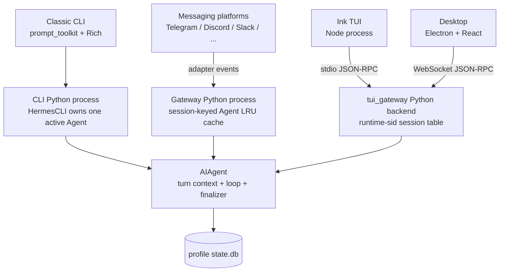
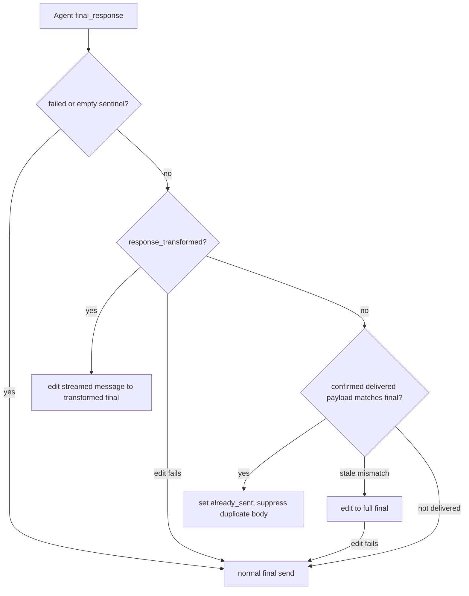

# CLI、Gateway、TUI 与 Desktop 入口对照

Hermes 所谓“所有入口共享同一个 Agent Core”，准确含义是共享同一套 `AIAgent`、turn context、conversation loop、tool runtime 和 SessionDB contract；它不是所有客户端连接到一个永久中央 Agent 服务。

Classic CLI、消息 Gateway 与 `tui_gateway` 都在各自 Python 进程内构造 `AIAgent`。Desktop 不再构造第四种 Agent：它通过 `hermes serve` 的 WebSocket JSON-RPC 使用 `tui_gateway`；standalone Ink TUI 则通过 stdio JSON-RPC 使用同一 backend。

因此入口差异主要集中在四个 outer-shell concern：

1. Agent 实例由谁拥有、何时复用或重建；
2. history/session routing 由谁拥有；
3. 同步 callback 如何桥接到终端、event loop 或 JSON-RPC；
4. 已流式展示的文本如何与最终 delivery projection 合并。

## 总图：相同内核，不同外壳



图中三个 `CORE` 是同一份代码的不同进程内实例，不是同一个内存对象。Dashboard 主聊天嵌入 Ink TUI，因此沿 INK → `tui_gateway` 路径；Desktop 是独立 React transcript/composer，但复用 TG backend protocol。

## 核心对照表

| 维度 | Classic CLI | Messaging Gateway | TUI / Desktop backend |
|---|---|---|---|
| Python owner | `HermesCLI.agent` | `GatewayRunner._agent_cache[session_key]` | `_sessions[runtime_sid]["agent"]` |
| 构造入口 | `cli_agent_setup_mixin._init_agent()` | `TurnRunner.run_sync()` | `tui_gateway.server._make_agent()` |
| 构造时机 | 首次 `chat()` lazy build | cache miss / signature change / coherence invalidation | session create/resume 后 deferred build；首个 prompt 等待 build |
| 跨轮复用 | 当前 CLI 会话复用 | 按 routing `session_key` 复用，LRU/idle 管理 | runtime session 存活期间复用 |
| 重建触发 | route signature 改变，`/new` 等显式边界 | config signature、dead session、跨进程 message-count mismatch、eviction/reset | `/new`、resume/rebuild、model/runtime 需要重建、session reap |
| live history owner | `HermesCLI.conversation_history` | cached Agent `_session_messages` + 每轮加载的 durable transcript | `session["history"]` + `history_lock/version` |
| canonical store | CLI `SessionDB` | async routing/transcript façade 下的 canonical `SessionDB` | profile-scoped `SessionDB` |
| session routing id | `session_id` | `session_key` → `session_id` | runtime `sid` → durable `session_key`; Agent `session_id` 可压缩旋转 |
| turn concurrency | UI/process-loop + Agent worker thread；单当前对话 | asyncio adapters + per-session running guard/turn lease + worker thread | JSON-RPC handler + per-session `running` guard + turn thread |
| platform identity | `platform="cli"` | platform/user/chat/thread/gateway key 全量 metadata | resolved `cli`/`tui`/`desktop` source，session-scoped profile/cwd |
| progress transport | terminal print/boxes/callbacks | sync callback → event-loop scheduling → adapter send/edit | sync callback → JSON-RPC event → Ink/React reducer |
| approval bridge | worker thread重绑 terminal callbacks | ContextVar session key + sync→async platform prompt | blocking request/response event keyed by runtime sid |
| final delivery | CLI 自己决定是否再次 render | stream consumer 与 adapter delivery ledger 决定 send/edit/suppress | backend 总发 `message.complete`，client reducer合并 live state |

## 1. Classic CLI：单一当前 Agent

`HermesCLI` 同时拥有：

- `self.agent`：当前 route 的 live Agent；
- `self.conversation_history`：界面采用的 canonical continuation list；
- `self._session_db` 和 `self.session_id`；
- terminal stream、tool progress、clarify、secret、notice callbacks。

`chat()` 每轮先解析 effective route。若 route signature 与 `_active_agent_route_signature` 不同，会丢弃当前引用并经 `_init_agent()` 重建；否则复用同一个 Agent，从而保留 frozen system prompt、tool schema snapshot、memory/provider live state 和 prompt-cache prefix。

resume 时 `_init_agent()` 从 SessionDB 读取并修复 history，必要时沿 compression lineage 跳到有实际 transcript 的 descendant；cwd/yolo 等 session metadata 同步恢复。构造完成后 Agent 绑定 `platform="cli"`、共享 SessionDB 和当前 callbacks。

每次回合前，CLI 把 exact user dict 暂存到自己的 history；Agent 返回后，CLI 用 `result.messages` 替换 `conversation_history`。这形成清晰的 ownership handoff：

```text
CLI owns history between turns
    -> shallow snapshot + staged user row
Agent owns mutable messages during turn
    -> result.messages
CLI adopts returned list for next turn
```

Agent loop 运行在单独 worker thread；approval/secret 等 thread-local callback 必须在该线程重绑。该并发层让 prompt-toolkit 保持响应、支持 interrupt，但核心 loop 仍是同步状态机。

## 2. Messaging Gateway：session-keyed Agent cache

Gateway 同时服务大量 platform/chat/thread，因此不能像 CLI 只持有一个 Agent。`_agent_cache` 是 `OrderedDict`：

```text
session_key -> (agent, config_signature, message_count_snapshot, session_id)
```

复用同一 Agent 是明确的成本/语义设计：如果每条消息都重建 Agent，就会重建 system prompt、memory snapshot 和 tool schemas，破坏 provider prefix cache。

cache hit 需要同时满足：

- route/config signature 相同；
- cached session 不是已结束的 stale routing artifact；
- 同一 `session_id` 的 durable `message_count` 未被其他进程改变。

message-count guard 用来发现 Dashboard/另一 Gateway 进程对共享 SessionDB 的外部写入。当前进程自己完成一轮写入后会重新 baseline count，避免把自己的正常 append 误判为跨进程修改并在每轮重建 Agent。

cache 还有 LRU cap、idle sweep 和 session-expiry lifecycle。active turn 不会被 eviction 拆掉；soft eviction 保留可恢复的 terminal/browser/background resources 语义，并在需要时提交 end-of-session memory。

### Gateway history 不是简单 `role/content` 数组

每个 inbound event 在 per-session turn lease 内加载 durable transcript，再由 `_build_gateway_agent_history()`：

- 丢弃 `session_meta` 和旧 `system` rows；
- 保留完整 assistant tool_calls/tool result 结构；
- 清理 interrupted/dangling tool tails；
- 清理过期危险确认文本；
- 将 Telegram observed group rows 移出 replay history，作为当前 user turn 的 API-only context；
- 可选给 replay user row 注入 timestamp。

若 SessionDB/FTS 写入异常导致 durable transcript 比同一 cached Agent 的 `_session_messages` 更短，Gateway 会优先保留更长的 live history，避免同进程突然失忆；但仍重跑安全清理。

### Gateway 每轮重绑 surface state

Agent 可以跨轮缓存，callback 却属于当前 event，因此每轮都会重绑：

- `tool_progress_callback`、voice `tool_start_callback`；
- `stream_delta_callback`、`interim_assistant_callback`；
- status/notice/event/step callbacks；
- `clarify_callback`；
- reasoning config、service tier、request overrides；
- user/chat/thread metadata 和 one-turn sidecar notes。

approval session identity 通过 ContextVar 绑定，并把 sync Agent thread 的请求桥接回 asyncio platform adapter。它不能依赖 process-global `HERMES_SESSION_KEY`，否则并发 chat 会把批准请求发往错误线程。

## 3. `tui_gateway`：每个 runtime session 一个 Agent

`tui_gateway` 同时服务两类客户端：

- standalone Ink TUI：stdio JSON-RPC；
- Desktop / web-side structured client：WebSocket JSON-RPC。

backend 的 `_sessions` 以短 runtime `sid` 为 key，每项保存：

- `agent` 与 durable `session_key`；
- `history`、`history_lock`、`history_version`；
- `running`、`inflight_turn`、queued prompt；
- cwd、profile home、source/platform、transport；
- model/reasoning/service-tier per-session overrides；
- attachments、tool UI state 和 slash worker。

Agent 构造可以延迟。`prompt.submit` 先：

1. 取得 per-session running claim；
2. 建立 inflight turn；
3. 确保 SessionDB row 可写，disk-full 在 RPC 层 fail-closed；
4. 触发/等待 deferred Agent build；
5. 在独立 turn thread 调 `_run_prompt_submit()`。

这避免慢 MCP/provider startup 吞掉已经接受的消息。若 build 失败或等待被取消，backend 会产生 terminal error event，并保留足以 resume 的 inflight snapshot。

`_make_agent()` 统一装配 provider、toolsets、routing prefs、session DB、profile、startup skill prompt 和 `_agent_cbs(sid)`。Callbacks 将 tool/reasoning/notice/clarify/approval 等同步事件转换为带 `sid` 的 JSON-RPC events。

每轮开始时，turn thread snapshot `history` 和 `history_version`，把 clean prompt 作为 `persist_user_message`，把 image/reaction/barge-in 等 enrichment 只放进 API-bound `run_message`。回合结束时只有 version 未发生竞争变化才采用 `result.messages`；对合法的 mid-turn model-switch marker 有专门 merge，其余 desync 会展示结果并明确警告未写入 live session history。

Agent compression 改变 `agent.session_id` 后，backend 必须同步 durable `session_key`、slash worker 和后续 lifecycle target。runtime `sid` 保持不变，所以 UI 连接不需要因为 lineage rotation 重新订阅。

## 4. Desktop 不是第四套 Agent runtime

Desktop 的 Electron main process 启动 headless `hermes serve`，renderer 通过共享 WebSocket JSON-RPC client 发 `prompt.submit`。它拥有自己的 React transcript、composer 和 nanostore state，但模型调用、工具、SessionDB、approval 和 session lifecycle 都由 `tui_gateway` backend 执行。

因此：

- Desktop UI optimistic user/pending assistant rows 不是 canonical DB；
- `message.delta`、`message.interim`、`tool.*` 是 live projection；
- `message.complete` 是 turn settle signal；
- session resume/hydrate 从 backend stored session 重新建立客户端视图。

这与 Dashboard 主聊天不同：Dashboard 嵌入真实 Ink TUI 的 PTY，不使用 Desktop React transcript 重新实现主聊天。

## 5. Final delivery：三个不同层级的“已经展示”

理解 delivery 去重必须区分：

| 信号 | 含义 | 不意味着 |
|---|---|---|
| stream delta 已产生 | 模型文本进入 surface pipeline | 用户已经看到完整最终文本 |
| `response_previewed` | 同一最终候选此前作为 interim assistant 被发布 | 任意 commentary 都等于 final |
| `response_transformed` | finalizer 在 streaming/canonical response 后改写了最终展示文本 | transformed 文本已被旧 stream 送达 |
| `final_response_sent` / `final_content_delivered` | Gateway stream consumer 确认平台发送/编辑成功 | 发送内容必然等于最终 `final_response` |
| `already_sent` | Gateway outer delivery 应跳过普通 body send | media/footer 等 side delivery 已完成 |

### Classic CLI

CLI 读取 `response_previewed`，若为真，不再把 final response 作为新的 response box 打印，因为 verify-on-stop candidate 已由 interim callback 展示。普通 streaming 使用 CLI 自己的 `_stream_started/_stream_box_opened` 状态关闭或补全已有 box。

### Messaging Gateway

Gateway 的去重条件更严格，因为一个“send 成功”可能只发送了 partial/stale preview：



`GatewayStreamConsumer` 同时记录 delivery flags 和最后一次 turn-final payload。Gateway 调 `delivered_final_matches(final_response)` 识别成功但 stale 的 finalize；只有实际 final delivery 或精确 preview match 才可 suppress。Plugin 改写后的 response 必须编辑已存在消息；失败时保留普通 final send 兜底。

即使 `already_sent=True`，Gateway 仍单独处理 `MEDIA:` artifact 和可选 runtime footer，然后返回 `None` 让 platform base 不再发送 body。

### TUI gateway + Ink/Desktop clients

`tui_gateway` 不需要把 `response_transformed` 单独发给 client：`message.complete.text` 已经是 authoritative delivery projection。它始终发送 terminal `message.complete`，并只透传 `response_previewed` 帮助 client 判断 sealed interim 是否与 final 是同一候选。

两个客户端的 settle policy 略有差异：

- Ink `turnController` 默认保留 interim boundary 前的独立 assistant segment；只有 `response_previewed=true` 时，final dedupe 才回看所有 sealed interims。
- Desktop `completeAssistantMessage()` 除 `response_previewed` 外，还用双向 prefix continuity 合并普通 tool-boundary interim 与 final；真正不同的 final 仍追加为新 bubble。

这不是 canonical transcript 的两套语义，而是两种 display segmentation policy。二者都把 `message.complete` 的 final text 当权威内容，并由测试锁定各自的去重行为。

## 6. Prompt-cache stability 如何约束入口实现

三个入口都避免“每轮重新构造 Agent”：

- CLI 用 active route signature 保持一个 Agent；
- Gateway 用 session/config signature cache，并只在外部 DB 写入或边界变化时失效；
- TUI backend 把 Agent 固定在 runtime session record 中。

动态内容不会通过修改 cached system prompt 进入当前轮：

- CLI staged input、`@` context 和 image enrichment进入当前 user turn；
- Gateway first-contact/channel/observed context进入 turn sidecar或当前 API-bound message；
- TUI reaction、barge-in、attachment enrichment进入 `run_message`，clean prompt 另作 persistence override。

入口层最大的正确性风险因此不是“调用错一个构造函数”，而是：

1. 过度重建 Agent，导致 cache/cost 退化；
2. 错误复用 stale Agent，导致跨进程 history 或 session identity 分叉；
3. 把 per-turn callback/ContextVar 烘焙进 cached Agent，导致跨会话事件串线；
4. 把 delivery projection误当 canonical history，导致重复展示或漏发最终变换。

## 7. Failure 与恢复对照

| 场景 | CLI | Gateway | TUI/Desktop backend |
|---|---|---|---|
| 首次 Agent build 失败 | `chat()` 返回错误/None，CLI 保持可重试 | 当前 event 返回 provider-auth failure；无 cache insert | `prompt.submit` terminal error，保留/关闭 inflight state |
| turn 中断 | worker flag + pending input requeue | generation/running state + queued/interrupt recursion | per-session interrupt/queued prompt + terminal event |
| 外部进程修改 SessionDB | 下一显式 resume/rebuild采用 DB | message-count guard 主动 invalidates cached Agent | session resume/hydrate；live `history_version` 防同进程竞争覆盖 |
| compression 旋转 session id | CLI adoption 更新 current session | routing entry、cache snapshot、turn lease同步 child id | durable key/slash worker同步，runtime sid不变 |
| streaming final 漏发/过期 | CLI 本地 stream box收尾 | payload match、edit reconcile、normal send fallback | `message.complete` settle；必要时 stored-session hydrate |
| disk full | Agent persistence explanation | failed final 不受 streamed partial suppress | 首次 row RPC fail-closed；mid-turn terminal error 可 toast |

## 8. 行为测试证据

| 测试入口 | 契约 |
|---|---|
| `tests/test_lazy_session_regressions.py`, `tests/cli/` | CLI lazy Agent、history staging、close/resume 边界 |
| `tests/gateway/test_agent_cache.py` | config signature、own-write rebaseline、cross-process message-count invalidation、in-band follow-up reuse |
| `tests/gateway/test_duplicate_reply_suppression.py` | partial stream 不能冒充 final delivery，empty/failure 不得被 suppress |
| `tests/gateway/test_stale_finalize_suppression.py` | delivered payload 与 completed final 不一致时 edit/send reconcile |
| `tests/gateway/test_run_progress_topics.py` | previewed/transformed final 的 platform edit 与 duplicate suppression |
| `tests/tui_gateway/test_failed_turn_retention.py` | deferred build/turn failure产生 terminal frame并保留恢复信息 |
| `tests/tui_gateway/test_finalize_session_persist.py` | backend session finalize 使用 Agent `_session_messages` marker-based flush |
| `ui-tui/src/__tests__/createGatewayEventHandler.test.ts` | Ink interim boundary 与 `response_previewed` 去重语义 |
| `apps/desktop/.../interim-sealing.test.tsx` | Desktop streamed/interim/final settle、prefix continuity 和 genuine multi-segment 保留 |

当前环境没有项目 `.venv`/`venv` pytest executable；本单元对生产代码和测试源码做了静态核对，没有在本会话运行 Python/TypeScript 测试。

## 9. 设计判断

入口架构体现出一种稳定的“narrow-waist library kernel”模式：

- `AIAgent.run_conversation()` 是共同腰部；
- 每个 surface 自己负责 routing、instance lifetime、concurrency 和 presentation；
- SessionDB 提供跨进程 canonical continuity；
- callback/JSON-RPC/adapter 是 presentation projection，不进入核心状态权威；
- Agent reuse 既是性能优化，也是 prompt semantics 的一部分。

这解释了为什么 Hermes 可以同时扩展大量 channel 和 UI，却仍把 core 控制在较窄范围：新增入口通常复用 `AIAgent` contract，复杂度主要留在外围的 session、event 和 delivery adapter 中。

## 源码入口

- Classic CLI：`hermes_cli/cli_agent_setup_mixin.py::_init_agent`、`cli.py::HermesCLI.chat`。
- Messaging Gateway：`gateway/run.py::TurnRunner.run_sync`、`_build_gateway_agent_history`、`_select_cached_agent_history`、`GatewayRunner._run_agent_inner`。
- Gateway delivery：`gateway/stream_consumer.py::GatewayStreamConsumer`、`gateway/run.py::_stream_confirmed_final_delivery` 与 final-send block。
- TUI/Desktop backend：`tui_gateway/server.py::_make_agent`、`_init_session`、`_run_prompt_submit`、`tui_gateway/methods_prompt.py` 的 `prompt.submit`。
- Ink client：`ui-tui/src/app/turnController.ts`、`createGatewayEventHandler.ts`。
- Desktop client：`apps/desktop/src/app/session/hooks/use-message-stream/index.ts`、`gateway-event.ts`。
