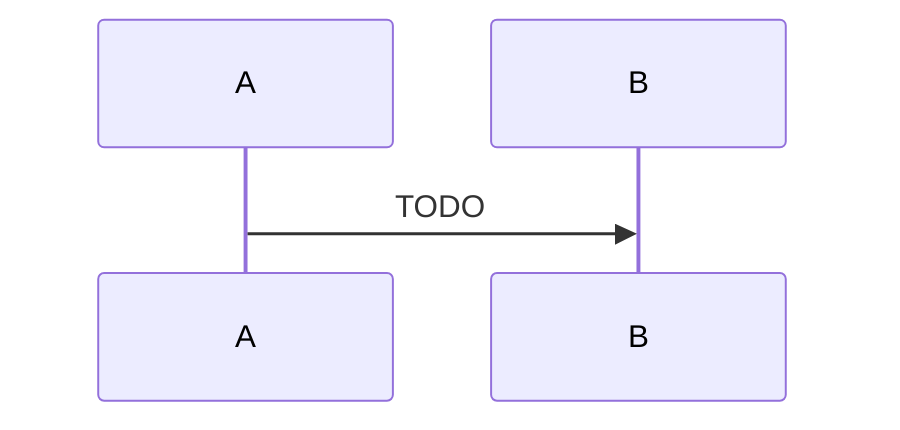

# <模块名>

## 研究问题

1. TODO
2. TODO
3. TODO

## 结论摘要

> 尚未研究。

## 职责与非职责

### 负责

- TODO

### 不负责

- TODO

## 入口与调用者

| 入口 | 调用者 | 说明 |
|---|---|---|
| | | |

## 核心数据结构与状态

| 数据/状态 | Owner | 生命周期 | 持久化位置 |
|---|---|---|---|
| | | | |

## 正常路径

## 失败、恢复与并发路径

| 场景 | 触发条件 | 状态变化 | 恢复机制 |
|---|---|---|---|
| | | | |

## 不变量

| ID | 不变量 | 代码证据 | 测试证据 |
|---|---|---|---|
| | | | |

## 扩展点

| 扩展点 | 稳定性 | 使用者 | 约束 |
|---|---|---|---|
| | | | |

## 源码地图

| 文件/符号 | 作用 |
|---|---|
| | |

## 测试地图

| 测试 | 验证的契约 | 是否运行 |
|---|---|---|
| | | |

## Git 历史与设计意图

- TODO

## 未解决问题

- TODO

## 证据等级

- `verified`：
- `inferred`：
- `historical`：
