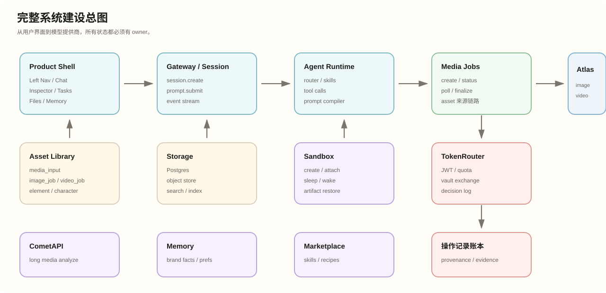
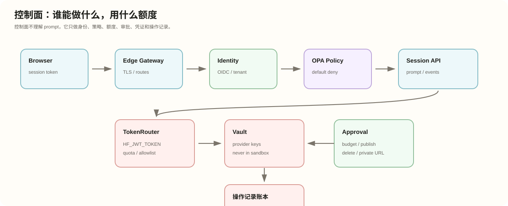
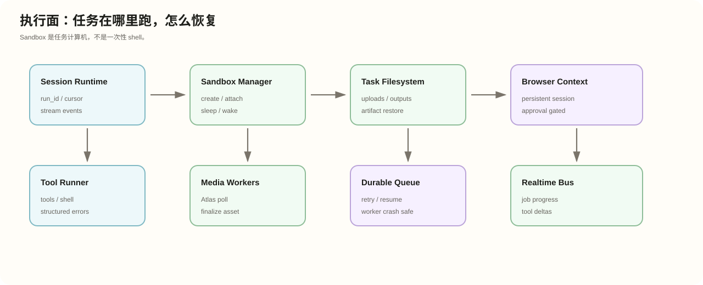
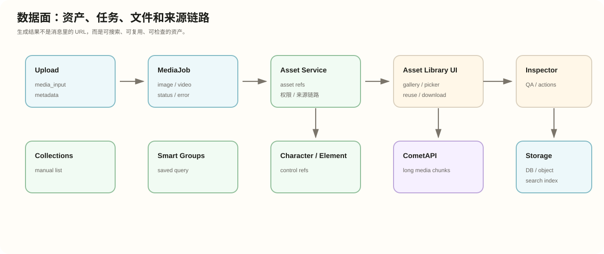
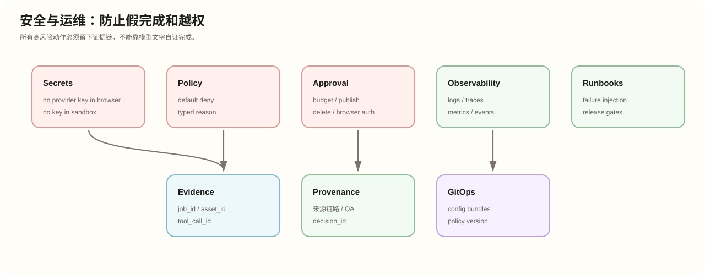
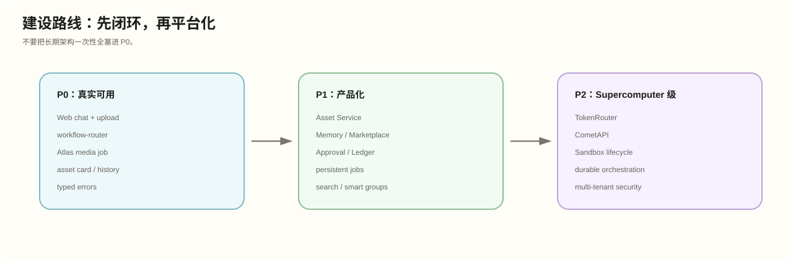

文档路径：docs/ultra-studio-zh/architecture-blueprint.md

# Ultra Studio 完整建设图谱

状态：中文可视化架构图谱  
日期：2026-06-11

## 图谱预览

## 包含图

- 完整系统建设总图
- 控制面建设图
- 执行面建设图
- 数据面建设图
- 安全与运维建设图
- P0/P1/P2 建设路线图

## 关系

快速导读页只讲最短路径；本页讲完整建设图；[完整长期参考](long-term-reference) 讲长期目标形态和能力矩阵。旧版可编辑架构图保留在 `docs/ultra-studio-agent-architecture.html`。
