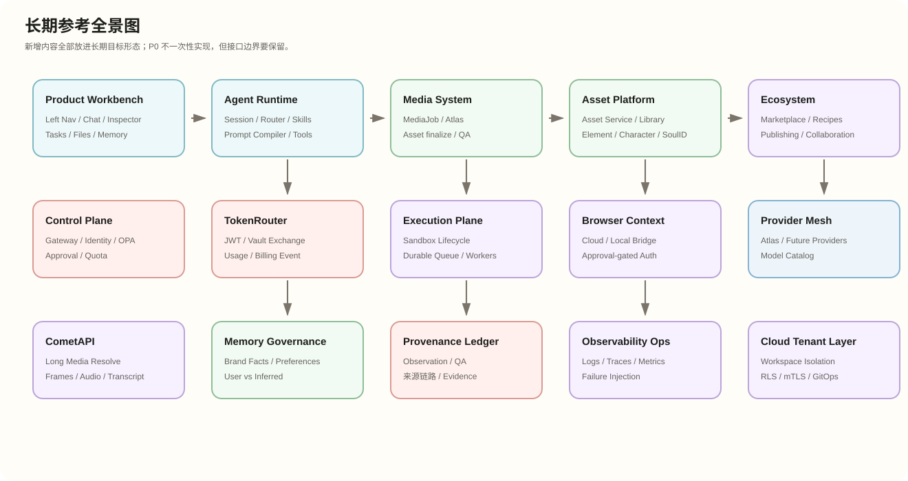
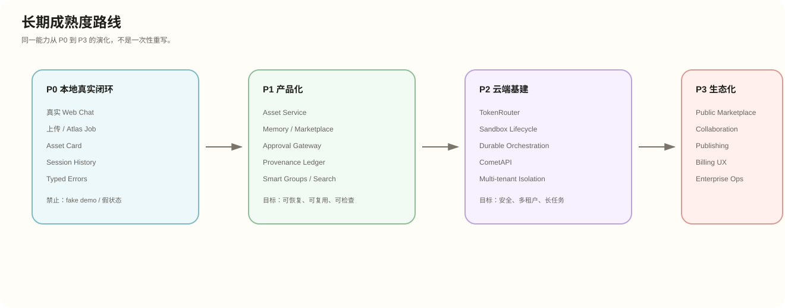
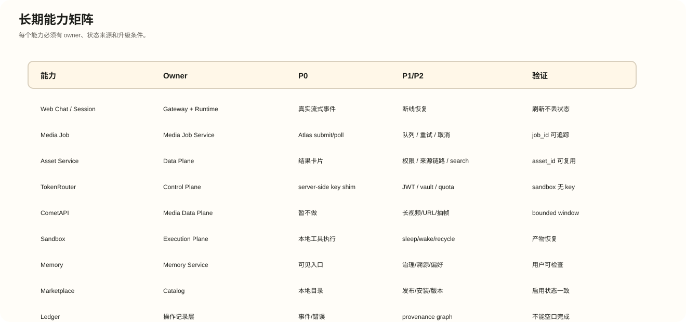

文档路径：docs/ultra-studio-zh/long-term-reference.md

# Ultra Studio 完整长期参考

状态：中文长期参考  
日期：2026-06-11

## 图谱预览

## 目的

旧版可编辑架构图只是历史大画布。新增的长期参考把 TokenRouter、CometAPI、Sandbox lifecycle、Asset Service、Memory、Marketplace、Ledger、Cloud tenant layer 等全部纳入目标形态。

## 包含图

- 长期参考全景图
- 长期成熟度路线
- 长期能力矩阵

## 关系

- [可视化导读](visual-guide)：快速导读。
- [完整建设图谱](architecture-blueprint)：完整建设图谱。
- 本页：长期目标形态和能力矩阵。
- `../ultra-studio-agent-architecture.html`：旧版可编辑大画布，保留用于编辑和历史对照。
