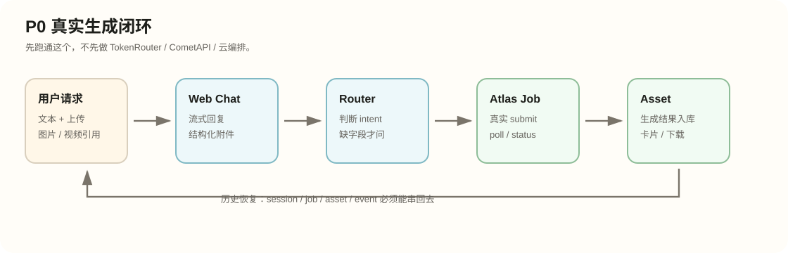
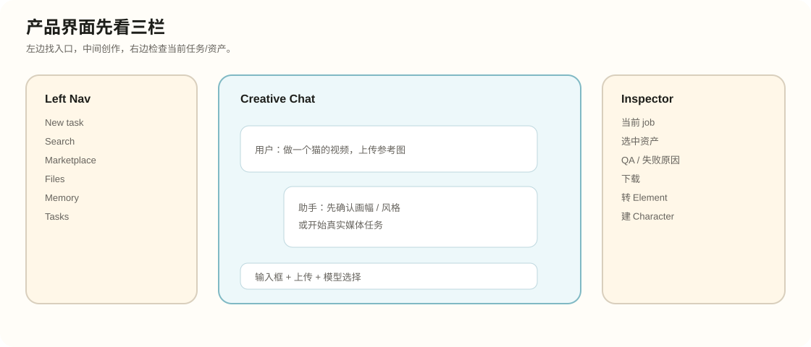
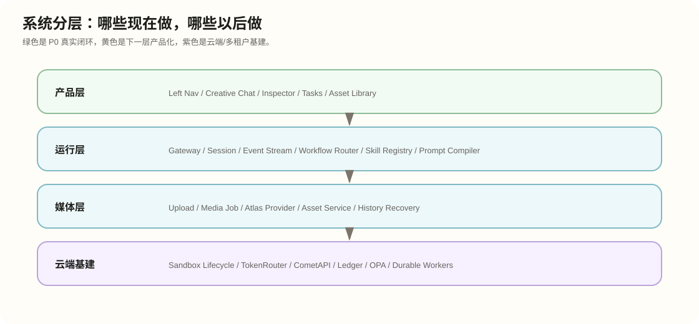
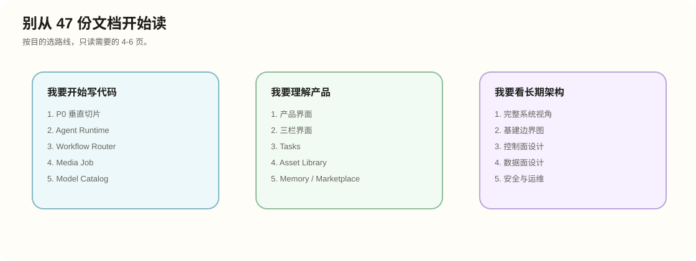

文档路径：docs/ultra-studio-zh/visual-guide.md

# Ultra Studio 可视化导读

状态：中文图文导读  
日期：2026-06-11

## 先看图

这页只解决一个问题：不要被 47 份详细规格淹没。先用四张图建立地图，再按目的进入详细文档。

## 三条阅读路线

### 我要开始写代码

- [P0 MVP 垂直切片](research-analysis/01-p0-mvp-vertical-slice)
- [Agent Runtime Contract](product-specs/02-agent-runtime-contract)
- [12 工作流路由器](product-specs/components/12-workflow-router)
- [Media Job Service](product-specs/components/10-media-job-service)
- [19 模型目录与供应商约束](product-specs/components/19-model-catalog-provider-constraints)

### 我要理解产品

- [Ultra Studio 产品界面](product-specs/01-product-surface)
- [01 左侧导航外壳](product-specs/components/01-left-nav-shell)
- [02 创作聊天界面](product-specs/components/02-creative-chat-ui)
- [03 右侧检查器 / 实时面板](product-specs/components/03-inspector-live-panel)
- [Asset Library UI](product-specs/components/08-asset-library-ui)

### 我要看长期基建

- [完整系统视角](research-analysis/05-complete-system-perspective)
- [基础设施边界图](infra-design/02-boundary-map)
- [控制面设计](infra-design/03-control-plane-design)
- [数据面设计](infra-design/05-data-plane-design)
- [安全与运维设计](infra-design/06-security-ops-design)

## 状态解释

- 绿色：P0 或已具备真实落地基础。
- 黄色：产品化/下一阶段要接入的能力。
- 紫色：云端、多租户、长期基建能力。

## 一句话结论

P0 不要从完整 Supercomputer 架构开工。先做真实聊天、上传、路由、Atlas 任务、资产卡片、历史恢复；TokenRouter、CometAPI、Sandbox lifecycle 等保留接口边界，后续再接。
