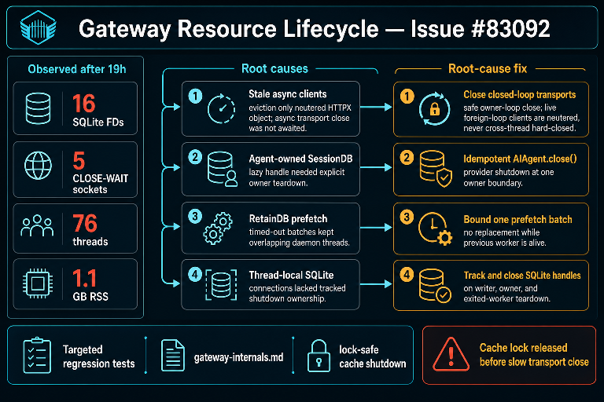

# Gateway Resource Lifecycle — Issue #83092

## Architecture

Hermes Gateway creates short-lived `AIAgent` instances around long-lived platform sessions. Those agents share auxiliary HTTP clients, session storage, and optional memory-provider workers. Teardown therefore needs explicit ownership boundaries:

- agent-owned resources close with `AIAgent.close()`;
- shared clients close only when their event-loop ownership is safe;
- memory-provider workers own and close their SQLite connections;
- repeated background work cannot create unbounded overlapping threads.

## Problem

Issue #83092 reported, after roughly 19 hours:

- 16 SQLite file descriptors;
- 5 `CLOSE-WAIT` sockets;
- 76 threads;
- 1.1 GB RSS.

The leak was a resource-lifecycle failure across several paths, not one isolated allocation: stale async transports were evicted without awaiting their close, RetainDB could replace still-alive prefetch workers, SQLite connections had no complete ownership registry, and provider teardown was not centralized/idempotent.

## Solution

The PR closes the root causes:

1. Closed-loop auxiliary clients run real async transport close. Clients still owned by a live foreign loop are neutered instead of being hard-closed across threads, preserving the SQLite/TLS safety boundary from #70773.
2. `AIAgent.close()` owns idempotent memory-provider shutdown and agent-owned lazy `SessionDB` teardown.
3. RetainDB permits one prefetch batch at a time and tracks SQLite handles for writer, owner, and exited-worker cleanup.
4. Cached-client shutdown snapshots and clears the registry under its lock, then closes transports outside the lock. Slow async close cannot form a process-wide lock convoy.

## Validation

Targeted regression coverage exists for:

- stale async transport close;
- `AIAgent.close()` and idempotent provider teardown;
- lazy `SessionDB` ownership;
- RetainDB connection closure and prefetch-thread bounding.

Detailed lifecycle guidance: [gateway-internals.md](website/docs/developer-guide/gateway-internals.md).

## Image generation

Generated with native image generation after inspecting the prior workspace asset. Final asset: `infographic.png`.

The required prompt helper was attempted directly with `python` and `.venv\Scripts\python.exe`; this environment could not launch Python (`python` unavailable; uv trampoline permission denied). Prompt content was supplied directly to the native image generator with the same issue summary and validation context.
