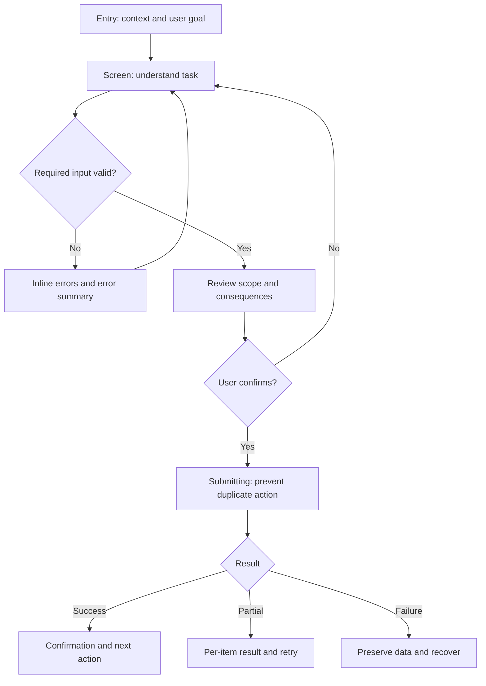

# Wireframe Output Templates

Use the smallest template that fully represents the requested screen or flow.
Keep all user-facing output in the user's requested language.

## Default delivery structure

```markdown
## User Goal & Key CTA
- Primary actor: ...
- Goal: ...
- Primary CTA: ...
- Platform: ...

## Assumptions / Open Decisions
- Confirmed: ...
- Assumed: ...
- Open decision: ...

## Information Architecture
1. ...
2. ...

## User Flow
Entry → ... → Success
Alternative/recovery: ...

## Text-based Wireframe Blueprint
...

## State & Rule Matrix
| Region/action | Loading | Empty | Error | Success | Permission |
|---|---|---|---|---|---|
| ... | ... | ... | ... | ... | ... |

## Responsive and Accessibility Notes
- ...

## Risks / Trade-offs
- ...

## Approval Gate
Approve this structure, or identify the screen/region to revise before visual
styling or implementation.
```

## Text blueprint syntax

```text
============================================================
[SCREEN: Screen name / Platform / Viewport assumption]
[GRID: Mobile 4 | Tablet 8 | Desktop 12]
[PRIMARY GOAL: ...]
[PRIMARY CTA: ...]
============================================================

[REGION: HEADER / NAVIGATION]
|-- Left (2 cols): [Logo Placeholder]
|-- Center (7 cols): [Nav: Home | Features | Pricing]
|-- Right (3 cols): [Button: Sign in] [Button Primary: Start]
|-- Behavior: [sticky / scroll / collapse rule]
|-- Mobile transform: [back + title + action / bottom nav / drawer]
------------------------------------------------------------

[REGION: MAIN TASK]
|-- Left (7 cols):
|   |-- [Header/Title]: Concrete task title
|   |-- [Body]: Two-line explanation or current status
|   |-- [Field: Email / label persistent / required]
|   |-- [Button Primary: Specific action]
|-- Right (5 cols):
|   |-- [Image Placeholder: purpose, 16:9]
|-- States: [loading | invalid | success | unavailable]
|-- Keyboard/focus: [order and return behavior]
------------------------------------------------------------

[REGION: SUPPORTING CONTENT]
|-- Col 1 (4 cols): [Header] + [Body]
|-- Col 2 (4 cols): [Header] + [Body]
|-- Col 3 (4 cols): [Header] + [Body]
|-- Responsive: [stack by priority, not equal shrink]
------------------------------------------------------------

[REGION: FOOTER / SECONDARY ACTIONS]
|-- Left (6 cols): [Help / status / legal]
|-- Right (6 cols): [Secondary action] [Primary action]
============================================================
```

### Syntax rules

- Use `REGION` for page-level areas and nested indentation for groups.
- Name position and column span only when they aid understanding.
- Mark overlays as `[MODAL]`, `[DRAWER]`, `[POPOVER]`, or `[SHEET]` and state
  trigger, dismissal, focus entry, and focus return.
- Mark persistent behavior with `[STICKY]`, `[FIXED]`, or `[SCROLL REGION]`.
- Label each control with its action or field meaning.
- State responsive transformation after each affected region.
- Use `[X]` only for a generic media box; prefer a descriptive image
  placeholder when purpose matters.

## Multi-screen flow template

```text
[FLOW: Flow name]

[ENTRY A]
    |
    v
[SCREEN 1: Orientation]
    |-- Primary: [Action] --> [SCREEN 2]
    |-- Exit: [Cancel] -----> [RETURN DESTINATION]
    |-- Error: [Condition] -> [RECOVERY STATE]

[SCREEN 2: Input / decision]
    |-- Valid -------------> [SCREEN 3]
    |-- Invalid -----------> [INLINE ERRORS + SUMMARY]
    |-- Session expired ---> [RE-AUTH] -> [RESTORE SCREEN 2]

[SCREEN 3: Review]
    |-- Edit section ------> [SCREEN 2: targeted return]
    |-- Confirm -----------> [SUBMITTING]

[SUBMITTING]
    |-- Success -----------> [CONFIRMATION]
    |-- Partial failure ---> [RESULT SUMMARY + RETRY]
    |-- Failure -----------> [PRESERVED INPUT + RETRY]
```

## Mermaid flow template

Use Mermaid only when the user requests a block diagram or when a branching
flow is materially clearer than text.



### Mermaid rules

- Node labels describe user-visible states, not backend services.
- Decision nodes are questions with explicit branches.
- Include cancel, back, error, retry, and permission branches when relevant.
- Keep the graph readable; split very large flows by phase.
- Do not use color styling in low-fidelity output.

## B2B dashboard blueprint

```text
============================================================
[SCREEN: Operations Dashboard / Desktop / 12-column grid]
[MODE: Monitor + Operate]
============================================================

[REGION: GLOBAL CONTEXT / 12 cols]
|-- [Tenant/Workspace selector]
|-- [Date range + timezone]
|-- [Saved view]
|-- [Data freshness + Refresh]
------------------------------------------------------------

[REGION: KPI STRIP / 12 cols]
|-- KPI 1 (3 cols): [Label] [Value] [Comparison basis] [Drill-down]
|-- KPI 2 (3 cols): [Label] [Value] [Comparison basis] [Drill-down]
|-- KPI 3 (3 cols): [Label] [Value] [Comparison basis] [Drill-down]
|-- KPI 4 (3 cols): [Label] [Value] [Comparison basis] [Drill-down]
|-- States: [loading | stale | unavailable | permission-limited]
------------------------------------------------------------

[REGION: FILTER BAR / 12 cols]
|-- [Search] [Frequent filters] [Advanced filters]
|-- [Active filter chips] [Result count] [Clear]
------------------------------------------------------------

[REGION: BULK ACTION BAR / conditional / 12 cols]
|-- [Selection scope + count]
|-- [Compatible actions]
|-- [Clear selection]
------------------------------------------------------------

[REGION: DATA TABLE / 12 cols]
|-- Header: [Select] [Identity] [Status] [Owner] [Updated] [Actions]
|-- Row: [Checkbox] [Primary label + metadata] [...] [Open details]
|-- Footer: [Pagination / loaded count / page size]
|-- States: [skeleton | empty | no results | partial | error | stale]
|-- Keyboard: [row navigation / selection / action menu]
|-- Mobile: [priority list -> detail screen]
------------------------------------------------------------

[REGION: DETAIL PANEL / conditional]
|-- [Object identity + status]
|-- [Tabs for peer views only]
|-- [Timeline / audit / related records]
|-- [Primary object action]
|-- Close returns focus to originating row
============================================================
```

## Complex form blueprint

```text
============================================================
[SCREEN: Form name / Mobile-first / 4-column grid]
[STRUCTURE: Single page | Step N of M]
============================================================

[REGION: ORIENTATION]
|-- [Header/Title]
|-- [Purpose and consequence]
|-- [Progress: meaningful stages]
|-- [Save state / last saved]
------------------------------------------------------------

[REGION: FIELD GROUP — meaning-based]
|-- [Field: Persistent label / type / required-or-optional]
|   |-- [Hint or example]
|   |-- [Inline validation location]
|-- [Conditional control]
|   |-- If condition: [Dependent fields]
|   |-- Hidden-value policy: [retain | clear | exclude]
------------------------------------------------------------

[REGION: ERROR SUMMARY / conditional]
|-- [Header: Correct N items]
|-- [Link/focus target: Field name — reason]
------------------------------------------------------------

[REGION: ACTION BAR]
|-- Left: [Back] [Save and exit, if supported]
|-- Right: [Button Primary: Continue / Review / Confirm]
|-- Keyboard-open behavior: [visible / scroll into view]
------------------------------------------------------------

[STATE: SUBMITTING]
|-- [Progress / duplicate prevention / cancel policy]

[STATE: SUCCESS]
|-- [Confirmation / receipt / next action]

[STATE: FAILURE]
|-- [Specific reason / preserved data / retry / support]
============================================================
```

## Tailwind wireframe skeleton

Generate code only when requested. Keep it structural, responsive, grayscale,
and free of dependencies beyond the user's requested stack.

```html
<main class="min-h-screen bg-white text-gray-700">
  <header class="border-b border-gray-300">
    <div class="grid grid-cols-4 gap-4 p-4 md:grid-cols-8 lg:grid-cols-12">
      <div class="col-span-2 border border-dashed border-gray-400 p-3">
        [Logo Placeholder]
      </div>
      <nav class="col-span-2 md:col-span-4 lg:col-span-7">
        [Navigation]
      </nav>
      <div class="col-span-4 flex gap-2 md:col-span-2 lg:col-span-3">
        <button class="border border-gray-400 bg-gray-200 px-4 py-3">
          Secondary action
        </button>
        <button class="border border-gray-700 bg-gray-300 px-4 py-3 text-black">
          Primary action
        </button>
      </div>
    </div>
  </header>

  <section class="grid grid-cols-4 gap-4 p-4 md:grid-cols-8 lg:grid-cols-12">
    <div class="col-span-4 space-y-4 lg:col-span-7">
      <h1 class="text-xl font-semibold text-black">[Header/Title]</h1>
      <p>[Body Text/Placeholder]</p>
      <div class="border border-gray-300 bg-gray-100 p-4">[Main task]</div>
    </div>
    <div
      class="col-span-4 grid aspect-video place-items-center border border-dashed border-gray-400 bg-gray-200 lg:col-span-5"
      role="img"
      aria-label="Image placeholder"
    >
      [X]
    </div>
  </section>
</main>
```

### Tailwind rules

- Use `grid-cols-4 md:grid-cols-8 lg:grid-cols-12`.
- Use `border border-dashed border-gray-400` for media and unfinished regions.
- Use `bg-gray-100`, `bg-gray-200`, and `bg-gray-300` for structural fills.
- Use `text-gray-700` and `text-black` for text hierarchy.
- Include semantic elements, persistent labels, keyboard focus behavior, and
  accessible names even in a skeleton.
- Do not add brand color, gradient, decorative shadow, custom font, or visual
  flourish.
- Do not connect fake APIs or include fabricated records/statuses.

## State and rule matrix template

```markdown
| Region/action | Trigger | Visible response | Recovery/exit | Permission/scope |
|---|---|---|---|---|
| Initial load | Screen opens | Region skeletons; context remains visible | Retry failed region | Show authorized scope only |
| Empty | Valid query has zero records | Explain empty vs no-results | Create/clear filters if allowed | Hide unauthorized actions |
| Submit | Valid confirmation | Disable duplicate submit; show progress | Cancel only if safe | Restate affected scope |
| Partial failure | Multi-item action returns mixed result | Per-item success/failure summary | Retry failed subset | Preserve selection context |
| Session expired | Protected action begins | Re-auth prompt | Restore task after auth | Do not reveal protected data |
```

## Approval wording

End with a concise gate such as:

> Wireframe approval: approve this structure, or name the screen/region to
> revise. I will not apply brand styling or implement production UI until the
> structure is approved.

If the user explicitly waived the gate, record that fact and proceed only
within the requested next phase.
