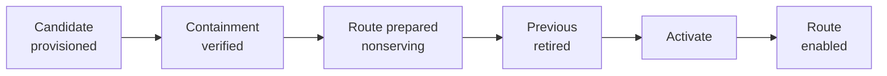

# Deployment Choreography

:::warning Status: draft / under development

This section documents Hermes Enterprise while its components are still landing as in-flight pull requests. Interfaces, commands, and resource shapes described here may change before release.

:::

Deploying an agent in Hermes Enterprise never mutates a running workload. A deploy creates an immutable [AgentRevision](./concepts.md) and walks it through a fixed sequence of stages. Each stage must fully succeed before the next begins, and each stage has a defined answer to "what is left behind if this fails?"

## The stages

1. **Candidate provisioned.** The controller snapshots the Agent and its references into a new AgentRevision and asks the compute driver to provision the candidate workload in the tenant's namespace. The candidate exists but serves nothing.
2. **Containment verified.** The sandbox driver enforces the revision's SandboxPolicy and then independently **verifies** it against the live candidate. Verification is a separate step from enforcement — the controller does not trust that enforcement worked; it checks.
3. **Route prepared (nonserving).** The namespace gateway learns the route to the candidate but keeps it disabled. No traffic flows yet; this proves the routing configuration is valid before anything depends on it.
4. **Previous retired.** The currently active revision (if any) is taken out of service. This is the start of the cutover window.
5. **Activate.** The candidate revision is marked active — it becomes the revision of record for the agent.
6. **Route enabled.** The gateway enables the prepared route and traffic flows to the new revision. The deploy is complete.

The ordering is deliberate: everything that can be checked without touching live traffic (provisioning, containment, routing config) happens **before** the previous revision is disturbed. The window in which the agent is not serving is confined to stages 4–6.

## Failure at each stage

| Stage that failed | What is left behind | Serving impact |
|---|---|---|
| Candidate provisioned | A failed revision record; any partial workload is torn down by the compute driver. | None — previous revision still serving. |
| Containment verified | The candidate workload, stopped and torn down; the revision marked failed with the verification error. **An unverified workload never starts serving.** | None — previous revision still serving. |
| Route prepared | Candidate torn down; the prepared (disabled) route removed from the gateway. | None — previous revision still serving. |
| Previous retired | Candidate is up and verified but the old revision may already be out of service. The controller proceeds to activate the candidate rather than resurrect the old one — forward is the recovery path at this point. | Brief gap possible. |
| Activate | Candidate verified and routed-nonserving; activation is retried. The store's revision phase records exactly where things stopped. | Gap until activation completes or an operator intervenes. |
| Route enabled | New revision is active but unreachable until the route flip is retried. | Gap until the route is enabled. |

Two invariants hold throughout:

- **Failure before retirement is invisible to users.** Stages 1–3 can fail all day; the previous revision keeps serving untouched.
- **Nothing unverified ever serves.** The route to a candidate is not enabled unless containment verification passed for that exact workload.

## Rollback semantics

Because revisions are immutable, rollback is not an "undo" — it is **a new deploy of a previous revision**:

- `agent deploy` targeting an earlier revision walks that revision's snapshot through the same six stages, including fresh containment verification. A revision that passed verification last month is re-verified today.
- There is no partial rollback: configuration, harness version, channels, and policies travel together in the snapshot. You get back exactly what that revision was.
- Failed candidate revisions are kept as records (spec + failure reason) for audit, but they hold no compute — teardown is part of failure handling, not a separate cleanup task.

The result is that the fleet's state is always describable as "revision X is active for agent Y," never as an in-between blend of two versions.
