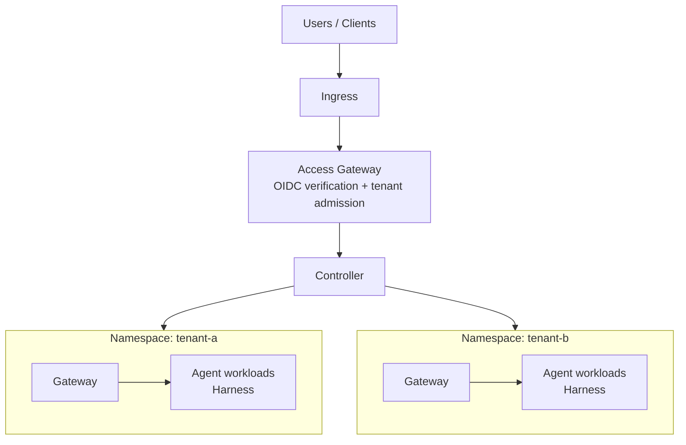

# Hermes Enterprise Overview

:::warning Status: draft / under development

This section documents Hermes Enterprise while its components are still landing as in-flight pull requests. Interfaces, commands, and resource shapes described here may change before release.

:::

Hermes Enterprise is a **multi-tenant control plane** for running fleets of Hermes agents inside an organization. It takes the same hermes-agent runtime you run on a laptop — referred to in enterprise contexts as the **Harness** — and deploys it per tenant **Namespace** on Kubernetes, with centralized identity, configuration, secret brokering, sandbox verification, and audit.

The single-user product does not change: your local CLI, TUI, desktop app, and personal gateway remain single-tenant by design. Enterprise is a separate control plane *around* the runtime, not a rewrite of it.

## What it adds

| Capability | Single-user Hermes | Hermes Enterprise |
|---|---|---|
| Tenancy | One user, one machine | Many tenants, each isolated in a Namespace |
| Identity | Local OS user / platform allowlists | OIDC-verified principals, groups, roles, access bindings |
| Deployment | `hermes update` in place | Immutable AgentRevisions with staged deploy choreography |
| Secrets | Local `.env` / secret sources | Brokered secrets — values never enter agent workloads |
| Sandbox | Local Docker/Modal settings | SandboxPolicy verified before a workload may start |
| Audit | Session logs | Structured audit trail (no secrets, no message contents) |

## Architecture

The control plane is a **controller** that reconciles declarative resources into per-namespace workloads. All traffic enters through an **access gateway** that verifies OIDC tokens and performs tenant admission before anything reaches the controller.

- **Ingress** terminates external traffic and routes it to the access gateway.
- The **access gateway** verifies the caller's OIDC token against the configured issuer and audience, maps the identity to a tenant, and rejects anything it cannot positively admit. Requests without a verified tenant identity never reach the controller.
- The **controller** owns the resource store, runs the deploy choreography, and drives compute, sandbox, and secret drivers.
- Each tenant Namespace gets its own **gateway** and **agent workloads** (the Harness) on Kubernetes — tenants never share a runtime process.

:::note Single-user gateway stays single-tenant

The existing hermes-agent messaging gateway is, and remains, **single-tenant by design**. Enterprise does not retrofit multi-tenancy into it; instead the controller deploys a dedicated gateway per Namespace. If you run personal Hermes today, nothing about your setup changes.

:::

## Design principles

- **Fail closed.** Unknown identities, unverified sandboxes, and unresolvable references are rejected, never defaulted. See [Concepts & Resource Model](./concepts.md).
- **Immutable deploys.** Agents roll forward through immutable [AgentRevisions](./concepts.md) using a staged [deploy choreography](./deployment.md) with well-defined rollback semantics.
- **Secrets stay out of workloads.** Secret values are brokered — workloads request *operations*, never raw values. See [Security Model](./security.md).
- **Narrow v1 scope.** No cross-namespace references, no external IAM adapters beyond OIDC, no non-Kubernetes compute. The [security page](./security.md) lists these exclusions explicitly.

## Where to go next

- [Concepts & Resource Model](./concepts.md) — the resource kinds and IAM entities
- [Deployment Choreography](./deployment.md) — how an agent revision goes live
- [Installation](./installation.md) — Helm quickstart and first agent walkthrough
- [Security Model](./security.md) — trust boundaries and audit guarantees
