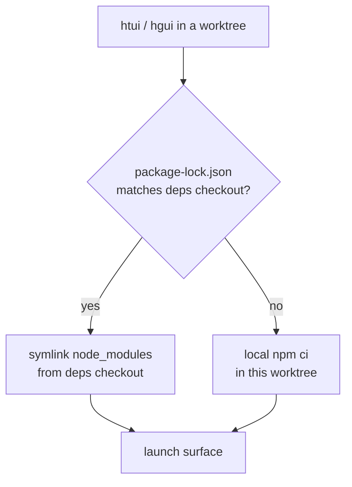

# TUI и рабочий стол от Worktrees

Ядро Python отлично работает из любого [git worktree](../user-guide/git-worktrees.md) — `cd` и `hermes` просто работает. Две поверхности TypeScript этого не делают: `ui-tui/` и `apps/desktop/` требуют заполненного `node_modules`, а новый `npm ci` для каждого рабочего дерева работает медленно и дублирует гигабайты в каждой проверенной вами ветке.

`htui` и `hgui` — два помощника оболочки, которые закрывают этот пробел. Каждый из них запускает свою поверхность **из текущего рабочего дерева**, заимствуя `node_modules` из одной канонической проверки — поэтому одноразовая ветвь стоит символической ссылки, а не установки.

Это удобство для разработчиков, а не готовые команды. Поместите их в `~/.zshrc`; адаптировать пути по вкусу.

## Модель совместного использования deps

Одна проверка — это **оформление deps** — единственное место, где вы фактически запускаете `npm install`. Любое другое рабочее дерево ссылается на него и переустанавливается локально только тогда, когда его файл блокировки расходится (ветвь, которая создает зависимость, не должна автоматически работать с устаревшими пакетами).



Две переменные env называют каноническую проверку:

| Переменная | Значение |
|----------|---------|
| `HERMES_MAIN_CHECKOUT` | Оформление заказа — где на самом деле живет `node_modules` и чей `.venv/bin/python` управляет серверной частью. |
| `HERMES_GUI_DEPS_CHECKOUT` | Где живут десктопы (`apps/desktop/node_modules`). По умолчанию `HERMES_MAIN_CHECKOUT`; переопределить, только если вы храните данные рабочего стола в другом месте. |

Ни то, ни другое не читает сам Гермес — они являются личными для этих помощников. Переменные, которые *читает* Гермес, описаны в [Переменные среды](../reference/environment-variables.md).

## `htui` — TUI из рабочего дерева

В Ink TUI уже есть путь разработки: `hermes --tui --dev` запускает источники TypeScript через `tsx` вместо предварительно созданного пакета. `htui` — это однострочный текст над ним, который также указывает выполнение на `ui-tui/` текущего рабочего дерева:

```bash
htui() {
  local root
  root="$(_hermes_root)" || { echo "htui: not in a Hermes checkout" >&2; return 1; }
  ( cd "$root" && PYTHONPATH="$root" \
      "$HERMES_MAIN_CHECKOUT/.venv/bin/python" -m hermes_cli.main --tui --dev "$@" )
}
```

`--dev` компилируется из исходного кода, поэтому он связывает `ui-tui/node_modules` с `HERMES_MAIN_CHECKOUT`, когда корневой файл блокировки совпадает, и в противном случае устанавливается локально (см. [`_hermes_root` / linking helpers](#shared-helpers)).

:::предупреждение `--dev` и `HERMES_TUI_DIR` являются взаимоисключающими
`HERMES_TUI_DIR` указывает Hermes на *готовый* пакет (Nix, системные пакеты), у которого нет исходного кода для горячей перезагрузки. Если он установлен в вашей оболочке, `hermes --tui --dev` завершает работу с ошибкой. Запустите `unset HERMES_TUI_DIR` до `htui`.
:::

## `hgui` — настольное приложение из рабочего дерева

Настольное приложение тяжелее: ему требуется `node_modules` как в корне репозитория, так и `apps/desktop/`, сервер разработки Vite, прикрепленный к порту `5174`, и серверная часть Python. `hgui` связывает все это с текущим рабочим деревом:

```bash
hgui() {
  local root deps desktop
  root="$(_hermes_root)" || { echo "hgui: not in a Hermes checkout" >&2; return 1; }
  deps="${HERMES_GUI_DEPS_CHECKOUT:-$HERMES_MAIN_CHECKOUT}"
  desktop="$root/apps/desktop"

  # Borrow deps when locks match; otherwise install locally in the worktree.
  if cmp -s "$root/package-lock.json" "$deps/package-lock.json"; then
    _hermes_link_deps "$desktop" "$deps/apps/desktop"
    _hermes_link_deps "$root" "$deps"
  else
    ( cd "$root" && npm ci ) || return 1
  fi

  # Vite is fixed at 5174 — evict a stale session from another hgui.
  lsof -t -i:5174 >/dev/null 2>&1 && killport 5174

  # Electron often survives Ctrl+C without reaping its ephemeral backends.
  trap '_hermes_gui_cleanup "$root"' INT TERM EXIT

  ( cd "$desktop"
    export PATH="$root/node_modules/.bin:$PATH"
    HERMES_DESKTOP_HERMES_ROOT="$root" \
    HERMES_DESKTOP_PYTHON="$HERMES_MAIN_CHECKOUT/.venv/bin/python" \
    HERMES_DESKTOP_IGNORE_EXISTING=1 \
    HERMES_DESKTOP_CWD="$root" \
    npm run dev )
}
```

Все переменные окружения рабочего стола, которые он устанавливает, являются настоящими регуляторами разрешения серверной части:

| Переменная | Роль в `hgui` |
|----------|----------------|
| `HERMES_DESKTOP_HERMES_ROOT` | Запускает серверную часть из **этого рабочего дерева**, а не из packaged/PATH `hermes`. |
| `HERMES_DESKTOP_PYTHON` | Повторно использует venv проверки deps вместо повторного разрешения Python. |
| `HERMES_DESKTOP_IGNORE_EXISTING` | Игнорирует любые `hermes` на `PATH`, поэтому не может затенить рабочее дерево. |
| `HERMES_DESKTOP_CWD` | Открывает чат рабочего стола, расположенный в рабочем дереве. |

Два пистолета `hgui` имеют ручки, которых нет у голого `npm run dev`:

- **Порт `5174` исправлен.** Второй `hgui` конфликтует с сервером Vite первого; помощник первым убивает несвежего.
- **Дети-сироты.** Electron часто выживает с `Ctrl+C` по `concurrently`, не используя эфемерный бэкэнд `dashboard --port 0` или процесс Vite. Ловушка `EXIT`/`INT`/`TERM` запускает очистку, которая завершает работу оболочки Electron, прослушивателя `:5174` и любой информационной панели `--port 0`, которую она создала.

## Общие помощники

Обе функции разрешают включающую проверку и ссылки на deps одинаково:

```bash
# The enclosing worktree, verified as a real Hermes checkout.
_hermes_root() {
  local root
  root="$(git rev-parse --show-toplevel 2>/dev/null)" || return 1
  [[ -f "$root/hermes_cli/main.py" && -d "$root/ui-tui" ]] && print -r "$root"
}

# Symlink node_modules from the deps checkout — never over an existing tree.
_hermes_link_deps() {
  local target="${1%/}" source="${2%/}"
  [[ -d "$source/node_modules" ]] || return 1
  [[ -e "$target/node_modules" ]] || ln -s "$source/node_modules" "$target/node_modules"
}

# Reap ephemeral backends Electron leaves behind on exit.
_hermes_gui_cleanup() {
  local root="$1"
  [[ -n "$root" ]] && pkill -TERM -f "${root}/apps/desktop/node_modules/electron" 2>/dev/null
  lsof -t -i:5174 >/dev/null 2>&1 && killport 5174
  pgrep -f 'hermes_cli\.main.*dashboard.*--port 0' 2>/dev/null | xargs -r kill -TERM 2>/dev/null
}
```

`killport` — ваш маленький помощник (`lsof -ti:$1 | xargs kill`); замените предпочитаемое вами заклинание.

:::info Зачем ссылаться только тогда, когда блокировки совпадают?
Символическая ссылка на другой `node_modules` хуже, чем отсутствие установки — рабочее дерево будет строиться на основе пакетов, а его собственный файл блокировки никогда не объявляется. Сравнение байтов `package-lock.json` — это дешевая и точная защита: тот же замок ⇒ безопасно брать взаймы; другой замок ⇒ `npm ci` локально. Прежде чем применять `server.fs.allow`, пропишите символические ссылки Realpaths, поэтому `apps/desktop/vite.config.ts` добавляет в белый список реальное местоположение `node_modules`.
:::

## См. также

- [Git Worktrees](../user-guide/git-worktrees.md) — модель изоляции, на которой строятся эти помощники.
- [TUI](../user-guide/tui.md) — `hermes --tui --dev` и путь предварительной сборки `HERMES_TUI_DIR`.
- [Настольное приложение](../user-guide/desktop.md) — сборка из исходного кода и лестница разрешения серверной части.
- [`apps/desktop/README.md`](https://github.com/NousResearch/hermes-agent/blob/main/apps/desktop/README.md) — сервер разработки, сценарий песочницы и упаковка.
- [Переменные среды](../reference/environment-variables.md) — каждая переменная `HERMES_*`, которую читает Гермес