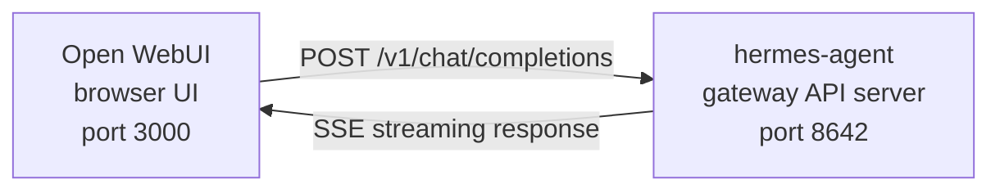

# Открытая интеграция WebUI

[Open WebUI](https://github.com/open-webui/open-webui) (126k★) — самый популярный автономный интерфейс чата для ИИ. Благодаря встроенному API-серверу агента Hermes вы можете использовать Open WebUI в качестве усовершенствованного веб-интерфейса для вашего агента — с управлением беседами, учетными записями пользователей и современным интерфейсом чата.

## Архитектура



Open WebUI подключается к серверу API агента Hermes так же, как и к OpenAI. Hermes обрабатывает запросы, используя полный набор инструментов — терминал, файловые операции, веб-поиск, память, навыки — и возвращает окончательный ответ.

:::важное расположение среды выполнения
Сервер API — это **среда выполнения агента Hermes**, а не чистый прокси-сервер LLM. Для каждого запроса Hermes создает на стороне сервера `AIAgent` на хосте API-сервера. Вызовы инструментов выполняются там, где работает этот сервер API.

Например, если ноутбук указывает Open WebUI или другой OpenAI-совместимый клиент на сервер Hermes API на удаленном компьютере, `pwd`, файловые инструменты, инструменты браузера, локальные инструменты MCP и другие инструменты рабочей области запускаются на хосте удаленного API-сервера, а не на ноутбуке.
:::

Открытый веб-интерфейс взаимодействует с сервером Hermes, поэтому для этой интеграции вам не нужен `API_SERVER_CORS_ORIGINS`.

## Быстрая настройка

### 1. Включите сервер API

```bash
hermes config set API_SERVER_ENABLED true
hermes config set API_SERVER_KEY your-secret-key
```

`hermes config set` автоматически направляет флаг на `config.yaml`, а секрет — на `~/.hermes/.env`. Если шлюз уже запущен, перезапустите его, чтобы изменения вступили в силу:

```bash
hermes gateway stop && hermes gateway
```

### 2. Запустите шлюз агента Hermes.

```bash
hermes gateway
```

Вы должны увидеть:

```
[API Server] API server listening on http://127.0.0.1:8642
```

### 3. Убедитесь, что сервер API доступен.

```bash
curl -s http://127.0.0.1:8642/health
# {"status": "ok", ...}

curl -s -H "Authorization: Bearer your-secret-key" http://127.0.0.1:8642/v1/models
# {"object":"list","data":[{"id":"hermes-agent", ...}]}
```

Если `/health` произошел сбой, шлюз не поймал `API_SERVER_ENABLED=true` — перезапустите его. Если `/v1/models` возвращает `401`, ваш заголовок `Authorization` не соответствует `API_SERVER_KEY`.

### 4. Запустите открытый веб-интерфейс.

```bash
docker run -d -p 3000:8080 \
  -e OPENAI_API_BASE_URL=http://host.docker.internal:8642/v1 \
  -e OPENAI_API_KEY=your-secret-key \
  -e ENABLE_OLLAMA_API=false \
  --add-host=host.docker.internal:host-gateway \
  -v open-webui:/app/backend/data \
  --name open-webui \
  --restart always \
  ghcr.io/open-webui/open-webui:main
```

`ENABLE_OLLAMA_API=false` подавляет серверную часть Ollama по умолчанию, которая в противном случае отображалась бы пустой и загромождала бы средство выбора модели. Пропустите это, если рядом с вами действительно бегает Оллама.

Первый запуск занимает 15–30 секунд: Open WebUI загружает модели встраивания преобразователя предложений (~ 150 МБ) при первом запуске. Подождите, пока `docker logs open-webui` установится, прежде чем открывать пользовательский интерфейс.

### 5. Откройте пользовательский интерфейс

Перейдите по адресу **http://localhost:3000**. Создайте учетную запись администратора (первый пользователь становится администратором). Вы должны увидеть своего агента в раскрывающемся списке моделей (названного в честь вашего профиля или **hermes-agent** для профиля по умолчанию). Начни общаться!

## Настройка Docker Compose

Для более постоянной настройки создайте `docker-compose.yml`:

```yaml
services:
  open-webui:
    image: ghcr.io/open-webui/open-webui:main
    ports:
      - "3000:8080"
    volumes:
      - open-webui:/app/backend/data
    environment:
      - OPENAI_API_BASE_URL=http://host.docker.internal:8642/v1
      - OPENAI_API_KEY=your-secret-key
      - ENABLE_OLLAMA_API=false
    extra_hosts:
      - "host.docker.internal:host-gateway"
    restart: always

volumes:
  open-webui:
```

Тогда:

```bash
docker compose up -d
```

## Настройка через интерфейс администратора

Если вы предпочитаете настраивать соединение через пользовательский интерфейс вместо переменных среды:

1. Войдите в Open WebUI по адресу **http://localhost:3000**.
2. Нажмите на свой **аватар профиля** → **Настройки администратора**.
3. Перейдите в раздел **Подключения**.
4. В разделе **OpenAI API** нажмите **значок гаечного ключа** (Управление).
5. Нажмите **+ Добавить новое соединение**.
6. Введите:
   - **URL**: `http://host.docker.internal:8642/v1`
   - **Ключ API**: то же значение, что и `API_SERVER_KEY` в Hermes.
7. Нажмите **галочку**, чтобы проверить соединение.
8. **Сохранить**

Модель вашего агента теперь должна появиться в раскрывающемся списке моделей (названном в честь вашего профиля или **hermes-agent** для профиля по умолчанию).

:::предупреждение
Переменные среды вступают в силу только при **первом запуске** Open WebUI. После этого настройки подключения сохраняются в его внутренней базе данных. Чтобы изменить их позже, используйте интерфейс администратора или удалите том Docker и начните заново.
:::

## Тип API: Завершения чата и ответы

Open WebUI поддерживает два режима API при подключении к серверной части:

| Режим | Формат | Когда использовать |
|------|--------|-------------|
| **Завершения чата** (по умолчанию) | `/v1/chat/completions` | Рекомендуется. Работает из коробки. |
| **Ответы** (экспериментально) | `/v1/responses` | Для состояния разговора на стороне сервера через `previous_response_id`. |

### Использование дополнений в чате (рекомендуется)

Это значение по умолчанию и не требует дополнительной настройки. Open WebUI отправляет стандартные запросы в формате OpenAI, и агент Hermes отвечает соответствующим образом. Каждый запрос включает полную историю разговоров.

### Использование API ответов

Чтобы использовать режим API ответов:

1. Откройте **Настройки администратора** → **Подключения** → **OpenAI** → **Управление**.
2. Отредактируйте соединение с агентом Hermes.
3. Измените **Тип API** с «Завершения чата» на **«Ответы (экспериментальный)»**.
4. Сохранить

С помощью API Responses Open WebUI отправляет запросы в формате Responses (массив `input` + `instructions`), а агент Hermes может сохранять полную историю вызовов инструментов между ходами через `previous_response_id`. При `stream: true` Hermes также передает в потоковом режиме собственные элементы `function_call` и `function_call_output`, что обеспечивает настраиваемый структурированный пользовательский интерфейс вызова инструментов в клиентах, которые отображают события Responses.

:::примечание
Open WebUI в настоящее время управляет историей разговоров на стороне клиента даже в режиме ответов — он отправляет полную историю сообщений в каждом запросе, а не использует `previous_response_id`. Основным преимуществом режима «Ответы» сегодня является структурированный поток событий: текстовые изменения, элементы `function_call` и `function_call_output` поступают как события SSE «Ответы OpenAI», а не фрагменты «Завершения чата».
:::

## Как это работает

Когда вы отправляете сообщение в Open WebUI:

1. Open WebUI отправляет запрос `POST /v1/chat/completions` с вашим сообщением и историей разговоров.
2. Агент Hermes создает экземпляр `AIAgent` на стороне сервера, используя профиль сервера API, конфигурацию модели/провайдера, память, навыки и настроенные наборы инструментов API-сервера.
3. Агент обрабатывает ваш запрос — может вызывать инструменты (терминал, файловые операции, веб-поиск и т. д.) на хосте API-сервера.
4. По мере выполнения инструментов **встроенные сообщения о ходе выполнения передаются в пользовательский интерфейс**, чтобы вы могли видеть, что делает агент (например, `` `💻 ls -la` ``, `` `🔍 Python 3.12 Release` ``)
5. Окончательный текстовый ответ агента возвращается в Open WebUI.
6. Открытый WebUI отображает ответ в интерфейсе чата.

Ваш агент имеет доступ к тем же инструментам и возможностям, что и экземпляр API-сервера Hermes. Если сервер API удален, эти инструменты тоже удалены.

Если вам нужны инструменты для работы в вашем **локальном** рабочем пространстве сегодня, запустите Hermes локально и укажите для него чистого поставщика LLM или чистого прокси-сервера модели, совместимого с OpenAI (например, vLLM, LiteLLM, Ollama, llama.cpp, OpenAI, OpenRouter и т. д.). Будущий режим разделенного выполнения для «удаленного мозга, локальных рук» отслеживается в [#18715](https://github.com/NousResearch/hermes-agent/issues/18715); это не поведение текущего сервера API.

:::tip Ход работы с инструментом
При включенной потоковой передаче (по умолчанию) при запуске инструментов вы увидите краткие встроенные индикаторы — смайлик инструмента и его ключевой аргумент. Они появляются в потоке ответов перед окончательным ответом агента, что дает вам представление о том, что происходит за кулисами.
:::

## Справочник по конфигурации

### Агент Гермеса (API-сервер)

| Переменная | По умолчанию | Описание |
|----------|---------|-------------|
| `API_SERVER_ENABLED` | `false` | Включить сервер API |
| `API_SERVER_PORT` | `8642` | Порт HTTP-сервера |
| `API_SERVER_HOST` | `127.0.0.1` | Привязать адрес |
| `API_SERVER_KEY` | _(обязательно)_ | Токен носителя для аутентификации. Матч `OPENAI_API_KEY`. |

### Открыть веб-интерфейс

| Переменная | Описание |
|----------|-------------|
| `OPENAI_API_BASE_URL` | URL-адрес API агента Hermes (включая `/v1`) |
| `OPENAI_API_KEY` | Должно быть непусто. Сопоставьте свой `API_SERVER_KEY`. |

## Устранение неполадок

### В раскрывающемся списке не отображаются модели

– **Проверьте, что URL-адрес имеет суффикс `/v1`**: `http://host.docker.internal:8642/v1` (а не только `:8642`).
- **Убедитесь, что шлюз работает**: `curl http://localhost:8642/health` должен вернуть `{"status": "ok"}`.
– **Проверьте список моделей**: `curl -H "Authorization: Bearer your-secret-key" http://localhost:8642/v1/models` должен вернуть список с `hermes-agent`.
- **Сеть Docker**: изнутри Docker `localhost` означает контейнер, а не ваш хост. Используйте `host.docker.internal` или `--network=host`.
- **Пустой сервер Ollama, скрывающий средство выбора**: если вы опустили `ENABLE_OLLAMA_API=false`, Open WebUI отобразит пустой раздел Ollama над вашими моделями Hermes. Перезапустите контейнер с помощью `-e ENABLE_OLLAMA_API=false` или отключите Ollama в **Настройки администратора → Подключения**.

### Тест соединения пройден, но модели не загружаются

Почти всегда это отсутствующий суффикс `/v1`. Тест подключения Open WebUI — это базовая проверка подключения, он не проверяет работоспособность списка моделей.

### Ответ занимает много времени

Агент Hermes может выполнять несколько вызовов инструментов (чтение файлов, выполнение команд, поиск в Интернете), прежде чем выдать окончательный ответ. Это нормально для сложных запросов. Ответ появляется сразу после завершения работы агента.

### Ошибки «Неверный ключ API»

Убедитесь, что ваш `OPENAI_API_KEY` в Open WebUI соответствует `API_SERVER_KEY` в Hermes Agent.

:::предупреждение
Open WebUI сохраняет настройки подключения, совместимые с OpenAI, в собственной базе данных после первого запуска. Если вы случайно сохранили неверный ключ в пользовательском интерфейсе администратора, одного исправления переменных среды недостаточно — обновите или удалите сохраненное соединение в **Настройки администратора → Соединения** или сбросьте каталог/базу данных Open WebUI.
:::

## Многопользовательская настройка с профилями

Чтобы запускать отдельные экземпляры Hermes для каждого пользователя — каждый со своей собственной конфигурацией, памятью и навыками — используйте [profiles](/user-guide/profiles). Каждый профиль запускает собственный сервер API на другом порту и автоматически объявляет имя профиля в качестве модели в Open WebUI.

### 1. Создайте профили и настройте API-серверы

`API_SERVER_*` — это переменные среды, а не ключи конфигурации YAML, поэтому запишите их в `.env` каждого профиля. Выберите порты за пределами диапазона платформы по умолчанию (`8644` — адаптер веб-перехватчика, `8645` — обратный вызов wecom, `8646` — msgraph-webhook), например `8650+`:

```bash
hermes profile create alice
cat >> ~/.hermes/profiles/alice/.env <<EOF
API_SERVER_ENABLED=true
API_SERVER_PORT=8650
API_SERVER_KEY=alice-secret
EOF

hermes profile create bob
cat >> ~/.hermes/profiles/bob/.env <<EOF
API_SERVER_ENABLED=true
API_SERVER_PORT=8651
API_SERVER_KEY=bob-secret
EOF
```

### 2. Запустите каждый шлюз

```bash
hermes -p alice gateway &
hermes -p bob gateway &
```

### 3. Добавьте соединения в Open WebUI

В **Настройки администратора** → **Подключения** → **OpenAI API** → **Управление** добавьте по одному подключению для каждого профиля:

| Подключение | URL-адрес | API-ключ |
|-----------|-----|---------|
| Алиса | `http://host.docker.internal:8650/v1` | `alice-secret` |
| Боб | `http://host.docker.internal:8651/v1` | `bob-secret` |

В раскрывающемся списке моделей `alice` и `bob` будут показаны как отдельные модели. Вы можете назначать модели пользователям Open WebUI через панель администратора, предоставляя каждому пользователю собственный изолированный агент Hermes.

:::tip Пользовательские названия моделей
Имя модели по умолчанию совпадает с именем профиля. Чтобы переопределить его, установите `API_SERVER_MODEL_NAME` в `.env` профиля:
```bash
hermes -p alice config set API_SERVER_MODEL_NAME "Alice's Agent"
```
:::

## Linux Docker (без Docker Desktop)

В Linux без Docker Desktop `host.docker.internal` не разрешается по умолчанию. Опции:

```bash
# Option 1: Add host mapping
docker run --add-host=host.docker.internal:host-gateway ...

# Option 2: Use host networking
docker run --network=host -e OPENAI_API_BASE_URL=http://localhost:8642/v1 ...

# Option 3: Use Docker bridge IP
docker run -e OPENAI_API_BASE_URL=http://172.17.0.1:8642/v1 ...
```